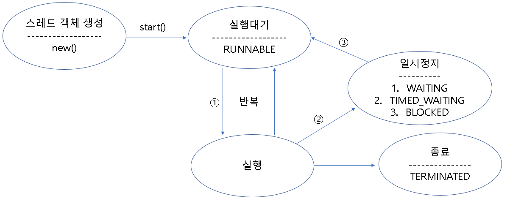
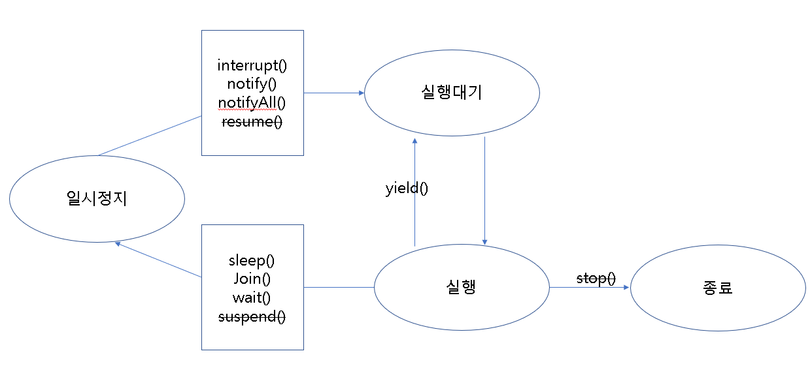
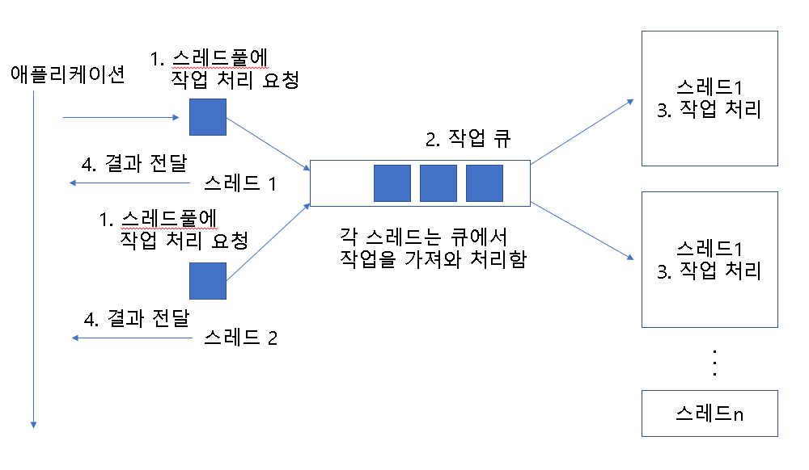

<h1>멀티 스레드 개념</h1>

<h3>프로세스와 스레드</h3>

1. 프로세스(Process) : 실행 중인 프로그램(어플리케이션)이다. 프로세스는 다중으로 만들어지기도한다. (하나의 프로그램을 여러번 시키는 것) 멀티 프로세스는 독립적이다.
2. 멀티 태스킹(Multi Tasking) : 두 가지 이상의 작업을 동시에 처리하는 것이다. 병렬로 실행시킨다.
3. 스레드(Thread) : 한가닥의 실이라는 뜻, 프로세스 안에서 실행되는 멀티태스킹이다. 하나의 프로세스에 스레드가 2개 이상이라면 멀티 스레드이다. 

<h3>메인 스레드</h3>

​	모든 자바 어플리케이션은 메인 스레드가 main() 메소드를 실행시키면서 시작된다.

​	main()은 순차적으로 실행하고, return문이나, 마지막 코드를 실행하면 종료된다.

​	메인 스레드는 필요에 따라 멀티스레드를 만들어 병렬처리가 가능하다.

1. 싱글 스레드 : 메인 스레드가 종료시, 종료
2. 멀티 스레드 : 메인 스레드가 종료되더라도, 작업중인 스레드가 있을 경우, 종료하지 않고 계속 작업을 처리한다.

<h3>Thread 클래스로 부터 직접 생성</h3>

​	java.lang.Thread 클래스로부터 작업 스레드 객체를 직접 생성하려면 Runable을 매개값으로 갖는 생성자를 호출해야 한다.

~~~java
public class ThreadClass{
    public static void main(String[] args){
        //방법 1
        Thread thread1 = new Thread(new Runnable(){
           @Override
            public void run(){
                //구현 내용
            }
        });
        thread1.start();
        //방법 2
        Thread thread2 = new Thread(()->{
           @Override
            public void run(){
                //구현 내용
            }
        });
        thread2.start();
        
      	//방법 3
        Runnable Task = new Task();
        Thread thread3 = new Thread(Task);
    }
}
~~~

<h3>Thread 하위 클래스로부터 생성</h3>

~~~java
public class ThreadExtendsClass extends Thread{
    @Override
    public void run(){
        //구현
    }
}
public class MainClass{
    public static void main(String[] args){
        ThreadExtendsClass thread = new ThreadExtendsClass();
        thread.start();
    }
}
~~~

<h3>스레드 이름</h3>

​	스레드는 자신만의 이름을 가지고 있다.

​	디버깅 할 때 요긴하기 쓰인다.

​	main 스레드 이외 기본적으로 Thread-n번호의 이름을 갖는다.

~~~java
public class ThreadName{
    public static void main(String[] args){
        Thread thread = new Thread(new Runnable(){
            @Ovrride
            public void run(){
                //구현
            }
        });
        //이름 설정
        thread.setName("MyThread");
        //이름 알아내기
        System.out.pritln(thread.getName());
    	//현재 스레드객체 참조하기
        Thread currentThread = Thread.currentThread();
    }
}
~~~

<h3>스레드 우선순위</h3>

​	멀티스레드는 동시성 또는 병렬성으로 실행된다.

​	스레드의 개수가 코어 수보다 많은 경우 어떤 순서에 의해 동시성으로 샐행할 것인지를 결정해야한다. 이를 스레드 시케줄링이라고 한다.

1. 동시성 : 멀티작업을 위해 하나에 코어에서 멀티스레드가 실행되는 것
2. 병렬성 : 멀티작업을 위해 멀티 코어에서 멀티스레드가 실행되는 것  

<h4>스레드 스케줄링</h4>

<dl>
    <dt>1. 우선순위 방법</dt>
    <dd>스레드에 우선순위를 결정하여 우선순위가 높은 스레드가 먼저 실행되는 것</dd>
    <dt>2. 순환할당(Round Robin) 방법</dt>
    <dd>시간 할당량(Time Slice)을 정하여 정해진 시간만큼 스레드가 번갈아가며 쓰는 방식</dd>
</dl>

​	우선 순위 방식은 개발자가 설정이 가능하고, 순환 할당 방식은 불가능하다.

​	우선 순위 방식은 1이 가장 낮고, 10이 가장 높다. 기본 설정은 5이다.

~~~java
public class ThreadClass extends Thread{
    public ThreadClass(String name){
        setName(name);
    }
    @Override
    public void run(){
        Thread currentThread = Thread.currentThread();
        System.out.println(currentThread.getName());
    }
}
public class PriorityThreadClass{
    public static void main(String[] args){
        ThreadClass thread;
        for(int i=1; i<=10; i++){
            thread = new ThreadClass("["+i+"] Thread");
            if(i == 10)
                thread.setPriority(Thread.MAX_PRIORITY);
            else
                thread.setPriority(Thread.MIN_PRIORITY);
            thread.start();
        }
    }
}
~~~

<h1>동기화 메소드와 동기화 블록</h2>

<h4>공유 객체를 사용할 때의 주의점</h4>

​	싱글 스레드의 경우 한 개의 자원을 독차지해서 사용한다.

​	멀티 스레드의 경우 자원을 공유해서 사용하기 때문에, Thread A가 사용중에 Thread B가 변경하여 Thread A는 이상한 값을 얻을 수 있다.

<h4>동기화 메소드 및 동기화 블록</h4>

​	Thread A에서 사용중인 자원을 Thread B가 변경할 수 없게 할려면 Thread A 작업이 끝날 때까지 자원을 잠궈야한다.

​	멀티 스레드 프로그램에서 단 하나의 스레드만이 살행할 수 있는 코드 영역을 <em><b>임계영역</b></em>이라고한다.

~~~java
public interface SynInterface{
    public void setMoney(int money, String name);
}

public class SynchronizedClass1 implements SynInterface{
    private int money;

    @Override
    public void setMoney(int money, String name){
        this.money = money;
        try{
            Thread.sleep(2000);
        }catch(InterruptedException e){

        }
        System.out.println("["+name+"]"+"My money: "+this.money);
    }
}
public class SynchronizedClass2 implements SynInterface{
    private int money;

    public synchronized void setMoney(int money,String name){
        this.money = money;
        try{
            Thread.sleep(2000);
        }catch(InterruptedException e){

        }
        System.out.println("["+name+"]"+"My money: "+this.money);
    }
}
public class User1 extends Thread{
    private SynInterface syncClass;
    private String name;
    public User1(String name){
        this.name = name;
    }

    @Override
    public void run(){
        syncClass.setMoney(100,name);
    }
    public void setSync(SynInterface syncClass){
        if(syncClass instanceof SynchronizedClass1)
            this.syncClass = (SynchronizedClass1) syncClass;
        else if(syncClass instanceof SynchronizedClass2)
            this.syncClass = (SynchronizedClass2) syncClass;
    }
}

public class User2 extends Thread{
    private  SynInterface syncClass;
    private String name;
    public User2(String name){
        this.name = name;
    }

    @Override
    public void run(){
        syncClass.setMoney(200,name);
    }
    public void setSync(SynInterface syncClass){
        if(syncClass instanceof SynchronizedClass1)
            this.syncClass = (SynchronizedClass1) syncClass;
        else if(syncClass instanceof SynchronizedClass2)
            this.syncClass = (SynchronizedClass2) syncClass;
    }
}

public class MainClass{
    public static void main(String[] args){
        SynchronizedClass1 syncClass1 = new SynchronizedClass1();
        User1 user1 = new User1("NonSync User1");
        user1.setSync(syncClass1);

        User2 user2 = new User2("NonSync User2");
        user2.setSync(syncClass1);

        //둘다 200
        user1.start();
        user2.start();

        SynchronizedClass2 syncClass2 = new SynchronizedClass2();
        User1 user3 = new User1("Sync User1");
        user3.setSync(syncClass2);

        User2 user4 = new User2("Sync User2");
        user4.setSync(syncClass2);

        user3.start();
        user4.start();
    }
}
~~~

<h2>스레드 상태</h2>

​	Thread의 현재 정보를 알기위해 getState() 메소드를 사용한다. 

​	Thread.State 열거상수를 리턴한다. 

<table>
    <tr>
        <th>상태</th>
        <th>열거 상수</th>
        <th>설명</th>
    </tr>
    <tr>
    	<td>객체 생성</td>
        <td>NEW</td>
        <td>Thread 객체가 생성, 아직 start()되기 전 상태</td>
    </tr>
    <tr>
    	<td>실행 대기</td>
        <td>RUNNABLE</td>
        <td>실행 상태로 언제든지 갈 수 있는 상태</td>
    </tr>
    <tr>
    	<td rowspan="3">일시정지</td>
        <td>WAITING</td>
        <td>다른 Thread가 통지할 때까지 기다리는 상태</td>
    </tr>
    <tr>
        <td>TIMED_WAITING</td>
        <td>주어진 시간 동안 기다리는 상태</td>
    </tr>
    <tr>
        <td>BLOCKED</td>
        <td>자원의 락이 풀릴때까지 기다리는 상태</td>
    </tr>
    <tr>
    	<td>종료</td>
        <td>TERMINATED</td>
        <td>실행을 마친 상태</td>
    </tr>
</table>

~~~java
public class StatePrintThread extends Thread{
    private Thread targetThread;
    
    public StatePrintThread(Thread targetThread){
        this.targetThread = targetThread;
    }
    
    @Override
    public void run(){
        while(true){
        	Thread.State state = targetThread.getState();
        	System.out.println("타켓 스레드 상태: "+state);
        
        	if(state == Thread.State.NEW)
            	targetThread.start();
        
        	if(state == Thread.State.TERMINATED)
           	 	break;
            
            try{
                Thread.sleep(500);
            }catch(Exception e){}
        }
    }
}

public class TargetThread extends Thread{
   	@Override
    public void run(){
        for(int i=0; i<1000000000; i++){}
        try{
            Thread.sleep(500);
        }catch(Exception e){}
        for(long i=0; i<1000000000; i++){}
    }
}

public class ThreadStateEx{
    public static void main(String[] args){
        StatePrintThread spt = new StatePrintThread(new TargetThread());
        spt.start();
    }
}
~~~

<h2>스레드 상태 제어</h2>

<h4>주어진 시간동안 일시 정지(sleep())</h4>

~~~java
public class SleepClass{
    public static void main(String[] args){
        Toolkit toolkit = Toolkit.getDefaultToolkit();
        for(int i=0; i<10; i++){
            toolkit.beep();
            try{
                Thread.sleep(3000);	//밀리세컨드 동안 일시정지 상태 만듬
            }catch(InterruptedException e){}
        }
    }
}
~~~

<h4>다른 스레드에게 실행 양보(yield())</h4>

~~~java
public class ThreadA extends Thread{
    public boolean stop = false;
    public boolean work = true;
    
    @Override
    public void run(){
       	while(!stop){
            if(work)
                System.out.println("ThreadA 작업 내용");
        	else
                Thread.yield();
        }
        System.out.println("ThreadA 종료");
    }
}

public class ThreadB extends Thread{
    public boolean stop = false;
    public boolean work = true;
    
    @Override
    public void run(){
       	while(!stop){
            if(work)
                System.out.println("ThreadB 작업 내용");
        	else
                Thread.yield();
        }
        System.out.println("ThreadB 종료");
    }
}
public class YieldClass{
    public static void main(String[] args){
        ThreadA threadA = new ThreadA();
        ThreadB threadB = new ThreadB();
        
        threadA.start();
        threadB.start();
    	
        try{Thread.sleep(3000);}catch(InterruptedException e){}
        threadA.work = false;
        
 		try{Thread.sleep(3000);}catch(InterruptedException e){}
        threadA.work = true;
        
        try{Thread.sleep(3000);}catch(InterruptedException e){}
        threadA.stop = true;
        threadB.stop = true;
    }
}
~~~

<h4>다른 스레드의 종료를 기다림(join())</h4>

~~~java
public class SumThread extends Thread{
    private long sum;
    
    public long getSum(){
        return sum;
    }
    
    @Override
    public void run(){
        for(int i=1; i<=100; i++)
            sum += i;
    }
}

pubilc class JoinClass{
    public static void main(String[] args){
        SumThread sumThread = new SumThread();
        sumThread.start();
        try{
            //SumThread가 끝날 때까지, 메인 스레드를 일시 정지시킴
            sumThread.join();
        }catch(InterruptedException e){}
        
        System.out.println("1~100 합: "+sumThread.getSum());
    }
}
~~~

<h4>스레드 간 협업(wait(), notify(), notifyAll())</h4>

​	스레드가 협업시, 공유 객체는 두 스레드가 작업할 내용을 동기화 메소드로 구분시키고, 한 스레드가 작업을 완료하면 notify() 메소드를 호출해서 일시 정지 상태에 있는 다른 스레드를 실행 대기 상태로 만들고, 자신은 두 번 작업을 하지 않도록 wait()메소드를 호출하여 일시 정지 상태로 만든다.

 notifyAll()과 notify의 차이점은 notify는 wait()에 의해 일시정지된 스레드 중 한 개를 실행대기 상태로 만들고, notifyAll()은 wait()에 의해 일시정지된 스레드 모두를 실행대기 상태로 만든다.

~~~java
public class ThreadA extends Thread{
    private SharedObjectClass sharedObj;
    
    public ThreadA(SharedObjectClass sharedObj){
        this.sharedObj = sharedObj;
    }
    @Override
    public void run(){
        for(int i=0; i<10; i++)
            sharedObj.methodA();
    }
}

public class ThreadB extends Thread{
    private SharedObjectClass sharedObj;
    
    public ThreadB(SharedObjectClass sharedObj){
        this.sharedObj = sharedObj;
    }
    
    @Override
    public void run(){
        for(int i=0; i<10; i++)
            sharedObj.methodB();
        
    }
}

public class SharedObjectClass{
    public synchronized void methodA(){
        System.out.println("ThreadA의 methodA() 작업 실행");
        notify();
        try{
            wait();
        }catch(InterruptedException e){}
    }
    public synchronized void methodB(){
        System.out.println("ThreadB의 methodB() 작업 실행");
        notify();
        try{
            wait();
        }catch(InterruptedException e){}
    }
}

public class MainClass{
    public static void main(String[] args){
        SharedObjectClass sharedObj = new SharedObjectClass();
        ThreadA threadA = new ThreadA(sharedObj);
    	ThreadB threadB = new ThreadB(sharedObj);
        
        threadA.start();
        threadB.start();
    }
}
~~~

<h5>스레드 간 객체가 아닌 Data를 이용해 협업할 경우</h5>

~~~java
public class DataBox{
    private String data;
   
    public synchronized String getData(){
        if(this.data == null){
            try{
                wait();
            }catch(InterruptedException e){}
        }
        
        String returnValue = data;
        System.out.println("ConsummerThread가 읽은 데이터: "+returnValue);
        data = null;
        notify();
        return returnValue;
    }
    
    public synchronized void setData(String data){
        if(this.data != null){
            try{
                wait();
            }catch(InterruptedException e){}
        }
        this.data = data;
        System.out.println("ProducerThread가 생성한 데이터: "+data);
        notify();
    }
}

public ProducerThread extends Thread{
    private DataBox dataBox;
    
    public ProducerThread(DataBox dataBox){
        
    }
    
    @Overrides
    public void run(){
        for(int i=1; i<=3; i++){
            String data = "Data-"+i;
            dataBox.setData(data);
        }
    }
}

public ConsumerThread extends Thread{
    private DataBox dataBox;
    
    public ConsumerThread(DataBox dataBox){
        this.dataBox = dataBox;
    }
    
    @Override
    public void run(){
        for(int i=0; i<=3; i++){
            String data = dataBox.getData();
        }
    }
}

public class WaitNotifyClass{
    public static void main(String[] args){
        DataBox dataBox = new DataBox();
        
        ProducerThread producerThread = new ProducerThread(dataBox);
        ConsumerThread consumerThread = new ConsumerThread(dataBox);
        
        producerThread.start();
        consumerThread.start();
    }
}
~~~

<h3>스레드의 안전한 종료(stop 플래그, interrupt())</h3>

​	실행중인 스레드를 강제적으로 종료할 때 쓰인다.

​	스레드에 있는 자원을 안전하게 종료하기 위해 사용된다.

<h4>stop 플래그를 이용하는 방법</h4>

~~~java
public class StopThreadClass extends Thread{
    private boolean stop;
    
    public void setStop(boolean stop){
        this.stop = stop;
    }
    
    @Override
    public void run(){
        while(!stop){
            System.out.println("Running...");
        }
        System.out.println("Resource closing...");
        System.out.println("end...");
    }
}

public class MainClass{
    public static void main(String[] args){
        StopThreadClass thread = new StopThreadClass();
        thread.start();
        
        try{Thread.sleep(1000);}catch(InterruptedException e){}
        thread.setStop(true);
    }
}
~~~

<h4>interrupt() 메소드를 이용하는 방법</h4>

​	Thread가 일시정지 상태이여야 한다.

​	interruptedException을 발생시킨다.

​	Thread가 일시정지 상태가 아니면 소용이 없다.

~~~java
public class InterruptedThreadClass extends Thread{
    @Override
    public void run(){
        try{
            while(true){
                System.out.println("Running...");
                Thread.sleep(1);
            }
        }catch(InterruptedException e){
            
        }
        System.out.println("Resource closing...");
		System.out.println("end...");
    }
}

public class InterruptedThreadClass2 extends Thread{
    @Override
    public void run(){
        while(true){
            if(Thread.interrupted())
                break;
            System.out.println("Running...");
        }
        System.out.println("Resource closing...");
		System.out.println("end...");
    }
}

public class MainClass{
    public static void main(String[] args){
        Thread thread = new InterruptedThreadClass();
        thread.start();
        
        try{Thread.sleep(1000);}catch(InterruptedException e){}
        thread.interrupt();
        
        Thread thread2 = new InterruptedThreadClass2();
        thread2.start();
        
        try{Thread.sleep(1000);}catch(InterruptedException e){}
        thread.interrupt();
    }
}
~~~

<h1>데몬 스레드</h1>

​	주 스레드를 돕는 보조적인 역활을 한다.

​	예를 들어 워드 프로세스의 저장기능, 미디어 플레이어의 동영상 및 음악 재생 등이 있다.

​	주 스레드가 종료되면 자동으로 종료된다.

~~~java
public class AutoSaveThread extends Thread{
    public void save(){
        System.out.println("saving...");
    }
    
    @Override
    public void run(){
        while(true){
            try{
                Thread.sleep(1000);
            }catch(InterruptedException e){
                break;
            }
            save();
        }
        System.out.println("DaemonThread end...");
    }
}

public class MainClass{
    public static void main(String[] args){
        Thread thread = new AutoSaveThread();
        thread.setDaemon(true);
        thread.start();
        
        try{
            Thread.sleep(3000);
        }catch(InterruptedException e){
        }
        System.out.println("main Thread end...");
    }
}
~~~

<h1>스레드 그룹</h1>

​	관련된 스레드를 묶어서 관리할 목적으로 이용한다.

<h3>스레드 그룹 이름 얻기</h3>

~~~java
ThreadGroup group = Thread.currentThread().getThreadGroup();
String groupName = group.getName();
~~~

<h3>스레드 그룹 생성</h3>

​	스레드 그룹을 생성 시, 부모를 지정하지 않으면, 현재 스레드가 속한 그룹의 하위 그룹으로 생성된다.

~~~java
ThreadGroup threadGroup = new ThreadGroup(String name);
ThreadGroup threadGroup = new ThreadGroup(ThreadGroup parent, String name);
Thread thread = new Thread(threadGroup, Runnable target);
Thread thread = new Thread(threadGroup, Runnable target, String name);
Thread thread = new Thread(threadGroup, Runnable target, String name, long stackSize);
Thread thread = new Thread(threadGroup, String name);
~~~

<h3>스레드 그룹의 일괄 interrupt()</h3>

​	interrupt() 메소드 실행 시, 그룹 내에 있는 모든 스레드가 일괄 interrupt 된다.

~~~java
public class ThreadWork extends Thread{
    public ThreadWork(ThreadGroup threadGroup, String name){
        super(threadGroup, name);
    }
    
    @Override
    public void run(){
        while(true){
			try{
                Thread.sleep(1000);
            }catch(InterruptedException e){
                System.out.println(getName()+" interrupted");
                break;
            }         
        }
        System.out.println(getName()+" end...");
    }
    
}

public class ThreadGroupClass{
    public static void main(String[] args){
        ThreadGroup myGroup = new ThreadGroup("myGroup");
        ThreadWork firstThread = new ThreadWork(myGroup,"ThreadA");
        ThreadWork secondThread = new ThreadWork(myGroup,"ThreadB");
        
        firstThread.start();
        secondThread.start();
        
        try{Thread.sleep(3000);}catch(InterruptedException e){}
        myGroup.interrupt();
    }
}
~~~

<h1>스레드 풀</h1>

​	병렬 작업 처리가 많아지면 스레드 개수가 증가되, 그에 따라 스레드 생성과 스케줄링으로 인해 CPU가 바빠져 메모리 사용량이 늘어난다. 애플리케이션의 성능이 저하된다. 그렇기 때문에 스레드 풀을 사용해야 한다.

<h3>스레드풀 생성 및 종료</h3>

<h4>스레드풀 생성</h4>

​	ExecutorService 구현 객체는 Executors 클래스의 두 가지 메소드 중 하나를 사용하여 생성할 수 있다.

<table>
    <tr>
        <th>메소드명(매개 변수)</th>
        <th>초기 스레드 수</th>
        <th>코어 스레드 수</th>
        <th>최대 스레드 수</th>
    </tr>
    <tr>
    	<td>newCachedThreadPool()</td>
        <td>0</td>
        <td>0</td>
        <td>Integer.MAX_VALUE</td>
    </tr>
    <tr>
    	<td>newFixedThreadPool(int nThreads)</td>
        <td>0</td>
        <td>nThreads</td>
        <td>nThreads</td>
    </tr>
</table>

~~~java
ExecutorService executorService = Executors.newCachedThreadPool();
//CPU 코어의 수만큼 최대 스레드를 사용하는 스레풀
ExecutorService executorService = Executors.newFiexedThreadPool(
	Runtime.getRuntim().availableProcessors();
);
ExecutorService threadPool = new ThreadPoolExecutor{
    3,		//코어 스레드 개수
    100,	//최대 스레드 개수
    120L,	//놀고 있는 시간
    TimeUnit.SECONDS,	//놀고 있는 시간단위
    new SynchronousQueue<Runnable>()	//작업 큐
};
~~~

<h4>스레드풀 종료</h4>

~~~java
//남아있는 작업을 마무리하고 스레풀을 종료할때
executorService.shutdown();
//남아있는 작업과 상관없이 강제로 종료할 때
executorService.shutdownNow();
~~~

<h3>작업 생성과 처리 요청</h3>

<h4>작업 생성</h4>

​	하나의 작업은 Runnable 또는 Callable 구현 클래스로 표현한다.

​	Runnable과 Callable의 차이점은 리턴값이 있느냐 없느냐이다.

~~~java
//Runnable
Runnable task = new Runnable(){
    @Override
    public void run(){
        //스레드가 처리할 작업내용
    }
}
//Callable
Callable<T> task = new Callable<T>(){
    @Override
    public T call() throws Exception{
        //스레드가 처리할 작업내용
        return T;
    }
}
~~~

<h4>작업 처리요청</h4>

​	ExecutorService의 작업 큐에 Runnable 또는 Callable 객체를 넣는 행위를 말한다.

​	submit은 블로킹 되지 않는다.

<table>
    <tr>
    	<th>리턴 타입</th>
        <th>메소드명(매개 변수)</th>
        <th>설명</th>
    </tr>
    <tr>
    	<td>void</td>
        <td>execute(Runable command)</td>
        <td>Runnable을 작업 큐에 저장 작업 처리 결과를 받지 못함</td>
    </tr>
    <tr>
    	<td>Future&lt;?&gt; Future&lt;V&gt; Future&lt;V&gt;</td>
        <td>
           submit(Runnable task) submit(Runnable task, V result)					  	 	  		 submit(Callable&lt;V&gt; task)
        </td>
        <td>
        	Runable 또는 Callable을 작업 큐에 저장 
            러턴된 Future를 통해 작업 처리 결과를 얻을 수 있음
        </td>
    </tr>
</table>

<h4>블로킹 방식의 작업 완료 통보</h4>

​	Future 객체는 작업이 완료될 때까지 기다렸다가(지연했다가=블록킹되었다가) 최종결과를 얻는다.

​	Future.get() 메소드를 사용시, 작업을 완료될때까지 기다렸다가 작업을 완료하면 처리결과를 반환한다.

​	주의 점은 Future.get() 메소드 사용시, UI이벤트 처리를 할 수 없기 때문에 새로운 스레드거나 스레드 풀이이여야 한다.

~~~java
//새로운 스레드 생성
new Thread(()->{
   @Override
    public void run(){
        try{
            future.get();
        }catch(Exception e){
            e.printStatckTrace();
        }
    }
});
//스레드풀의 스레드가 호출
executorService.submit(()->{
   @Override
    public void run(){
        try{
            future.get();
        }catch(Exception e){
            e.printStatckTrace();
        }
    }
});
~~~

<h4>Future 객체 메소드</h4>

​	지연 완료 객체이다.

<table>
    <tr>
    	<th>리턴 타입</th>
        <th>메소드명(매개 변수)</th>
        <th>설명</th>
    </tr>
    <tr>
    	<td>booelan</td>
        <td>cancel(boolean mayInterruptIfRunning)</td>
        <td>작업 처리가 진행 중일 경우 취소시킴</td>
    </tr>
    <tr>
        <td>boolean</td>
        <td>isCancelled()</td>
        <td>작업이 취소되었는지 여부</td>
    </tr>
    <tr>
    	<td>boolean</td>
        <td>isDone()</td>
        <td>작업 처리가 완료되었는지 여부</td>
    </tr>
</table>

<h4>리턴 값이 없는 작업 완료 통보</h4>

~~~java
public class NoResultClass{
    public static void main(String[] args){
        ExecutorService executorService = Excutros.newFixedThreadPool(
        	Runtime.getRunime().availableProcessors()
        );
        
        System.out.println("[작업 처리 요청]");
        Runnable runnable = new Runnable(){
          	@Override
            public void run(){
                int sum = 0;
                for(int i=1; i<=10; i++) sum += i;
                System.out.pritnln("[처리 결과] "+sum);
            }
        };
        
        Future future = executroService.submit(runnable);
        
        try{
            future.get();
            System.out.println("[작업 처리 완료]");
        }catch(Exception){
            System.out.println("[예외 발생]");
        }
    }
}
~~~

<h4>리턴값이 있는 작업 완료 통보</h4>

~~~java
public class ResultClass{
    public static void main(String[] args){
        ExecutorService executorService = Excutros.newFixedThreadPool(
        	Runtime.getRunime().availableProcessors()
        );
        
        System.out.println("[작업 처리 요청]");
        Callable<Integer> task = new Callable<Integer>(){
            @Override
            public Integer call() throws Exception{
                int sum = 0;
                for(int i=1; i<=10; i++) sum += i;
                return sum;
            }
        }        
        
        Future<Integer> future = executroService.submit(task);
        
        try{
            int sum = future.get();
            System.out.println("[처리 결과] "+sum);
            System.out.println("[작업 처리 완료]");
        }catch(Exception){
            System.out.println("[예외 발생]");
        }
    }
}
~~~

<h4>작업 처리 결과를 외부 객체에 저장</h4>

~~~java
public class Result{
    private int addValue;
    public synchronized void addValue(int value){
        addValue += value;
    }
    
    public int getValue(){
        return addValue;
    }
}

public class Task implements Runnable{
    private Result result;
    public Task(Result result){
        this.result = result;
    }
    @Override
    public void run(){
        int sum = 0;
        for(int i=1; i<=10; i++) sum += i;
        result.addValue(sum);
    }
}

public ResultClassEx{
    public static void main(String[] args){
        ExecutorService executorService = Excutros.newFixedThreadPool(
        	Runtime.getRunime().availableProcessors()
        );
        
        System.out.println("[작업 처리 요청]");
        Result result = new Result();
        Runnable task1 = new Task(result);
        Runnable task2 = new Task(result);
        Future<Result> future1 = executorService.submit(task1, result);
        Future<Result> future2 = executorService.submit(task2, result);
        
        try{
            result = future1.get();
            result = future2.get();
            System.out.println("[처리 결과]"+result.getValue());
            System.out.println("[작업 처리 완료]");
        }catch(Exception e){
            System.out.println("[실행 예외]");
        }
    }
}
~~~

<h4>작업 완료 순으로 통보</h4>

​	스레드풀에서 작업 처리가 완료된 것만 통보받는 방법 CompletionService를 사용하는 것이다.

<table>
    <tr>
    	<th>리턴 타입</th>
        <th>메소드명(매개 변수)</th>
        <th>설명</th>
    </tr>
    <tr>
    	<td>Future&lt;V&gt;</td>
        <td>poll()</td>
        <td>완료된 작업의 Future를 가져옴 
            완료된 작업이 없다면 즉시 null을 리턴함
        </td>
    </tr>
    <tr>
    	<td>Future&lt;V&gt;</td>
        <td>take()</td>
        <td>완료된 작업의 Future를 가져옴 
            완료된 작업이 없다면 있을 때까지 블로킹됨
        </td>
    </tr>
</table>

~~~java
ExecutorService executorService = Executors.newFixedThreadPool(
	Runtim.getRuntime().availableProcessors()
);
CompletionService<V> completionService = new ExecutorCompletionService<V>(
	executorService
);
completionService.submit(Callable<V> task);
completionService.submit(Runnable task, V result);
executorService.submit(new Runnable()->{
    @Override
    public void run(){
        while(true){
            try{
                Future<Integer> future = completionService.take();
                int value = future.get();
                System.out.println("[처리 결과] "+value);
            }catch(Exception e){
                break;
            }
        }
    }
});
~~~

~~~java
public class CompletionServiceClass{
    public static void main(String[] args){
        ExecutorService executorService = Executors.newFixedThreadPool(
        	Runtime.getRuntime().availableProcessors()
        );
        CompletionService<Integer> completionService = 
            new ExecutorCompletionService<Integer>(executorService);
        
        System.out.println("[작업 처리 요청]");
        for(int i=0; i<3; i++){
            completionService.submit(new Callable<Integer>(){
                @Override
                public Integer call() throws Exception{
                    int sum = 0;
                    for(int i=1; i<=10; i++) sum += i;
                    return sum;
                }
            });
        }
        
        System.out.println("[처리 완료된 작업 확인]");
        executorService.submit(new Runnable(){
            @Override
            public void run(){
                while(true){
                    try{
                        Future<Integer> future = completionService.take();
                        int value = future.get();
                        System.out.println("[처리 결과] "+value);
                    }catch(Exception e){
                        break;
                    }
                }
            }
        });
        
        try{Thread.sleep(3000)}catch(InterruptedException e){}
        executorService.shutdownNow();
    }
}
~~~

<h4>콜백 방식의 작업 완료 통보</h4>

​	블로킹 방식은 작업이 완료될 때까지 블로킹 되지만, 콜백 방식은 작업 결과를 기다릴 필요 없이 다른 기능을 수행 할 수 있기 때문이다.

​	비동기 통신에서 콜백 객체를 만들 때 사용된다.

​	java.nio.channels.CompletionHandler

~~~java
CompletionHandler<V, A> callback = new CompletionHandler<V, A>(){
    @Override
    public void completed(V result, A attachment){
    }
    @Override
    public void failed(Throwable exc, A attachment){
    }
};
Runnable task = new Runnable(){
    @Override
    public void run(){
  		try{
            V result = ...;
            callback.completed(result, null);
        }catch(Exception e){
            callback.failed(e, null);
        }	      
    }
};
~~~

~~~java
public class CallbackClass {
    private ExecutorService executorService;

    public CallbackEx(){
        executorService = Executors.newFixedThreadPool(
                Runtime.getRuntime().availableProcessors()
        );
    }

    private CompletionHandler<Integer,Void> callback =
            new CompletionHandler<Integer, Void>() {
                @Override
                public void completed(Integer result, Void attachment) {
                    System.out.println("completed() 실행: "+result);
                }

                @Override
                public void failed(Throwable exc, Void attachment) {
                    System.out.println("failed() 실행: "+exc.toString());
                }
            };

    public void doWork(final String x, final String y){
        Runnable task = new Runnable() {
            @Override
            public void run() {
                try{
                    int intX = Integer.parseInt(x);
                    int intY = Integer.parseInt(y);
                    int result = intX + intY;
                    callback.completed(result,null);
                }catch (NumberFormatException e){
                    callback.failed(e, null);
                }
            }
        };
        executorService.submit(task);
    }

    public void finish(){
        executorService.shutdown();
    }

    public static void main(String[] args) {
        CallbackEx example = new CallbackEx();
        example.doWork("3","3");
        example.doWork("3","삼");
        example.finish();
    }
}
~~~

