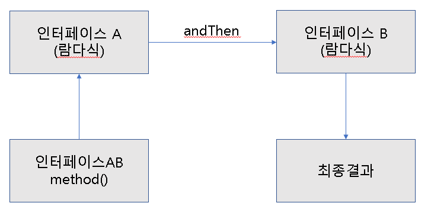
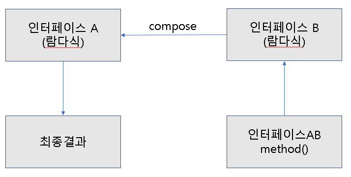

<h1>람다식</h1>

​	병렬처리와 이벤트 처리에 적절하다.

~~~java
Runnable runnable = new Runnable(){
	@Override
    public void run(){}
};
//람다식
Runnable runnable = ()->{};
~~~

<h2>람다식 기본 문법</h2>

~~~java
(타입 매개변수, ...) -> {실행문, ...}
//매개 변수가 하나일 경우()괄호 생략 가능
a -> System.out.println(a);
//리턴문이 있을 경우
(x, y) -> {return x+y;};
//리턴문이 없을 경우
(x, y) -> x+y;
~~~

<h2>타겟 타입과 함수적 인터페이스</h2>

​	람다식은 인터페이스 변수에 대입된다.

​	람다식은 인터페이스의 익명 구현 객체를 생성한다는 뜻이다.

​	람다식이 대입될 인터페이스를 람다식의 타겟 타입(target type)이라고 한다.

~~~java
인터페이스 변수 = 람다식;
~~~

<h2>함수적 인터페이스(@FuntionalInterface)</h2>

​	두 개이상의 메소드가 정의되어 있는 타겟 타입은 람다식으로 구현이 불가능하다.

​	추상 메소드가 두 개 이상 정의되지 않도록 @FuntionalInterface 어노테이션을 붙인다.

~~~java
@FunctionalInterface
public interface MyFunctionalInterface{
    public void method();
    //public void otherMethod(); 컴파일 오류
}
~~~

<h3>매개 변수와 리턴값이 없는 람다식</h3>

~~~java
@FunctionalInterface
public interface MyInterface{
    public void method();
}
public class MainClass{
    public static void main(String[] args){
        MyInterface myInterface;
        myInterface = () -> {
            String str = "method() call1...";
            System.out.println(str);
        };
        myInterface.method();
        
        myInterface = () -> {System.out.println("method() call2...");};
        myInterface.method();
        
        myInterface = () -> {System.out.println("method() call3...");};
        myInterface.method();
    }
}
~~~

<h3>매개 변수가 있는 람다식</h3>

~~~java
@FunctionalInterface
public interface MyInterface{
    public void method(int x);
}
public class MainClass{
    public static void main(String[] args){
        MyInterface myInterface;
        myInterface = (x) -> {
            int result = x * 5;
            System.out.println(result);
        };
        myInterface.method(2);
        
        myInterface = (x) -> {System.out.println(x * 5);};
        myInterface.method(2);
        
        myInterface = x -> System.out.println(x * 5);
        myInterface.method(2);
    }
}
~~~

<h3>리턴값이 있는 람다식</h3>

~~~java
@FunctionalInterface
public interface MyInterface{
    public int method(int x, int y);
}
public class MainClass{
    public static void main(String[] args){
        MyInterface myInterface;
        
        myInterface = (x,y) -> {
          	int result = x + y;
            return result;
        };
        System.out.println(myInterface.method(2,5));
        
        myInterface = (x,y) -> {return x + y;};
        System.out.println(myInterface.method(2,5));
        
        myInterface = (x,y) -> x+y;
        System.out.println(myInterface.method(2,5));
        
        myInterface = (x,y) -> sum(x,y);
        System.out.println(myInterface.method(2,5));
    }
    public static int sum(int x, int y){
        return x+y;
    }
}
~~~

<h1>클래스 멤버와 로컬 변수 사용</h1>

​	람다식의 실행 블록에서는 클래스의 멤버(필드와 메소드) 및 로컬 변수를 사용할 수 있다.

​	멤버는 제약사항이 없지만, 로컬 변수는 제약 사항이 따른다.

<h3>클래스의 멤버 사용</h3>

​	this 키워드 사용시, 람다식을 실행한 객체의 참조이다.

~~~java
@FunctionalInterface
public interface MyInterface{
    public void method();
}
public class UsingThis{
    int outterField = 10;
    class Inner{
        int innerField = 20;
        public void method(){
            MyInterface myInterface;
            myInterface = () ->{
                System.out.println("outterField: "+outterField);
                System.out.println("outterField: "+UsingThis.this.outterField);
                
                System.out.println("innerField: "+innerField);
                System.out.println("innerField: "+this.innerField);
            };
            myInterface.method();
        }
    }
}
public class MainClass{
    public static void main(String[] args){
        UsingThis usingThis = new UsingThis();
        UsingThis.Inner inner = usingThis.new Inner();
        inner.method();
    }
}
~~~

<h3>로컬 변수 사용</h3>

​	매개 변수값은 final이여야 한다.

~~~java
@FunctionalInterface
public interface MyInterface{
    public void method();
}
public class UsingLocalVariable{
    //매개변수 값이 final이여야함 자동으로 final 변수가됨
    public void method(int var){
        int localVar = 10;
        MyInterface myInterface;
        myInterface = () ->{
          	System.out.println("localVar: "+localVar);
            System.out.println("argument: "+var);
        };
        myInterface.method();
    }
}
public class MainClass{
    public static void main(String[] args){
        UsingLocalVariable usingLocalVariable = new UsingLocalVariable();
        usingLocalVariable.method();
    }
}
~~~

<h2>표준 API의 함수적 인터페이스</h2>

​	표준 API에서 한 개의 추상메소드를 가진 인터페이스는 람다식으로 구현가능하다.

​	빈번하게 사용되는 함수적 인터페이스는 java.util.function 표준 API 패키지로 제공한다.

<table>
    <tr>
    	<th>종류</th>
        <th>추상 메소드 특징</th>
        <th></th>
    </tr>
    <tr>
    	<td>Consumer</td>
        <td>매개값은 있고, 리턴값은 없음</td>
        <td>매개값 → Consumer</td>
    </tr>
    <tr>
    	<td>Supplier</td>
        <td>매개값은 없고, 리턴값은 있음</td>
        <td>Supplier → 리턴값</td>
    </tr>
    <tr>
    	<td>Function</td>
        <td>
            매개값도 있고, 리턴값도 있음 
        	주로 매개값을 리턴값으로 매핑(타입 변환)
        </td>
        <td>매개값 → Function → 리턴값</td>
    </tr>
    <tr>
    	<td>Operator</td>
        <td>
        	매개값도 있고, 리턴값도 있음 
            주로 매개값을 연산하고 결과를 리턴
        </td>
        <td>매개값 → Operator → 리턴값</td>
    </tr>
    <tr>
    	<td>Predicate</td>
        <td>
        	매개값은 있고, 리턴 타입은 boolean 
            매개값을 조사해서 true/false를 리턴
        </td>
        <td>매개값 → Predicate → boolean</td>
    </tr>
</table>

~~~java
public class RunnableClass{
    public static void main(String[] args){
        //방법 1
        Runnable runnable = () ->{
          	for(int i=0; i<10; i++)
                System.out.println(i);
        };
        Thread thread = new Thread(runnable);
        thread.start();
        //방법 2
        Thread thread2 = new Thread(()->{
            for(int i=0; i<10; i++)
                System.out.println(i);
        });
        thread2.start();
    }
}
~~~

<h3>Consumer 함수적 인터페이스</h3>

~~~java
//한개의 객체를 매개변수로 받아 소비
Consumer<String> consumer = t -> { t를 소비하는 실행문; };
//두개의 객체를 매개변수로 받아 소비
BiConsumer<String, String> consumer = (t, u) -> { t와 u를 소비하는 실행문; };
//Double값을 받아 소비
DoubleConsumer consumer = d -> { d를 소비하는 실행문 };
//객체 한개와 int값 한개를 받아 소비
ObjIntConsumer<String> consumer = (t, i) -> { t와 i를 소비하는 실행문; };
~~~

~~~java
public class ConsumerClass{
    public static void main(String[] args){
        Consumer<String> consumer1 = t -> System.out.println(t+"8");
        consumer1.accept("Java");
        
        BiConsumer<String, String> consumer2 = (t, u) -> System.out.println(t+u);
        consumer2.accept("Java","8");
        
        DoubleConsumer consumer3 = d -> System.out.println("Java"+d);
        consumer3.accept(8.0);
        
        ObjIntConsumer<String> consumer4 = (t,i) -> System.out.println(t+i);
        consumer4.accept("Java",8);
    }
}
~~~

<h3>Supplier 함수적 인터페이스</h3>

~~~java
Supplier<String> supplier = () -> { return "문자열";};
IntSupplier supplier = () -> {return int값;};
~~~

~~~java
public class SupplierClass{
    public static void main(String[] args){
        IntSupplier supplier = () -> {
          	int num = (int)(Math.random()*6) + 1;
            return num;
        };
        int num = supplier.getAsInt();
        System.out.println("주사위 눈의 수: "+num);
    }
}
~~~

<h3>Function 함수적 인터페이스</h3>

~~~java
Function<Student, String> function = t -> {return t.getName();};
Function<Student, String> function = t -> t.getName();
ToIntFunction<Student> function = t -> {return t.getScore();};
ToIntFunction<Student> function = t -> t.getScore();
~~~

~~~java
public class Student{
    private String name;
    private int englishScore;
    private int mathScore;
    
    public Student(String name, int englishScore, int mathScore){
        this.name = name;
        this.englishScore = englishScore;
        this.mathScore = mathScore;
    }
    public String getName(){return name;}
    public int getEnglishScore(){return englishScore;}
    public int getMathScore(){return mathScore;}
}
public class Storage{
    private static List<Student> list = Arrays.asList(
    	new Student("홍길동",96,90);
        new Student("김자바",98,92);
    );
    
    public static double avg(ToIntFunction<Student> function){
        int sum = 0;
        for(Student student : list)
            sum += function.applyAsInt(student);
        double avg =  (double) sum / list.size();
        return avg;
    }
    
    public static String getName(Function<Student> function){
        return function.getName();
    }
}
public class MainClass{
    public static void main(String[] args){
        double englishAvg = Storage.avg(s->s.getEnglishScore());
        System.out.println("영어 평균 점수: "+englishAvg);

    	double mathAvg = Storage.avg(s->s.getMathScore());
        System.out.println("수학 평균 점수: "+mathAvg);
    }
}
~~~

<h3>Operator 함수적 인터페이스</h3>

~~~java
IntBinaryOperator operator = (a,b) -> { return int값;};
~~~

~~~java
public class OperatorEx {
    private static int[] scores = {92,95,87};

    public static int maxOrMin(IntBinaryOperator operator){
        int result = scores[0];
        for(int score: scores)
            result = operator.applyAsInt(result,score);
        return result;
    }

    public static void main(String[] args) {
        int max = maxOrMin((a,b) -> {
            if(a>=b) return a;
            else return b;
        });
        System.out.println("최대값: "+max);

        int min = maxOrMin((a,b) -> {
            if(a<=b) return a;
            else return b;
        });
        System.out.println("최소값: "+min);
    }
}
~~~

<h3>Predicate 함수적 인터페이스</h3>

~~~java
Predicate<Student> predicate = t -> {return t.getGender().equals("남자");};
Predicate<Student> predicate = t -> t.getGender().equals("남자");
~~~

~~~java
public class Student{
    private String name;
    private String gender;
    private int score;
    public Student(String name, String gender, int score){
        this.name = name;
        this.gender = gender;
        this.score = score;
    }
    
    public String getName(){return name;}
    public String getGender(){return gender;}
    public int getScore(){return score;}
}
public class Storage{
    private List<Student> list = Arrays.asList(
        new Student("홍길동","남자",90),
        new Student("김순희","여자",90),
        new Student("김자바","남자",95),
         new Student("박한나","여자",92)
    );
    
    public static double avg(Predicate<Student> predicate){
        int cnt = 0, sum = 0;
        for(Student student : list){
            if(predicate.test(student)){
                cnt++;
                sum += student.getScore();
            }
        }
        return (double) sum / cnt;
    }
}
public class MainClass{
    public static void main(String[] args){
        double maleAvg = Storage.avg(t->t.getGender().equals("남자"));
        System.out.println("남자 평균 점수: "+maleAvg);
        
        double femaleAvg = Storage.avg(t->t.getGender().equals("여자"));
        System.out.println("여자 평균 점수: "+femaleAvg);
    }
}
~~~

<h1>andThen()과 compose() 디폴트 메소드</h1>

~~~java
인터페이스 AB = 인터페이스A.andThen(인터페이스B);
최종결과 = 인터페이스AB.method();
~~~

~~~java
인터페이스 AB = 인터페이스A.compose(인터페이스B);
최종결과 = 인터페이스AB.method();
~~~

<table>
    <tr>
    	<th>종류</th>
        <th>함수적 인터페이스</th>
        <th>andThen()</th>
        <th>compose()</th>
    </tr>
    <tr>
    	<td rowspan="5">Consumer</td>
        <td>Consumer&lt;T&gt;</td>
        <td>O</td>
        <td>X</td>
    </tr>
    <tr>
    	<td>BiConsumer&lt;T,U&gt;</td>
        <td>O</td>
        <td>X</td>
    </tr>
    <tr>
    	<td>DoubleConsumer</td>
		<td>O</td>
        <td>X</td>
    </tr>
    <tr>
    	<td>IntConsumer</td>
        <td>O</td>
        <td>X</td>
    </tr>
    <tr>
    	<td>LongConsumer</td>
        <td>O</td>
        <td>X</td>
    </tr>
    <tr>
    	<td rowspan="2">Function</td>
        <td>Function&lt;T,R&gt;</td>
        <td>O</td>
        <td>O</td>
    </tr>
    <tr>
    	<td>BiFunction&lt;T,U,R&gt;</td>
        <td>O</td>
        <td>X</td>
    </tr>
    <tr>
    	<td rowspan="4">Operator</td>
        <td>BinaryOperator&lt;T&gt;</td>
        <td>O</td>
        <td>X</td>
    </tr>
    <tr>
    	<td>DoubleUnaryOperator</td>
        <td>O</td>
        <td>O</td>
    </tr>
    <tr>
        <td>IntUnaryOperator</td>
        <td>O</td>
        <td>O</td>
    </tr>
    <tr>
    	<td>LongUnaryOperator</td>
        <td>O</td>
        <td>O</td>
    </tr>
</table>

<h3>Consumer의 순차적 연결</h3>

~~~java
public class Member{
    private String name;
    private String id;
    
    public Member(String name, String id){
        this.name = name;
        this.id = id;
    }
    public String getName(){return name;}
    public String getId(){return id;}
}
public class ConsumerAndThenClass{
    public static void main(String[] args){
        Consumer<Member> consumerA = m -> 
            System.out.println("consumerA: "+m.getName());
        Consumer<Member> consumerB = m ->
            System.out.println("consumerB: "+m.getId());
        
        Consumer<Member> consumerAB = consumerA.andThen(consumerB);
        consumerAB.accept(new Member("홍길동","hong"));
    }
}
~~~

<h3>Function의 순차적 연결</h3>

~~~java
public class Address{
    private String county;
    private String city;
    public Address(String county, String city){
        this.county = county;
        this.city = city;
    }
    public String getCounty(){return county;}
    public String getCity(){return city;}
}
public class Member{
    private String name;
    private String id;
    private Address address;
    public Member(String name, String id, Address address){
        this.name = name;
        this.id = id;
        this.address = address;
    }
    public String getName(){return name;}
    public String getId(){return id;}
    public Address getAddress(){return address;}
}
public class FunctionAndthenComposeClass{
    public static void main(String[] args){
        Function<Member, Address> functionA;
        Function<Address, String> functionB;
        Function<Member, String> functionAB;
        String city;
        
        functionA = m-> m.getAddress();
        functionB = a-> a.getCity();
        
        functionAB = functionA.andThen(functionB);
        city = functionAB.apply(
        	new Member("홍길동","hong",new Address("한국","서울"))
        );
        System.out.println("현재 거주 지역: "+city);
        
        functionAB = functionA.compose(functionB);
        city = functionAB.apply(
       	 	new Member("홍길동","hong",new Address("한국","서울"))
        );
        System.out.println("현재 거주 지역: "+city);
    }
}
~~~

<h3>and(), or(), negate() 디폴트 메소드와 isEqual() 정적 메소드</h3>

​	Predicate 함수적 인터페이스는 and(), or(), negate, isEqual()를 사용할 수 있다.

​	and() &&, or() ||, negate() !과 대응된다고 할 수 있다.

~~~java
public class PredicateAndOrNegateClass{
    public static void main(String[] args){
        //2의 배수인 경우
        Predicate predicateA = a -> a&&2 == 0;
        //3의 배수인 경우
    	Predicate predicateB = a -> a&&3 == 0;
        
        Predicate predicateAB = predicateA.and(predicateB);
        boolean result = predicateAB.test(9);
        System.out.println("9는 2와 3의 배수입니까? "+result);
        
        predicateAB = predicateA.or(predicateB);
        result = predicateAB.test(9);
        System.out.println("9는 2또는 3의 배수입니까? "+result);
       	
        predicateAB = predicateA.negate(predicateAB);
		result = predicateAB.test(9);
        System.out.println("9는 홀수입니까? "+result);
    }
}
~~~

 ~~~java
 public class PredicateIsEqualClass{
     public static void main(String[] args){
         Predicate<String> predicate;
         
         predicate = Predicate.isEqual(null);
         System.out.println("null, null: "+predicate.test(null));
 
         predicate = Predicate.isEqual("Java8");
         System.out.println("null, Java8: "+predicate.test(null));
 
         predicate = Predicate.isEqual(null);
         System.out.println("Java8, null: "+predicate.test("Java8"));
 
         predicate = Predicate.isEqual("Java8");
         System.out.println("Java8, Java8: "+predicate.test("Java8"));
 
         predicate = Predicate.isEqual("Java7");
         System.out.println("Java7, Java8: "+predicate.test("Java8"));
     }
 }
 ~~~

<h3>minBy(), maxBy() 정적 메소드</h3>

~~~java
public class Fruit{
    private String name;
    private int price;
    public Fruit(String name, int price){
        this.name = name;
        this.price = price;
    }
    public String getName(){return name;}
    public int getPrice(){return price;}
}
public class OperationMinByMaxByClass{
    public static void main(String[] args){
        BinaryOperator<Fruit> binaryOperator;
        Fruit fruit;
        binaryOperator = 
        	BinaryOperator.minBy((f1,f2)->Integer.compare(f1.getPrice(),f2.getPrice()));
        fruit = binaryOperator.apply(new Fruit("딸기",6000),new Fruit("수박",10000));
        System.out.println(fruit.getName());
        
       	binaryOperator =
            BinaryOperator.maxBy((f1,f2)->Integer.compare(f1.getPrice(),f2.getPrice()));
        fruit = binaryOperator.apply(new Fruit("딸기",6000),new Fruit("수박",10000));
        System.out.println(fruit.getName());
    }
}
~~~

<h3>메소드 참조</h3>

​	메소드를 참조해서 매개 변수의 정보 및 리턴 타입을 알아내어 람다식에 불필요한 매개변수를 제거하는 것이 목적이다.

~~~java
(left, right) -> Math.max(left, right);
//메소드 참조
Math::max;
//메소드 참조
IntBinaryOperator operator = Math::max;
~~~

<h4>정적 메소드와 인스턴스 메소드 참조</h4>

~~~java
public class Calculator{
    public static int staticMethod(int x, int y){
        return x + y;
    }
    public int instanceMethod(int x, int y){
        return x + y;
    }
}
public class MethodReferenceClass{
    public static void main(String[] args){
        IntBinaryOperator operator;
        
        operator = (x,y) -> Calculator.staticMethod(x,y);
        System.out.println("result1: "+operator.applyAsInt(1,2));
        
        operator = Calculator :: staticMethod;
        System.out.println("result2: "+operator.applyAsInt(1,2));
        
        Calculator cal = new Calculator();
        operator = (x,y) -> cal.instanceMethod(x,y);
        System.out.println("result3: "+operator.applyAsInt(1,2));
        
        operator = cal :: instanceMethod;
        System.out.println("result4: "+operator.applyAsInt(1,2));
    }
}
~~~

<h4>매개 변수의 메소드 참조</h4>

~~~java
public class ArgumentMethodReferenceMethodClass{
    public static void main(String[] args){
        ToIntBifunction<String, String> function;
        
        function = (a,b) -> a.compareToIgnoreCase(b);
        printf(function.applyAsInt("Java8","JAVA8"));
        
        function = String :: compareToIgnoreCase;
        printf(function.applyAsInt("Java8","JAVA8"));
    }
    public static void printf(int order){
        if(order<0) System.out.println("정렬이 먼저 되어있습니다.");
        else if(order == 0) System.out.println("동일한 문자입니다.");
        else System.out.println("정렬이 나중에 되어있습니다.");
    }
}
~~~

<h4>생성자 참조</h4>

~~~java
public class Member{
    private String name;
    private String id;
    
    public Member(){}
    public Member(String id){
        this.id = id;
    }
    public Member(String name,String id){
        this.id = id;
        this.name = name;
    }
    
    public String getName(){return name;}
    public String getId(){return id;}
}
public class ConstructorReferenceClass{
    public static void main(String[] args){
        Function<String, Member> function1 = Member :: new;
        Member member1 = function1.apply("angel");
        System.out.println("ID: "+member.getId());
        
        BiFunctino<String, String, Member> function2 = Member :: new;
        Member member2 = functino2.apply("엔젤","angel");
        System.out.println("ID: "+member.getId()+" Name: "+member.getName());
    }
}
~~~

