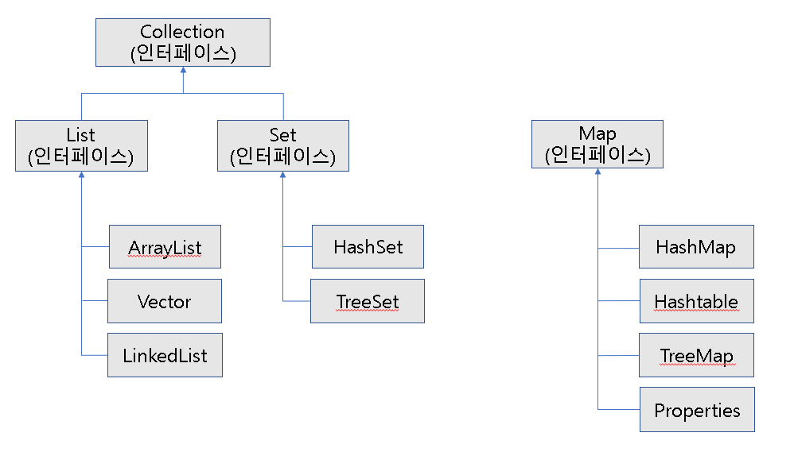
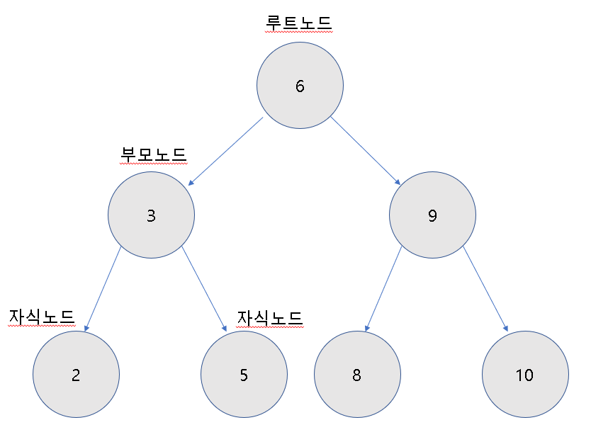

<h1>컬렉션 프레임워크</h1>

​	자료구조를 바탕으로 만들어진 객체들을 효율적으로 추가, 삭제, 검색할 수 있도록 만들어 놓은 것이다.

​	java.util 패키지에 컬렉션 관련 인터페이스와 클래스들이 포함되어 있다.

​	List와 Set은 객체를 추가, 삭제, 검색하는 방법에 많은 공통점이 있기 때문에 이 인터페이스들의 공통된 메소드들만 모아 Collection 인터페이스로 정의해 두었다.

<table>
    <tr>
    	<th colspan="2">인터페이스 분류</th>
        <th>특징</th>
        <th>구현 클래스</th>
    </tr>
    <tr>
    	<td rowspan="2">Collection</td>
    	<td>List</td>
        <td>순서를 유지하고 저장 중복저장가능</td>
        <td>ArrayList, Vector, LinkedList</td>
    </tr>
    <tr>
    	<td>Set</td>
        <td>순서를 유지하지 않고 저장 중복저장 안 됨</td>
        <td>HashSet, TreeSet</td>
    </tr>
    <tr>
    	<td colspan="2">Map</td>
        <td>키와 값의 쌍으로 저장 키는 중복 저장 안 됨</td>
        <td>HashMap, Hashtable, TreeMap, Properties</td>
    </tr>
</table>

<h2>List 컬렉션</h2>

​	객체를 인덱스로 관리한다.

​	인덱스로 검색, 삭제할 수 있는 기능을 제공한다.

~~~java
List<String> list;
list.add("홍길동");
list.add("김자바");
//인덱스로 검색
String str = list.get(1);
//인덱스로 삭제
list.remove(0);
//객체 삭제
list.remove("신용권");
~~~

<h4>ArrayList</h4>

​	List 인터페이스의 구현 클래스로 배열과 비슷하지만 객체를 추가하면, 저장 용량(capacity)가 자동으로 늘어났다가, 객체를 삭제하면 자동으로 줄어든다.

​	빈번한 객체 삭제와 삽입이 일어나는 곳에서는 사용하는 것이 바람직하지 않다.

~~~java
List<String> list = new ArrayList<String>();
//String 객체 30개를 저장할 수 있음
List<String> list = new ArrayList<String>(30);
~~~

~~~java
public class ArrayListClass{
    public static void main(String[] args){
        List<String> list = new ArrayList<>();
        list.add("Java");
        list.add("JDBC");
        list.add(2,"DataBase");
        list.add("iBATIS");
        
        String skill = list.get(2);
        System.out.println("index item 2: "+skill+"\n");
        
        for(int i=0; i<list.size(); i++){
            String str = list.get(i);
            System.out.println(i+":"+str);
        }
        System.out.println();
        
        list.remove(2);
        list.remove(2);
        list.remove("iBATIS");
        
        for(String skill : list)
  			System.out.println(skill);      
    }
}
~~~

~~~java
//고정된 객체들로 구성된 List를 생성할 때
public class ArraysAsListClass{
    public static void main(String[] args){
        List<String> list1 = Arrays.asList("홍길동","김자바","강아지");
        for(String name : list1)
            System.out.println(name);
        
        List<Integer> list2 = Arrays.asList(1,2,3);
        for(int value : list2)
            System.out.println(value);
    }
}
~~~

<h4>Vector</h4>

​	Vector는 ArrayList와 동일한 내부 구조를 가지고 있다.

​	ArrayList와 다른 점은 Vector는 동기화(Synchronized) 메소드로 구성되어있다는 것이다.

​	ArrayList보다 멀티 스레드 환경에서 스레드가 안전(Thread Safe)하게 실행된다.

~~~java
public class Board{
    String subject;
    String content;
    String writer;
    public Board(String subject, String content, String writer){
        this.subject = subject;
        this.content = content;
        this.writer = writer;
    }
}

public class VectorClass{
    public static void main(String[] args){
        List<Board> list = new Vector<>();
        
        for(int i=1; i<=5; i++)
        	list.add(new Board("제목"+i,"내용"+i,"글쓴이"+i));
        list.remove(2);
        list.remove(3);
        
        for(Board board : list)
            System.out.println(board.subject+" "+board.content+" "+board.writer);
    }
}
~~~

<h4>LinkedList</h4>

​	인접 참조를 링크해서 체인처럼 관리한다.

​	특정 인덱스의 객체를 제거하면 앞뒤 링크만 변경된다.

​	중간에 추가 및 삭제할 경우 ArrayList보다 빠르다.

<table>
    <tr>
        <th>구분</th>
        <th>순차적으로 추가/삭제</th>
        <th>중간에 추가/삭제</th>
        <th>검색</th>
    </tr>
    <tr>
    	<td>ArrayList</td>
        <td>빠르다</td>
        <td>느리다</td>
        <td>빠르다</td>
    </tr>
    <tr>
    	<td>LinkedList</td>
        <td>느리다</td>
        <td>빠르다</td>
        <td>느리다</td>
    </tr>
</table>

~~~java
//ArrayList와 LinkedList의 속도 차이
public class ArrayListCompareLinkedList{
    public static void main(String[] args){
        long startTime;
        long endTime;
        
        List<String> list1 = new ArrayList<>();
        List<String> list2 = new LinkedList<>();
        
        startTime = System.nanoTime();
        for(int i=0; i<10000; i++)
            list1.add(0,String.valueOf(i));
        endTime = System.nanoTime();
        System.out.println("ArrayList 걸린시간: "+(endTime-startTime)+" ns");
        
        
        startTime = System.nanoTime();
        for(int i=0; i<10000; i++)
            list2.add(0,String.valueOf(i));
        endTime = System.nanoTime();
        System.out.println("LinkedList 걸린시간: "+(endTime-startTime)+" ns");
    }
}
~~~

<h2>Set 컬렉션</h2>

​	List는 저장 순서를 유지하지만, Set은 저장 순서가 유지 되지 않는다.

​	객체를 중복해서 저장할 수 없고, 하나의 null만 저장이 가능하다.

​	Set컬렉션은 인덱스로 객체를 검색해서 가져오는 메소드가 없기때문에, 반복자(Iterator)를 제공한다.

~~~java
Set<String> set;
set.add("홍길동");
set.add("김자바");
//객체 삭제
set.remove("홍길동");
//반복자 사용하여 객체를 하나씩 얻음
Set<String> set;
Iterator<String> iterator = set.iterator();
//저장된 객체 수만큼 루핑한다.
while(iterator.hasNext()){
    //객체 하나를 가져온다.
    String str = iterator.next();
}
//반복자를 사용하지 않고 향상된 for문으로 가져오는 방법
for(String str : set){}
//반복자로 set컬렉션 객체 삭제하기
while(iterator.hasNext()){
    String str = iterator.next();
    if(str.equals("홍길동"))
        iterator.remove();
}
~~~

<h4>HashSet</h4>

~~~java
public class HashSetClass{
    public static void main(String[] args){
        Set<String> set = new HashSet<>();
        set.add("Java");
        set.add("JDBC");
        set.add("Servlet/JSP");
        //Java는 한번만 저장됨
        set.add("Java");
    	set.add("iBATIS");
		
        Iterator<String> iterator = set.iterator();
        while(iterator.hasNext()){
            String element = iterator.next();
            System.out.println(element);
        }
        set.remove("JDBC");
        set.remove("iBATIS");
        
		for(String skill : set)
            System.out.println(skill);
    }
}
~~~

~~~java
public class Member{
    private String name;
    private String age;
    
    public Member(String name, String age){
        this.name = name;
        this.age = age;
    }
    
    @Override
    public boolean equals(Object obj){
        if(obj instanceof Member){
            Member member = (Member) obj;
            return member.getName().equals(name) && member.getAge().equals(age);
        }else
            return false;
    }
    
    @Override
    public int hashCode(){
        return name.hashCode() + age;
    }
    
    public String getName(){return name;}
    public String getAge(){return age;}
}
public class ObjectHashSetClass{
    public static void main(String[] args){
        Set<Member> set = new HashSet<>();
        set.add(new Member("홍길동",30));
        set.add(new Member("홍길동",30));
    }
}
~~~

<h2>Map 컬렉션</h2>

​	키(key)와 값(value)로 구성된 객체를 저장하는 구조이다.

​	키는 중복 될 수 없지만 값은 중복 될 수 있다. 동일한 키로 값을 저장할 경우 Overrap(덮어쓰기)된다.

~~~java
Map<String, Integer> map;
map.put("홍길동",30);
//객체 검색
int score = map.get("홍길동");
//객체 삭제
map.remove("홍길동");
Map<K, V> map;
Set<K> keySet = map.keySet();
Iterator<K> keyIterator = keySet.iterator();
while(keyIterator.hasNext()){
    K key = keyIterator.next();
    V value = map.get(key);
}
Set<Map.Entry<K,V>> entrySet = map.entrySet();
Iterator<Map.Entry<K,V>> entryIterator = entrySet.iterator();
while(entryIterator.hasNext()){
    Map.Entry<K,V> entry = entryIterator.next();
    K key = entry.getKey();
    V value = entry.getValue();
}
~~~

<h4>HashMap</h4>

​	HashMap의 키로 사용할 객체는 hashCode()와 equals()메소드를 재정의해서 동등 객체가 될 조건을 정해야한다.

~~~java
public class HashMapClass{
    public static void main(String[] args){
        Map<String, Integer> map = new HashMap<>();
        map.put("홍길동",85);
        map.put("동장군",90);
        map.put("김자바",80);
        //홍길동 값 95로 바뀜
        map.put("홍길동",95);
        
        //객체 찾기
        System.out.println("홍길동: "+map.get("홍길동"));
        System.out.println("총 Entry 수: "+map.size());
        System.out.println();
        
        Set<String> ketSet = map.keySet();
        Iterator<String> keyIterator = keySet.iterator();
        while(keyIterator.hasNext()){
            String key = keyIterator.next();
            Integer value = map.get(key);
            System.out.println("\t"+key+":"+value);
        }
        System.out.println();
        
        //객체 삭제
        map.remove("홍길동");
        System.out.println("총 Entry 수: "+map.size());
        
        Set<Map.Entry<String, Integer>> entrySet = map.entrySet();
        Iterator<Map.Entry<String, Integer>> entryIterator = entrySet.iterator();
        while(entryIterator.hasNext()){
            Map.Entry<String, Integer> entry = entryIterator.next();
            String key = entry.getKey();
            Integer value = entry.getValue();
            System.out.println("\t"+key+":"+value);
        }
    }
}
~~~

~~~java
public class Student{
    private int sno;
    private String name;
    
    public Student(int sno, String name){
        this.sno = sno;
        this.name = name;
    }
    public int getSno(){return sno;}
    public String getName(){return name;}
    @Override
    public boolean equals(Object obj){
        if(obj instanceof Student){
            Student student = (Student) obj;
          	return (sno == student.getSno()) && (name.equals(student.getName()));
        }else
            return false;
    }
    @Override
    public int hashCode(){
        return sno + name.hashCode();
    }
}
public class ObjectHashMapClass{
    public static void main(String[] args){
        Map<Student, Integer> map = new HashMap<>();
        map.put(new Student(1,"홍길동"),95);
        //홍길동 값 바뀜
        map.put(new Student(1,"홍길동"),70);
        
        System.out.println("총 Entry 수: "+map.size());
        
        Set<Map.Entry<Student, Integer>> entrySet = map.entrySet();
        Iterator<Map.Entry<Student, Integer>> iterator = entrySet.iterator();
        while(iterator.hasNext()){
            Map.Entry<Student, Integer> entry = iterator.next();
            Student key = entry.getKey();
            Integer value = entry.getValue();
            System.out.println(key+":"+value);
        }
    }
}
~~~

<h4>Hashtable</h4>

​	HashMap과 동일한 구조를 가지고 있다.

​	HashMap과 마찬가지로 hashCode()와 equals()를 재정의해야 한다.

​	HashMap과 차이점은 Hashtable이 동기화(Synchronized) 메소드로 구성되어있다는 것이다.

~~~java
public class HashtableClass{
    public static void main(String[] args){
        Map<String, String> map = new Hashtable<>();

        map.put("spring","12");
        map.put("summer","123");
        map.put("fall","1234");
        map.put("winter","12345");

        Scanner scanner = new Scanner(System.in);
        while(true){
            System.out.println("아이디와 비밀번호를 입력해주세요.");
            System.out.print("아이디: ");
            String id = scanner.nextLine();

            System.out.print("비밀번호: ");
            String password = scanner.nextLine();
            System.out.println();

            if(map.containsKey(id)){
                if (map.get(id).equals(password)){
                    System.out.println("로그인되었습니다.");
                    break;
                }else
                    System.out.println("비밀번호가 일치하지 않습니다.");
            }else
                System.out.println("입력하신 아이디가 존재하지 않습니다.");
        }
    }
}
~~~

<h4>Properties</h4>

​	properties Hashtable의 특징을 그대로 가지고 있다.

​	키와 값을 String 타입으로 제한한다.

​	주로 애플리케이션 정보나, 데이터베이스 연결 정보 등이 저장된 .properties 파일을 읽을 때 사용된다.

~~~properties
driver=oracle.jdbc.OracleDriver
url=jdbc:oracle:thin:@localhost:1521:orcl
uername=scott
password=tiger
~~~

~~~java
public class PropertiesClass{
    public static void main(String[] args) throws Exception{
        Properties properties = new Properties();
        String path = PropertiesClass.class.getResource("database.properties").getPath();
        path = URLDecoder.decode(path,"utf-8");
        properties.load(new FileReader(path));
        
        String driver = properties.getProperty("driver");
        String url = properties.getProperty("url");
        String username = properties.getProperty("username");
        String password = properties.getProperty("password");
        
        System.out.println("driver: "+driver);
        System.out.println("url: "+url);
        System.out.println("username: "+username);
        System.out.println("password: "+password);
        
    }
}
~~~

<h1>검색 기능을 강화시킨 컬렉션</h1>

​	계층적인 구조(Tree 구조)를 가지면서 객체를 저장시킨다.

<h2>이진 트리 구조</h2>

​	6을 기준으로 왼쪽은 작은 값, 오른쪽은 큰 값이 들어간다.

<h4>TreeSet</h4>

​	TreeSet에 객체를 저장하면 자동으로 정렬된다.

​	부모값과 비교하여 낮은 것은 왼쪽 자식 노드, 높은 것은 오른쪽 자식 노드에 저장한다.

~~~java
public class TreeSetClass{
    public static void main(String[] args){
        TreeSet<Integer> scores = new TreeSet<>();
        scores.add(87);
        scores.add(98);
        scores.add(90);
        scores.add(75);
        scores.add(80);
        
        Integer score = null;
        
        score = scores.first();
        System.out.println("가장 낮은 점수: "+score);
        
        score = scores.last();
        System.out.println("가장 높은 점수: "+score);
        
        score = scores.lower(95);
        System.out.println("95점 아래 점수: "+score);
        
        score = scores.higher(95);
        System.out.println("95점 위의 점수: "+score);
        
        score = scores.floor(95);
        System.out.println("95점 이거나, 95 바로 아래 점수: "+score);
        
        score = scores.ceiling(85);
        System.out.println("85점 이거나, 85 바로 위의 점수: "+score);
        
        while(scores.isEmpty()){
            //제일 낮은 객체를 꺼내오고 컬렉션에서 제거함
            score = scores.pollFirst();
            System.out.println("남아 있는 객체 수: "+scores.size()+": "+score);
        }
    }
}
~~~

<h5>TreeSet 정렬</h5>

~~~java
public class TreeSetClass{
    public static void main(String[] args){
        TreeSet<Integer> scores = new TreeSet<>();
        scores.add(87);
        scores.add(98);
        scores.add(75);
        scores.add(95);
        scores.add(80);
        
        //내림차순 정렬
        NavigableSet<Integer> descendingSet = scores.descendingSet();
        for(int score : descendingSet)
            System.out.print(score+" ");
        System.out.println();
        
        //내림차순 정렬된 것을 다시 내림차순으로 정렬시켜, 오름차순 정렬
        NavigableSet<Integer> ascendingSet = descendingSet.descendingSet();
        for(int score : ascendingSet)
            System.out.print(score+" ");
    }
}
~~~

<h5>TreeSet 단어 검색</h5>

~~~java
public class TreeSetClass{
	public static void main(String[] args){
        TreeSet<String> treeSet = new TreeSet<>();
        treeSet.add("apple");
        treeSet.add("forever");
        treeSet.add("description");
        treeSet.add("ever");
        treeSet.add("zoo");
        treeSet.add("base");
        treeSet.add("guess");
        treeSet.add("cherry");

        System.out.println("[c-f 사이의 단어 검색]");
        NavigableSet<String> rangeSet = treeSet.subSet("c",true,"f",true);
        for(String word : rangeSet)
            System.out.println(word);
    }
}
~~~

<h4>TreeMap</h4>

​	키와 값이 저장된 Map.Entry를 저장한다.

​	TreeMap에 객체를 저장하면 자동으로 정렬한다.

​	부모 키 값과 비교하여, 키 값이 낮은 것은 왼쪽 자식노드, 키 값이 높은 것은 오른쪽 자식노드에 저장한다.

~~~java
public class TreeMapClass{
	public static void main(String[] args) {
        TreeMap<Integer, String> scores = new TreeMap<>();
        scores.put(87,"홍길동");
        scores.put(98,"이동수");
        scores.put(75,"박길순");
        scores.put(95,"신용권");
        scores.put(80,"김자바");

        Map.Entry<Integer, String> entry = null;

        entry = scores.firstEntry();
        System.out.println("가장 낮은 점수: "+entry.getKey()+"-"+entry.getValue());

        entry = scores.lastEntry();
        System.out.println("가장 높은 점수: "+entry.getKey()+"-"+entry.getValue());

        entry = scores.lowerEntry(95);
        System.out.println("95점 아래 점수: "+entry.getKey()+"-"+entry.getValue());

        entry = scores.higherEntry(95);
        System.out.println("95점 위의 점수: "+entry.getKey()+"-"+entry.getValue());

        entry = scores.floorEntry(95);
        System.out.println("95점 이거나, 바로 아래 점수: "+
                           entry.getKey()+"-"+entry.getValue());

        entry = scores.ceilingEntry(85);
        System.out.println("85점 이거나, 바로 아래 점수: "+
                           entry.getKey()+"-"+entry.getValue());

        while(!scores.isEmpty()){
            entry = scores.pollFirstEntry();
            System.out.println(entry.getKey()+"-"+
                               entry.getValue()+"(남은 객체 수: "+scores.size()+")");
        }
    }
}
~~~

<h5>TreeMap 정렬</h5>

~~~java
public class TreeMapClass{
    public static void main(String[] args) {
        TreeMap<Integer, String> scores = new TreeMap<>();
        scores.put(87,"홍길동");
        scores.put(98,"이동수");
        scores.put(75,"박길순");
        scores.put(95,"신용권");
        scores.put(80,"김자바");

        NavigableMap<Integer, String> descendingMap = scores.descendingMap();
        Set<Map.Entry<Integer,String>> descendingEntrySet = descendingMap.entrySet();
        for(Map.Entry<Integer, String> entry : descendingEntrySet)
            System.out.print(entry.getKey()+"-"+entry.getValue()+" ");
        System.out.println();

        NavigableMap<Integer, String> ascendingMap = descendingMap.descendingMap();
        Set<Map.Entry<Integer, String>> ascendingEntrySet = ascendingMap.entrySet();
        for(Map.Entry<Integer, String> entry : ascendingEntrySet)
            System.out.print(entry.getKey()+"-"+entry.getValue()+" ");
    }
}
~~~

<h5>TreeMap 단어 검색</h5>

~~~java
public class TreeMapClass{
     public static void main(String[] args) {
        TreeMap<String, Integer> treeMap = new TreeMap<>();
        treeMap.put("apple",10);
        treeMap.put("forever",60);
        treeMap.put("description",40);
        treeMap.put("ever",50);
        treeMap.put("zoo",10);
        treeMap.put("base",20);
        treeMap.put("guess",70);
        treeMap.put("cherry",30);
        
        System.out.println("[c-f 사이의 단어 검색]");
        NavigableMap<String, Integer> rangeMap = treeMap.subMap("c",true,"f",true);
        for (Map.Entry<String, Integer> entry : rangeMap.entrySet())
            System.out.println(entry.getKey()+"-"+entry.getValue()+"페이지");
    }
}
~~~

<h3>Comparable과 Comparator</h3>

​	숫자 일 경우, 값으로 정렬하고, 문자열일 경우, 유니코드로 정렬한다.

~~~java
public class Person implements Comparable<Person>{
    private String name;
    private int age;
    public Person(String name, int age){
        this.name = name;
        this.age = age;
    }
    //오름차순 정렬
    @Override
    public int compareTo(Person o){
        if(age < o.getAge()) return -1;
        else if(age == o.getAge()) return 0;
        else return -1;
    }
    public String getName(){return name;}
    public int getAge(){return age;}
}
public class ComparableClass{
    public static void main(String[] args){
        TreeSet<Person> treeSet = new TreeSet<>();
        treeSet.add(new Person("홍길동",45));
        treeSet.add(new Person("김자바",25));
        treeSet.add(new Person("박지원",31));
        
        Iterator<Person> iterator = treeSet.iterator();
        while(iterator.hasNext()){
            Person person = iterator.next();
            System.out.println(person.getName()+":"+person.getAge());
        }
    }
}
~~~

~~~java
public class Fruit{
    private String name;
    private int price;
    public Fruit(String name, int price){
        this.name = name;
        this.price = price;
    }
    public String getName(){return name;}
    public int getPrice(){return price;}
}

public class DescendingComparator implements Comparator<Fruit>{
    @Override
    public int compare(Fruit o1, Fruit o2){
        if(o1.getPrice() < p2.getPrice()) return 1;
        else if(o1.getPrice() == o2.getPrice()) return 0;
        else return -1;
    }
}
public class ComparatorClass{
    public static void main(String[] args){
        TreeSet<Fruit> treeSet = new TreeSet<>(new DescendingComparator());
        treeSet.add(new Person("딸기",6000));
        treeSet.add(new Person("수박",10000));
        treeSet.add(new Person("포도",3000));
        
        Iterator<Person> iterator = treeSet.iterator();
        while(iterator.hasNext()){
            Person person = iterator.next();
            System.out.println(person.getName()+":"+person.getAge());
        }
    }
}
~~~

<h1>LIFO와 FIFO 컬렉션</h1>

​	LIFO(Last Input First Output) : 스택

​	FIFO(First Input First Output) : 큐

<h3>Stack</h3>

~~~java
public class Coin{
    private int value;
    public Coin(int value){
        this.value = value;
    }
    public int getValue(){return value;}
}
public class StackClass{
    public static void main(String[] args){
        Stack<Coin> coinBox = new Stack<>();
        coinBox.push(new Coin(100));
        coinBox.push(new Coin(50));
        coinBox.push(new Coin(500));
        coinBox.push(new Coin(10));
        
        while(!coinBox.isEmpty()){
            //스택의 맨위 객체를 가져오고 제거함
            Coin coin = coinBox.pop(); //peek() : 맨위 객체 가져오고, 제거하지는 않음
            System.out.println("꺼내온 동전 : "+coin.getValue()+" 원");
        }
    }
}
~~~

<h3>Queue</h3>

​	Queue 인터페이스를 구현한 대표적 클래스는 LinkedList이다.

~~~java
public class Message{
    private String command;
    private String to;
    public Message(String command, String to){
        this.command = command;
        this.to = to;
    }
    public String getCommand(){return command;}
    public String getTo(){return to;}
}
public class QueueClass{
    public static void main(String[] args){
        Queue<Message> messageQueue = new LinkedList<>();
        
        messageQueue.offer(new Message("sendMail","홍길동"));
        messageQueue.offer(new Message("sendSMS","김자바"));
        messageQueue.offer(new Message("sendKakao","홍두께"));
    		
       	while(!messageQueue.isEmpty()){
            Message message = messageQueue.poll();
            switch(message.getCommand()){
                case "sendMail":
                    System.out.println(message.getTo()+"님에게 메일을 보냅니다.");
                    break;
                case "sendSMS":
					System.out.println(message.getTo()+"님에게 SMS을 보냅니다.");
                    break;
                case "sendKakaotalk":
                    System.out.println(message.getTo()+"님에게 카카오톡을 보냅니다.");
                    break;
            }
        }
    }
}
~~~

<h1>동기화된 컬렉션</h1>

​	HashMap, ArrayList, HashSet를 멀티 스레드에서 사용시, 동기화시키기위한 목적이다.

​	Collections.synchronized...() 메소드를 사용한다.

~~~java
List<T> list = Collections.synchronizedList(new ArrayList<T>());
Set<T> set = Collections.synchronizedList(new HashSet<T>()));
Map<K,V> map = Collections.synchronizedList(new HashMap<K,V>()));
~~~

<h1>병렬 처리를 위한 컬렉션</h1>

​	하나의 스레드가 요소를 처리할 때 전체 잠금이 발생하여 다른 스레드는 대기 상태가 된다.

​	전체적으로 처리 속도가 늦어진다.

​	java.util.concurrent 패키지에 포함되어있다.

~~~java
Map<K,V> map = new ConcurrentHashMap<K,V>();
Queue<E> queue = new ConcurrentLinkedQueue<E>();
~~~

