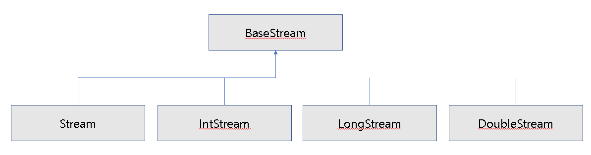

<h1>스트림</h1>

​	람다식으로 처리할 수 있도록 해주는 반복자이다.

<h3>반복자 스트림</h3>

​	컬렉션요소를 순차적으로 처리하기 위해 Iterator대신 사용한다.

~~~java
public class StreamClass{
    public static void main(String[] args){
        List<String> list = Arrays.asList("홍길동","김자바","강아지");
        Iterator iterator = list.iterator();
        while(iterator.hasNext()){
            String name = iterator.next();
            System.out.println(name);
        }
        System.out.println();
        
        Stream stream = list.stream();
        stream.forEach(name->System.out.println(name));
    }
}
~~~

<h3>스트림의 특징</h3>

​	병렬 처리가 쉽다는 것이다.

<h5>람다식으로 요소 처리 코드를 제공한다.</h5>

~~~java
public class Student{
    private String name;
    private int score;
    public Student(String name, int score){
        this.name = name;
        this.score = score;
    }
    public String getName(){return name;}
    public int getScore(){return score;}
}
public class LambdaExpressClass{
    public static void main(String[] args){
        List<Student> list = Arrays.asList(
        	new	Student("홍길동",96),
            new Student("김자바",86)
        );
        Stream<Student> stream = list.stream();
        stream.forEach(s->{
        	String name = s.getName();
            int score = s.getScore();
            System.out.println(name+"-"+score);
        });
    }
}
~~~

<h5>내부 반복자를 사용하므로 병렬 처리가 쉽다.</h5>

​	외부반복자 :  개발자가 코드로 직접 컬렉션 요소를 반복해서 가져오는 코드를 말한다.

​	내부반복자 :  컬렉션 내부에서 요소들을 반복시키고, 개발자는 요소당 처리해야 할 코드만 제공하는 코드패턴이다.

<dl>
    <dt>순차처리</dt>
    <dd>하나의 스레드가 요소들을 순차적으로 읽어 합을 구한다.</dd>
    <dt>병렬처리</dt>
    <dd>여러 개의 스레드가 요소들을 부분적으로 합하고, 이 부분합을 최종 결합해서 전체 합을 생성한다.	</dd>
</dl>

~~~java
public class ParallelClass{
    public static void main(String[] args){
        List<String> list = Arrays.asList(
        	"홍길동", "김자바", "람다식",
            "강아지", "박병렬"
        );
        //순차 처리
        Stream<String> stream = list.stream();
        stream.forEach(ParallelClass :: print);
        System.out.println();
        
        //병렬 처리
        Stream<String> parallelStream = list.parallelStream();
        parallelStream.forEach(ParallelClass :: print);
    }
    public static void print(String str){
        System.out.println(str+" : "+Thread.currentThread().getName());
    }
}
~~~

<h5>스트림은 중간 처리와 최종 처리를 할 수 있다.</h5>

​	중간 처리에는 매핑, 필터링, 정렬을 수행한다.

​	최종 처리에는 반복, 카운팅, 평균, 총합 등의 집계 처리를 수행한다.

~~~java
public class Student{
    private String name;
    private int score;
    public Student(String name, int score){
        this.name = name;
        this.score = score;
    }
}

public class MapAndReduceClass{
    public static void main(String[] args){
        List<Student> list = Arrays.asList(
        	new Student("홍길동",10),
            new Student("김바자",20),
            new Student("유미선",30)
        );
        
       	double avg = list.stream()
            .mapToInt(Student :: getScore)
            .average()
            .getAsDouble();
        System.out.println("평균 점수 : "+avg);
    }
}
~~~

<h1>스트림의 종류</h1>

<h3>컬렉션으로부터 스트림 얻기</h3>

~~~java
public class Student{
    private String name;
    private int score;
    public Student(String name, int score){
        this.name = name;
        this.score = score;
    }
    public String getName(){return name;}
    public int getScore(){return score;}
}
public class FromCollectionClass{
    public static void main(String[] args){
        List<Student> list = Arrays.asList(
        	new Student("홍길동",10),
            new Student("김자바",20),
            new Student("유미선",30)
        );
        Stream<Student> stream = list.stream();
        stream.forEach(s->System.out.println(s.getName()));
    }
}
~~~

<h3>배열로부터 스트림 얻기</h3>

~~~java
public class FromArrayClass{
    public static void main(String[] args){
        String strArray[] = {"홍길동","김자바","김이나"};
        Stream strStream = Arrays.stream(strArray);
        strStream.forEach(s->System.out.print(s+","));
        System.out.println();
        
        int intArray[] = {1,2,3,4,5};
        Stream intStream = Arrays.stream(intArray);
        intStream.forEach(s->System.out.print(s+","));
    }
}
~~~

<h3>숫자 범위로부터 스트림 얻기</h3>

~~~java
public class FromIntRangeClass{
    public static int sum;
    
    public static void main(String[] args){
        IntStream stream = IntStream.rangeClosed(1,100);
        stream.forEach(s->sum+=s);
        System.out.println("총합 : "+sum);
    }
}
~~~

<h3>파일로부터 스트림 얻기</h3>

~~~java
public class FromFileContentClass{
    public static void main(String[] args) throws IOException{
        Path path = Paths.get("src/file/linedata.txt");
        Stream<String> stream;
        
        stream = Files.lines(path, Charset.defaultCharset());
        stream.forEach(System.out :: println);
        System.out.println();
        
        /*File file = path.toFile();
        FileReader fileReader = new FileReader(file);
        BufferedReader br = new BufferedReader(fileReader);
        stream = br.lines();
        stream.forEach(System.out :: println);*/
    }
}
~~~

<h3>디렉토리로부터 스트림 얻기</h3>

~~~java
public class FromDirectoryClass{
    public static void main(String[] args){
        Path path = Paths.get("C:/test/src");
        Stream<Path> stream = files.list(path);
        stream.forEach(p->System.out.println(p.getFileName()));
    }
}
~~~

<h1>스트림 파이프라인</h1>

​	대량의 데이터를 가공해서 축소하는 것을 리덕션이라고 한다.

​	데이터의 합계, 카운팅, 최대값, 최소값 등이 대표적인 리덕션의 결과물이다.

<h3>중간 처리와 최종처리</h3>

​	최종처리가 시작되기 전까지 중간처리는 지연된다.

~~~java
public class Member{
    public static int MALE = 0;
    public static int FEMALE = 1;
    
    private String name;
    private int gender;
    private int age;
    
    public Member(String name, int gender, int age){
        this.name = name;
        this.gender = gender;
        this.age = age;
    }
    public String getName(){return name;}
    public int getGender(){return gender;}
    public int getAge(){return age;}
}
public class StreamPipelineClass{
    public static void main(String[] args){
        List<Member> list = Arrays.asList(
        	new Member("홍길동",Member.MALE,30),
            new Member("김자바",Member.MALE,27),
            new Member("김이나",Member.FEMALE,32),
            new Member("유수정",Member.FEMALE,25)
        );
        
        double ageAvg = list.strema() //오리지날 스트림
            .filter(m -> m.getGender() == Member.MALE) //중간처리 스트림
            .mapToInt(Member :: getAge)//중간 처리 스트림
            .average()//최종처리 스트림
            .getAsDouble();
    }
}
~~~

<h2>중간 처리 메소드와 최종 처리 메소드</h2>

<h3>필터링(distinct(), filter())</h3>

​	중간 처리 기능으로 요소를 걸러내는 역활을 한다.

<table>
    <tr>
    	<th>리턴 타입</th>
        <th>메소드(매개변수)</th>
        <th>설명</th>
    </tr>
    <tr>
    	<td rowspan="5">Stream IntStream LongStream DoubleStream</td>
        <td>distinct()</td>
        <td>중복제거</td>
    </tr>
    <tr>
    	<td>filter(Predicate)</td>
        <td rowspan="4">조건 필터링</td>
    </tr>
    <tr>
    	<td>filter(IntPredicate)</td>
    </tr>
    <tr>
    	<td>filter(LongPredicate)</td>
    </tr>
    <tr>
    	<td>filter(DoublePredicate)</td>
    </tr>
</table>

~~~java
public class FilteringClass{
    public static void main(String[] args){
        List<String> names = Arrays.asList("김자바","김이나","신철민","김자바","이자바");
        
        //중복제거
        names.stream()
            .distinct()
            .forEach(n->System.out.println(n));
        System.out.println();
        
        //필터링
        names.stream()
            .filter(n -> n.startWith("김"))
            .forEach(System.out::println);
        System.out.println();
        
        //중복제거와 필터링
        names.stream()
            .distinct()
            .filter(n->n.startWith("김"))
            .forEach(System.out::println);
    }
}
~~~

<h3>매핑(flatMapXXX(), mapXXX(), asXXXStream(), boxed())</h3>

​	매핑은 중간 처리 기능으로 스트림의 요소를 다른 요소로 대체해는 작업을 한다.

<h5>flatMapXXX() 메소드</h5>

~~~java
public class FlatMapClass{
    public static void main(String[] args){
        List<String> list1 = Arrays.asList("java8 lambda","stream mapping");
        list1.stream()
            .flatMap(data -> Arrays.stream(data.split(" ")))
            .forEach(System.out :: println);
        System.out.println();
        
        List<String> list2 = Arrays.asList("10, 20, 30","40, 50, 60");
        list2.stream()
            .flatMap(data -> {
               	String[] strArr = data.split(",");
               	int[] intArr = new int[strArr.length];
                for(int i=0; i<intArr.length; i++)
                    intArr = Integer.parseInt(strArr[i].trim());
                return Arrays.stream(intArr);
            })
            .forEach(System.out :: println);
    }
}
~~~

<h5>mapXXX() 메소드</h5>

~~~java
public class Student{
    private String name;
    private int score;
    public Student(String name, int score){
        this.name = name;
        this.score = score;
    }
    public String getName(){return name;}
    public int getScore(){return score;}
}
public class MapClass{
    public static void main(String[] args){
        List<Student> list = Arrays.asList(
        	new Student("홍길동",10),
            new Student("김자바",20),
            new Student("김이나",30)
        );
        list.stream()
            .mapToInt(Student :: getScore)
            .forEach(System.out :: println);
    }
}
~~~

<h5>asDoubleStream(), asLongStream(), boxed() 메소드</h5>

~~~java
public class AsDoubleStreamAndBoxedClass{
    public static void main(String[] args){
        int[] intArray = {1,2,3,4,5};
        IntStream intStream = Arrays.stream(intArray);
        
        intStream
            .asDoubleStream()
            .forEach(System.out :: println);
        System.out.println();
        
        intStream
            .boxed()
            .forEach(System.out :: println);
    }
}
~~~

<h3>정렬(sorted())</h3>

​	정렬은 중간 처리 기능이며, 스트림의 요소를 정렬하는 역활을 한다.

~~~java
public class Student implements Comparable<Student>{
    private String name;
    private int score;
    
    public Student(String name, int score){
        this.name = name;
        this.score = score;
    }
    public String getName(){return name;}
    public int getScore(){return score;}
    public int compareTo(Student o){
        return Integer.compare(score,o.getScore());
    }
}
public class SortedClass{
    public static void main(String[] args){
        IntStream intStream = Arrays.stream(new int[]{5,3,2,1,4});
        intStream.stream()
            .sorted()
            .forEach(System.out :: println);
        System.out.println();
        
        List<Student> list = Arrays.asList(
        	new Student("홍길동",30),
            new Student("김자바",20),
            new Student("김이나",10)
        );
        list.stream()
            .sorted()
            .forEach(s -> System.out.println(s.getScore()));
        System.out.println();
        
        //내림차순으로 정리
        list.stream()
            .sorted(Comparator.reverseOrder())
            .forEach(s -> System.out.println(s.getScore()));
    }
}
~~~

<h3>루핑(peek(), forEach())</h3>

​	루핑은 요소 전체를 반복하는 것을 말한다.

​	peek()와 forEach()기능은 동일하나, peek()는 중간처리 기능, forEach()는 최종처리 기능이다.

~~~java
public class PeekAndForEachClass{
    public static void main(String[] args){
        int[] intArr = {1,2,3,4,5};
        //peek()를 마지막에 호출한 경우
        Arrays.stream(intArr)
            .filter(a -> a%2 == 0)
            .peek(System.out :: println);
        //최종 처리 메소드를 마지막에 호출한 경우
        int total = Arrays.stream(intArr)
            .filter(a -> a%2 == 0)
            .peek(System.out :: println)
            .sum();
        System.out.println("총합 : "+total);
        //forEach를 마지막에 호출한 경우
        Arrays.stream(intArr)
            .filter(a -> a%2 == 0)
            .forEach(System.out :: println);
    }
}
~~~

<h2>최종 처리 기능 메소드</h2>

<h3>매칭(allMatch(), anyMatch(), noneMatch())</h3>

​	최종 처리 기능 메소드이다.

​	요소들이 특정 조건에 만족하는 지를 검사할 수 있다.

<table>
    <tr>
    	<td>allMatch()</td>
        <td>모든 요소들이 매개값으로 주어진 Predicate의 조건을 만족하는지 조사한다.</td>
    </tr>
    <tr>
    	<td>anyMatch()</td>
        <td>최소한 한개의 요소가 매개값으로 주어진 Predicate의 조건을 만족하는지 조사한다.</td>
    </tr>
    <tr>
        <td>noneMatch()</td>
        <td>모든 요소들이 매개값으로 주어진 Predicate의 조건을 만족하지 않는지 조사한다.</td>
    </tr>
</table>

~~~java
public class StreamMatchClass{
    public static void main(String[] args){
        int[] intArr = {2,4,6};
        
        boolean result = Arrays.stream(intArr)
            .allMatch(a -> a%2 == 0);
        System.out.println("intArr의 요소들은 모두 2의 배수인가? "+result);
        
        result = Arrays.stream(intArr)
            .anyMatch(a -> a%2 == 0);
        System.out.println("intArr의 요소 중 하나라도 2의 배수가 있는가? "+result);
        
        result = Arrays.stream(intArr)
            .noneMatch(a -> a%3 == 0);
        System.out.println("intArr의 요소 중 3의 배수가 없는가? "+result);
    }
}
~~~

<h3>기본 집계(sum(), count(), average(), max(), min())</h3>

​	최종 처리 기능 메소드이다.

<table>
    <tr>
    	<th>리턴 타입</th>
        <th>메소드(매개 변수)</th>
        <th>설명</th>
    </tr>
    <tr>
    	<td>long</td>
        <td>count()</td>
        <td>요소 개수</td>
    </tr>
    <tr>
        <td>OptionalXXX</td>
        <td>findFirst()</td>
        <td>첫 번째 요소</td>
    </tr>
    <tr>
    	<td>Optional&lt;T&gt; OptionalXXX</td>
        <td>max(Comparator&lt;T&gt;) max()</td>
        <td>최대 요소</td>
    </tr>
    <tr>
    	<td>Optional&lt;T&gt; OptionalXXX</td>
        <td>min(Comparator&lt;T&gt;) min()</td>
        <td>최소 요소</td>
    </tr>
    <tr>
    	<td>OptionalDouble</td>
        <td>average()</td>
        <td>요소 평균</td>
    </tr>
    <tr>
    	<td>int, long, double</td>
    	<td>sum()</td>
        <td>요소 총합</td>
    </tr>
</table>

~~~java
public class AggregateClass{
    public static void main(String[] args){
        int[] intArr = {1,2,3,4,5};
        
        long count = Arrays.stream(intArr)
            .filter(a->a%2 == 0)
            .count();
        System.out.println("2의 배수의 갯수 : "+count);
        
        long sum = Arrays.stream(intArr)
            .filter(a->a%2 == 0)
            .sum();
        System.out.println("2의 배수의 총합 : "+sum);
        
        double avg = Arrays.stream(intArr)
            .filter(a -> a%2 == 0)
            .average()
            .getAsDouble();
        System.out.println("2의 배수의 평균 : "+avg);
        
        int max = Arrays.stream(intArr)
            .filter(a -> a%2 == 0)
            .max()
            .getAsInt();
        System.out.println("2의 배수 최대값 : "+max);
        
        int min = Arrays.stream(intArr)
            .filter(a -> a%2 == 0)
            .min()
            .getAsInt();
        System.out.println("2의 배수 최소값 : "+min);
        
        int first = Arrays.stream(intArr)
            .filter(a -> a%2 == 0)
            .findFirst()
            .getAsInt();
        System.out.println("첫번째 2의 배수 값 : "+first);
    }
}
~~~

<h2>Optional 클래스</h2>

​	Optional 클래스는 집계 값을 저장할 뿐 아니라, 집계 값이 없을 경우 디폴드 값을 설정 할 수 있다. 또한 집계 값을 처리하는 Consumer도 등록할 수 있다.

<table>
    <tr>
        <th>리턴 타입</th>
        <th>메소드(매개 변수)</th>
        <th>설명</th>
    </tr>
    <tr>
    	<td>boolean</td>
        <td>isPresent()</td>
        <td>값이 저장되어 있는지 여부</td>
    </tr>
    <tr>
    	<td>T double int long</td>
        <td>orElse(&lt;T&gt;) orElse(double) orElse(int) orElse(long)</td>
        <td>값이 저장되어 있지 않을 경우 디폴트 값 지정</td>
    </tr>
    <tr>
    	<td>void</td>
        <td>
            ifPresent(Consumer) ifPresent(DoubleConsumer) 
            ifPresent(IntConsumer) ifPresent(LongConsumer)
        </td>
        <td>값이 저장되어 있을 경우 Consumer에서 처리</td>
    </tr>
</table>

~~~java
public class OptionalClass{
    public static void main(String[] args){
        List<Integer> list = new ArrayList<>();
        //오류 발생(예외 : java.util.NoSuchElementException)
        /*
        double avg = list.stream()
        	.mapToInt(Integer :: intValue)
        	.average()
        	.getAsDouble()
        */
        
        //방법 1
        OptionalDouble optional = list.stream()
            .mapToInt(Integer :: intValue)
            .average();
        if(optional.isPresent())
            System.out.println("방법1_평균 : "+optional.getAsDouble());
        else
            System.out.println("방법1_평균 : 0.0");
        
        //방법 2
        double avg = list.stream()
            .mapToInt(Integer :: intValue)
            .average()
            .orElse(0.0);
        System.out.println("방법2_평균 : "+avg);
        
        //방법 3
        list.stream()
            .mapToInt(Integer :: intValue)
            .average()
            .ifPresent(s -> System.out.println("방법3_평균 : "+s));
    }
}
~~~

<h3>커스텀 집계(reduce())</h3>

​	프로그램화해서 다양한 집계 결과물을 만들 수 있도록 reduce() 메소드도 제공한다.

~~~java
public class Student{
    private String name;
    private int score;
    public Student(String name, int score){
        this.name = name;
        this.score = score;
    }
    public String getName(){return name;}
    public int getScore(){return score;}
}

public class ReduceClass{
    public static void main(String[] args){
        List<Student> list = Arrays.asList(
        	new Student("홍길동",92),
            new Student("김자바",95),
            new Student("김이나",88)
        );
        
        int sum1 = list.stream()
            .mapToInt(Integer :: intValue)
            .sum();
        
        int sum2 = list.stream()
            .map(Student :: getScore)
            .reduce((a,b) -> a+b)
            .get();
        
        int sum3 = list.stream()
            .map(Student :: getScore)
            .reduce(0, (a,b) -> a+b);
        
        System.out.println("sum1 : "+sum1);
        System.out.println("sum2 : "+sum2);
        System.out.println("sum3 : "+sum3);
    }
}
~~~

<h2>수집(collect())</h2>

​	필요한 요소만 컬렉션으로 담을 수 있고, 요소들을 그룹핑한 후 집계(리덕션)을 할 수 있다.

<h3>필터링한 요소 수집</h3>

~~~java
public class Student{
    public enum Gender{MALE,FEMALE}
    private String name;
    private int score;
    private Gender gender;
    public Student(String name, int score, Gender gender){
        this.name = name;
        this.score = score;
        this.gender = gender;
    }
    public String getName(){return name;}
    public int getScore(){return score;}
    public Gender getGender(){return gender;}
}
public class ToCollectionClass{
    public static void main(String[] args){
        List<Student> list = Arrays.asList(
        	new Student("홍길동",10,Student.Gender.MALE),
            new Student("김이나",6,Student.Gender.FEMALE),
           	new Student("김수애",6,Student.Gender.FEMALE),
            new Student("박수홍",10,Student.MALE)
        );
        
        List<Student> maleList = list.stream()
            .filter(s -> s.getGender().equals(Student.Gender.MALE))
            .collect(Collectors.toList());
        maleList.stream().forEach(s->System.out.pritln(s.getName()));
        
        Set<Student> femaleList = list.stream()
            .filter(s -> s.getGender().equals(Student.Gender.FEMALE))
            .collect(Collectors.toSet());
        femaleList.stream().forEach(s->System.out.println(s.getName()));
    }
}
~~~

<h3>사용자 정의 컨테이너에 수집하기</h3>

~~~java
public class Student{
    public enum Gender{MALE,FEMALE}
    private String name;
    private int score;
    private Gender gender;
    public Student(String name, int score, Gender gender){
        this.name = name;
        this.score = score;
        this.gender = gender;
    }
    public String getName(){return name;}
    public int getScore(){return score;}
    public Gender getGender(){return gender;}
}

public class MaleStudent{
    private List<Student> list;
    
    public MaleStudent(Student student){
        list = new ArrayList<>();
        System.out.println("["+Thread.currentThread().getName()+"] MaleStudent()");
    }
    
    public void accumulate(Student student){
        list.add(student);
        System.out.println("["+Thread.currentThread().getName()+"] accumulate()");
    }
    
    public void combine(MaleStudent other){
        list.addAll(other);
        System.out.println("["+Thread.currentThread().getName()+"] combine()");
    }    
    
    public List<Student> getList(){return list;}
}

public class MainClass{
    public static void main(String[] args){
        List<Student> list = Arrays.asList(
        	new Student("홍길동",10,Student.Gender.MALE),
            new Student("김수애",6,Student.Gender.FEMALE),
            new Student("박수미",6,Student.Gender.FEMALE),
            new Student("김수홍",10,Student.Gender.MALE)
        );
        
        MaleStudent maleStudent = list.stream()
            .filter(s->s.getGender().equals(Student.Gender.MALE))
            .collect(MaleStudent::new, MaleStudent::accumulate, MaleStudent::combine);
        
        maleStudent.getList().stream()
            .forEach(s->System.out.println(s.getName()));
    }
}
~~~

<h3>요소를 그룹핑 하기</h3>

​	요소를 그룹핑하여 Map 컬렉션의 형태로 반환한다.

​	Collectors.groupingBy() 또는 Collectors.groupingByConcurrent() 를 사용한다.

​	Collectors.groupingByConcurrent()는 스레드 안전을 보장한다.

~~~java
public class Student{
    public enum Gender{MALE, FEMALE}
    public enum City{Seoul,Pusan}
    private String name;
    private int score;
    private Gender gender;
    private City city;
    public Student(String name, int score, Gender gender, City city){
        this.name = name;
        this.score = score;
        this.gender = gender;
        this.city = city;
    }
    public String getName(){return name;}
    public int getScore(){return score;}
    public Gender getGedner(){return gender;}
    public City getCity(){return city;}
}

public class GroupingByClass{
    public static void main(String[] args){
        List<Student> list = Arrays.asList(
        	new Student("홍길동",10,Student.Gender.MALE, Student.City.Seoul),
            new Student("김수아",6,Student.Gender.FEMALE, Student.City.Pusan),
            new Student("김홍수",10,Student.Gender.MALE, Student.City.Pusan),
            new Student("박수미",6,Student.Gender.FEMALE, Student.City.Seoul)
        );
        
        Map<Student.Gender, List<Student>> mapByGenders = list.stream()
            .collect(Collectors.groupingBy(Student :: getGender));
        
        System.out.println("[남학생]");
        mapByGender.get(Student.Gender.MALE).stream()
            .forEach(s->System.out.println(s.getName()));
        
        System.out.println("[여학생]");
        mapByGender.get(Student.Gender.FEMALE).stream()
            .forEach(s->System.out.println(s.getName()));
        System.out.println();
        
        Map<Student.City, List<Student>> mapByCity = list.stream()
            .collect(
        		Collectors.groupBy(
                	Student :: getCity,
                    Collectors.mapping(Student :: getName, Collectors.toList())
                );
        	);
        
        System.out.println("[서울]");
        mapByCity.get(Student.City.Seoul).stream().forEach(System.out :: println);
        
        System.out.println("[부산]");
        mapByCity.get(Student.City.Pusan).stream().forEach(System.out :: println);
    }
}
~~~

<h3>그룹핑 후 매핑 및 집계</h3>

​	Collectors.groupBy() 메소드는 그룹핑 후, 매핑이나 리덕션이가능하다.

~~~java
public class GroupByAndReductionClass{
    public static void main(String[] args){
        List<Student> list = Arrays.asList(
        	new Student("홍길동",10,Student.Gender.MALE),
            new Student("김수아",6,Student.Gender.FEMALE),
            new Student("김홍수",10,Student.Gender.MALE),
            new Student("박수미",6,Student.Gender.FEMALE)
        );
        
        Map<Student.Gender, Double> mapByGender = list.stream()
            .collect(Collectors.groupingBy(
            	Student :: getGender,
                Collectors.averagingDouble(Student::getScore)
            ));
        
        System.out.println("남학생 평균 점수 : "+mapByGender.get(Student.Gender.MALE));
        System.out.println("여학생 평균 점수 : "+mapByGender.get(Student.Gender.FEMALE));
        
        Map<Student.Gender, String> mapByName = list.stream()
            .collect(Collectors.groupingBy(
            	Student :: getGender,
                Collectors.mapping(
                	Student :: getName,
                    Collectors.joining(",")
                );
            ));
        
        System.out.println("남학생 전체 이름 : "+mapByGender.get(Student.Gender.MALE));
        System.out.println("여학생 전체 이름 : "+mapByGender.get(Student.Gender.FEMALE));s
    }
}
~~~

<h1>병렬 처리</h1>

​	멀티 코어 환경에서 하나의 작업을 분할하여 병렬적으로 처리하기 것이다.

<h2>동시성(Concurrency)과 병렬성(Parallelism)</h2>

<dl>
    <dt>동시성</dt>
    <dd>멀티 작업을 위해 멀티 스레드로 번갈아가며 작업하는 것</dd>
    <dt>병렬성</dt>
    <dd>멀티 작업을 위해 멀티 코어를 이용하여 동시에 실행하는 것</dd>
</dl>

<h3>데이터 병렬성</h3>

​	코어 만큼 데이터를 쪼개어 병렬처리를 하여 작업을 빨리 끝내는 것이다.

<h3>작업 병렬성</h3>

​	서로 다른 작업을 병렬 처리하는 것이다. 대표적인 예로 웹 서버가 있다.

<h2>포크조인(ForkJoin) 프레임 워크</h2>

​	병렬 스트림은 병렬 처리를 하기 위해 포크조인 프레임워크를 사용한다.

​	포크 조인 프레임워크는 Divide And Conquer의 알고리즘과 비슷하다.

<h3>병렬 스트림 생성</h3>

~~~java
public class Student{
    public enum Gender{MALE,FEMALE}
    private String name;
    private int score;
    private Gender gender;
    public Student(String name, int score, Gender gender){
        this.name = name;
        this.score = score;
        this.gender = gender;
    }
    public String getName(){return name;}
    public int getScore(){return score;}
    public Gender getGender(){return gender;}
}
public class MaleStudent{
    private List<Student> list;
    public MaleStudent(Student student){
        list = new ArrayList<>();
        System.out.println("["+Thread.currentThread().getName()+"] MaleStudent()");
    }
    
    public void accumulate(Student student){
        list.add(student);
        System.out.println("["+Thread.currentThread().getName()+"] accumulate()");
    }
    
    public void combine(MaleStudent other){
        list.addAll(other);
        System.out.println("["+Thread.currentThread().getName()+"] combine()");
    }    
    
    public List<Student> getList(){return list;}
}
public class PelleilStreamClass{
    public static void main(String[] args){
        List<Student> list = Arrays.asList(
        	new Student("홍길동",10,Student.Gender.MALE),
            new Student("김수아",6,Student.Gender.FEMALE),
            new Student("김홍수",10,Student.Gender.MALE),
            new Student("박수미",6,Student.Gender.FEMALE)
        );
        
        MaleStudent maleStudent = list.stream()
            .filter(s->s.getGender().equals(Student.Gender.MALE))
            .collect(MaleStudent::new, MaleStudent::accumulate, MaleStudent::combine);
        
        maleStudent.getList().stream()
            .forEach(s->System.out.println(s.getName()));
    }
}
~~~

<h2>병렬 처리 성능</h2>

​	병렬처리 스트림은 3가지 요인을 잘 살펴봐야한다.

<dl>
    <dt><b>1. 요소의 수와 요소당 처리 시간</b></dt>
    <dd>컬렉션 요소 수가 적고, 요소당 처리 시간이 짧으면 순차처리가 더 빠를 수 있다.</dd>
    <dt><b>2. 스트림 소스의 종류</b></dt>
    <dd>ArrayList, 배열은 병렬 처리 시간이 절약된다. 반면 HashSet, TreeSet, LinkedList는 병렬 처리 시간이 느리다.</dd>
    <dt><b>3. 코어(Core)의 수</b></dt>
    <dd>싱글 코어 일 경우 순차 처리가 빠르다. 코어 수가 많을 수록 병렬 작업 처리 속도는 빨라진다.</dd>
</dl>

~~~java
public class SequenceAndParallel{
     public static void work(int value){
        try{Thread.sleep(100);}catch (InterruptedException e){}
    }

    public static long testSquencial(List<Integer> list){
        long start = System.nanoTime();
        list.stream().forEach(a -> work(a));
        long end = System.nanoTime();
        long runTime = end = start;
        return runTime;
    }

    public static long testParallel(List<Integer> list){
        long start = System.nanoTime();
        list.stream().parallel().forEach(a->work(a));
        long end = System.nanoTime();
        long runTime = end - start;
        return runTime;
    }

    public static void main(String[] args) {
        List<Integer> list = Arrays.asList(0,1,2,3,4,5,6,7,8,9);

        long timeSequencial = testSquencial(list);
        long timeParallel = testParallel(list);

        if(timeSequencial < timeParallel)
            System.out.println("성능 테스트 결과 : 순차 처리가 더 빠름");
        else
            System.out.println("성능 테스트 결과 : 병렬 처리가 더 빠름");
    }
}
~~~

~~~java
public class ArrayListVsLinkedListClass{
    public static void work(int value){}

    public static long testParallel(List<Integer> list){
        long start = System.nanoTime();
        list.stream().parallel().forEach(a->work(a));
        long end = System.nanoTime();
        long runTime = end - start;
        return runTime;
    }

    public static void main(String[] args) {
        List<Integer> arrayList = new ArrayList<>();
        List<Integer> linkedList = new LinkedList<>();
        for(int i=0; i<100000; i++){
            arrayList.add(i);
            linkedList.add(i);
        }

        long arrayListParallel = testParallel(arrayList);
        long linkedListParallel = testParallel(linkedList);

        arrayListParallel = testParallel(arrayList);
        linkedListParallel = testParallel(linkedList);

        if(arrayListParallel < linkedListParallel)
            System.out.println("성능 테스트 결과 : ArrayList 처리가 더 빠름");
        else
            System.out.println("성능 테스트 결과 : LinkedList 처리가 더 빠름");
    }
}
~~~

