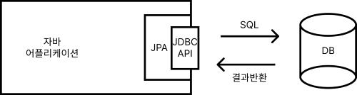
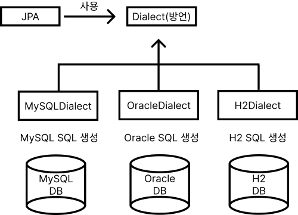

# JPA란 무엇인가?[★★★★★]

자바 진영의 **ORM 기술 표준**이다. 

**JPA란 어플리케이션과 JDBC API 사이에 있는 접점 :: 인터페이스(Interface)**

### ORM은 무엇인가?

ORM(Object-Relational Mapping) : **객체와 관계형 데이터베이스를 매핑한다.**

### 벤더(유통업체?) 독립성

방언을 통해서 MySQL, Oracle, H2 SQL문법을 자동으로 작성해준다.

