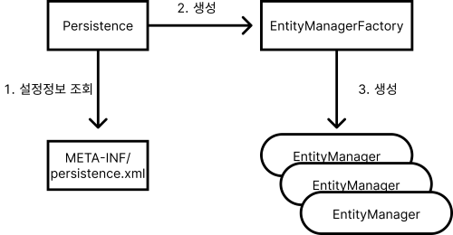

# 객체매핑

### 어노테이션 설명

| 어노테이션명 | 설명 |
| --- | --- |
| `@Entity` | 테이블과 매핑한다고 JPA에게 알려줌 :: 엔티티클래스 |
| `@Table` | 매핑할 테이블 정보를 알려줌 |
| `@Id` | 엔티티 클래스의 필드를 테이블의 기본 키(PK)에 매핑함 |
| `@Column` | 엔티티 클래스의 필드를 테이블의 컬럼이랑 매핑함 |

### 엔티티 매니저 [★★★]

