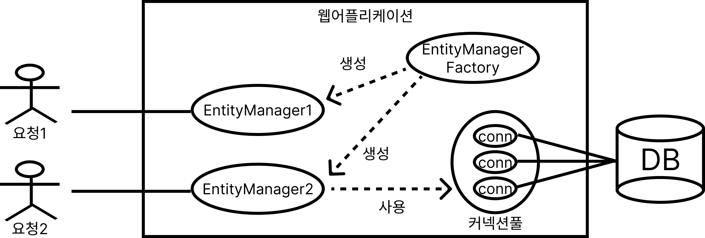
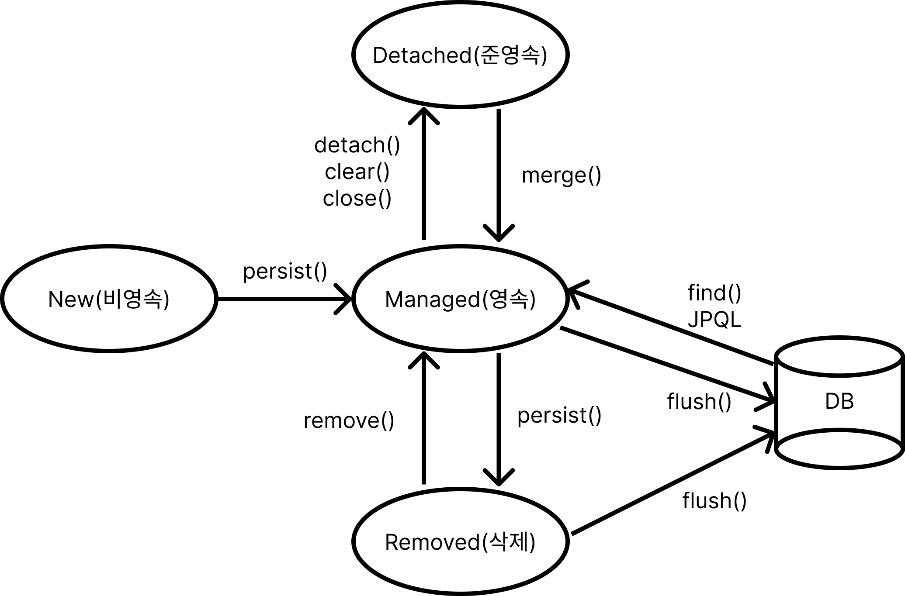
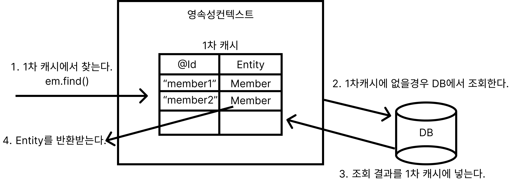
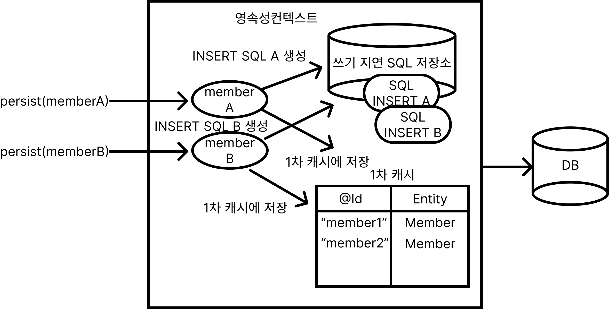
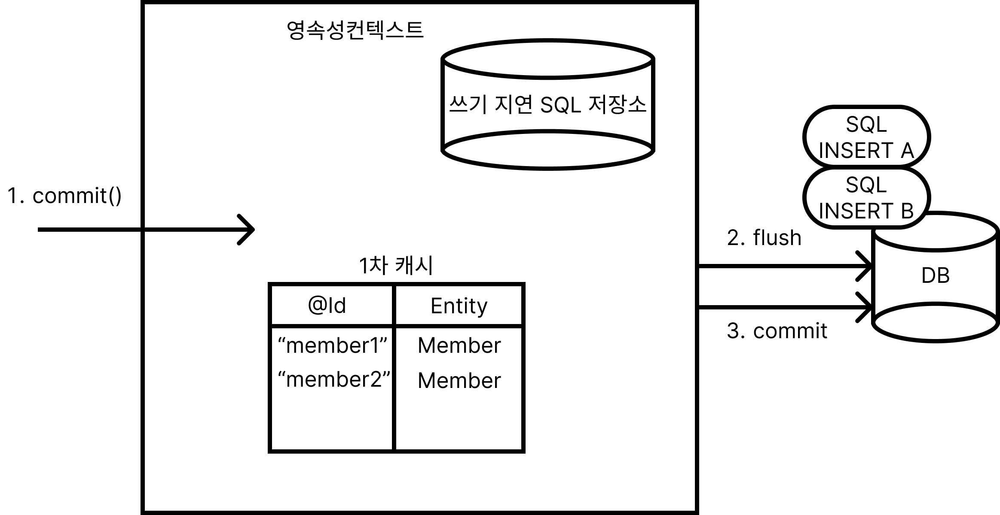
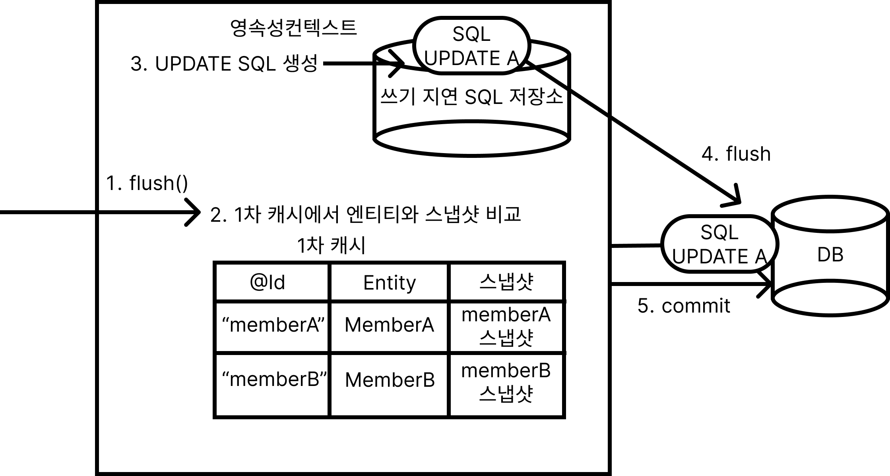
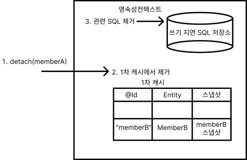
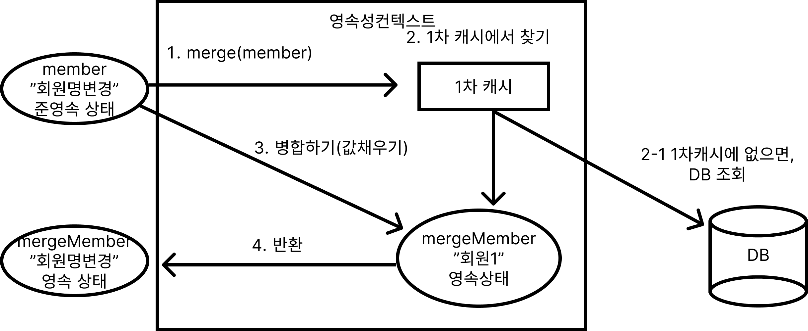

# 영속성 관리 (★★★)

**엔티티 매니저 팩토리는 여러 스레가 동시에 접근해도 안전하므로, 서로 다른 스레드 간에 공유해도 되지만, 엔티티 매니저는 여러 스레드가 동시에 접근하면 동시성 문제가 발생하므로 스레드 간에 절대 공유하면 안 된다.**



### 영속성 컨텍스란?

**엔티티를 영구 저장하는 환경이면서 동일성을 보장해준다.**


### 엔티티의 생명주기 [★★★★★]

| 상태 | 설명 |  |
| --- | --- | --- |
| 비영속(New/Transient) | 영속성 컨텍스트와 전혀 관계없는 상태 |  |
| 영속(Managed) | 영속성 컨텍스트에 저장된 상태 |  |
| 준영속(Detached) | 영속성 컨텍스트에 저장되 있다가 분리된 상태 |  |
| 삭제(Removed) | 영속성 컨텍스트에 삭제된 상태 |  |



### 비영속

순수한 객체상태

```java
// 객체를 생성한 상태(비영속)
Member member = new Member();
member.setId("memberId1');
member.setName("회원A");
member.setAge(25);
```

### 영속

영속성 컨텍스트가 관리하는 상태

```java
// 객체를 저장한 상태(영속)
em.persist(member);
```

### 준영속

영속성 컨텍스가 관리하다가 풀려난 상태

```java
// 회원 엔티티를 영속성 컨텍스트에서 분리, 준영속상태
em.detach(member);
em.close();
// em.clear();
```

### 삭제

엔티티를 영속성 컨텍스트와 데이터베이스에서 삭제한다.

```java
// 객체를 삭제한 상태(삭제)
em.remove(member);
```

### 3-1. 영속성 컨텍스트의 특징

- 영속성 컨텍스트와 식별자 값
    - 영속 상태는 식별자 값이 반드시 있어야한다. (`@Id`)
- 영속성 컨텍스트와 데이터베이스 저장
    - commit 하는 순간 영속성 컨텍스트에 새로 저장된 엔티티를 데이터베이스에 반영한다.(flush)

## 1차 캐시 [★★★]

```java
// begin
Member member = new Member();
member.setId("member1");
member.setName("회원A");
em.persist(member);
// commit
```


### `em.find(Member.class, "member1")`
1. 1차 캐시에서 찾는다.
2. 캐시에 없으면, DB에서 조회한다.
3. 1차 캐시에 저장한다.
4. 결과값(Entity)를 반환한다.

### 영속 엔티티의 동일성 보장 [★★★★★]



```java
Member member1 = em.find(Member.class, "member1");
Member member2 = em.find(Member.class, "member2");
// member1 == member2 :: True
```

### 쓰기 지연 SQL 저장소 [★★★★★]

쿼리들을 commit 되기 전까지 모아놓는 용도



플러시(flush) : 영속성 컨텍스트 내의 변동 내용을 동기화 하는 작업

마지막 커밋(commit) : 동기화한 후, 실제 데이터베이스 트랜잭션을 커밋한다. 




### 변경 감지 [★★★★★]

변경 감지는 영속성 컨텍스트가 관리하는 영속 상태의 엔티티만 적용된다.

```java
// begin
Member memberA = em.find(Member.class, "memberA");
memberA.setName("개똥이");
memberA.setAge(15);
// commit
```




### 플러시(flush) [★]

플러시는 영속성 컨텍스트의 변경 내용을 데이터베이스 반영한다.


### 준영속 [★]

준영속(Detach) 상태의 엔티티는 영속성 컨텍스트가 제공하는 기능을 사용할 수 없다.



### `merge()`

준영속 상태의 엔티티를 받아, 새로운 영속 상태의 엔티티를 반환한다.


