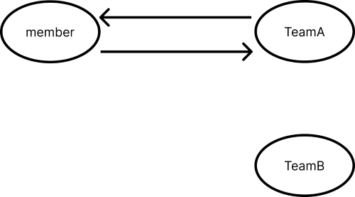
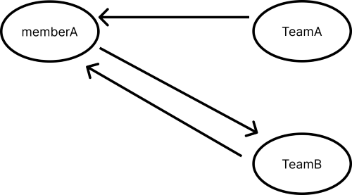

# 5. 연관관계 매핑 기초 (★★★)

1. 방향 : [단방향, 양방향]
2. 다중성 : [다대일(N:1), 일대다(1:N), 일대일(1:1), 다대다(N:M)]
3. **연관관계 주인** : 객체를 양방향으로 설정 했을 때, 연관관계의 주인을 지정하는 것

### 단방향 연관관계

- 테이블 연관관계 : 외래 키를 통해서 연관관계를 탐색한다. - 기본적으로 양뱡향관계 성립

```sql
SELECT m.MEMBER_ID, m.USERNAME, t.TEAM_ID, t.NAME
FROM MEMBER m
LEFT JOIN TEAM t
ON m.TEAM_ID = t.TEAM_ID;
-- 같은 결과
SELECT m.MEMBER_ID, m.USERNAME, t.TEAM_ID, t.NAME
FROM Team t
LEFT JOIN MEMBER m
ON m.TEAM_ID = t.TEAM_ID;
```

- 객체 연관관계 : **참조를 통해서 연관관계를 탐색한다[객체 그래프 탐색] - 단방향 2개가 합쳐져 양방향 관계 성립**

```java
// 생성자 id, name
Team team = new Team("teamA", "여신");

// 생성자 id, username
Member memberA = new Member("memberA", "회원A");
member.setTeam(team);

Member memberB = new Member("memberB", "회원B");
member.setTeam(team);

Team findTeam = memberA.getTeam();

Member whoMember = findTeam.getMember();
```

### 객체 관계 매핑

```java
@Entity
public class Member{
		@Id @Column(name = "MEMBER_ID")
		@GeneratedValue
		private Long id;

		private String username;
		// 연관관계 주인
		@ManyToOne
		@JoinColumn(name = "TEAM_ID")
		private Team team;
}

@Entity
public class Team{
		@Id @Column(name = "TEAM_ID")
		@GeneratedValue
		private Long id;
	
		private String name;

		@OneToMany(mappedBy = "team")
		private List<Member> members = new ArrayList<Member>();
}
```

### 연관관계 주인 [★★★★★]

ManyToOne(N:1)의 연관관계 주인은 Many(N)

**연관관계를 정한다는 것은 외래 키 관리자를 선택한다는 것이다.**

- 연관관계의 주인만이 데이터베이스 연관관계와 매핑되고, 외래 키를 관리(등록, 수정, 삭제)할 수 있다. 반면, 연관관계 주인이 아닌 쪽은 읽기만 할 수 있다.
- 주인은 mappedBy 속성을 소용하지 않는다.
- 주인이 아니면 mappedBy 속성을 사용해서 속성의 값으로 연관관계의 주인을 지정해야 한다.

### 연관관계 편의 메소드 [★★★]

```java
@Entity
public class Member{
		@Id @Column(name = "MEMBER_ID")
		private String id;

		private String username;
		// 연관관계 주인
		@ManyToOne
		@JoinColumn(name = "TEAM_ID")
		private Team team;
		// 연관관계 편의 메소드
		public void setTeam(Team team){
				this.team = team;
				this.team.getMembers().add(this);
		}
}

@Entity
public class Team{
		@Id @Column(name = "TEAM_ID")
		private String id;
	
		private String name;

		@OneToMany(mappedBy = "team")
		private List<Member> members = new ArrayList<Member>();
}

Team teamA = new Team("team1", "A");
Team teamB = new Team("team2", "B");
Member memberA = new Member("member1", "회원A");

memberA.setTeam(teamA);
memberA.setTeam(teamB);
```

### `memberA.setTeam(teamA);`



### `memberA.setTeam(teamB);`



### 연관관계 편의 메소드 (리팩토링)

```java
public void setTeam(Team team){
		if (this.team != null){
				this.team.getMembers().remove(this);
		}
		this.team = team;
		this.team.getMembers().add(this);
}
```