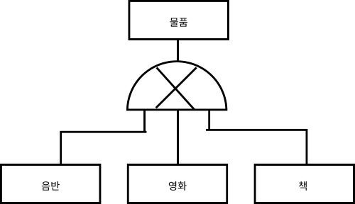
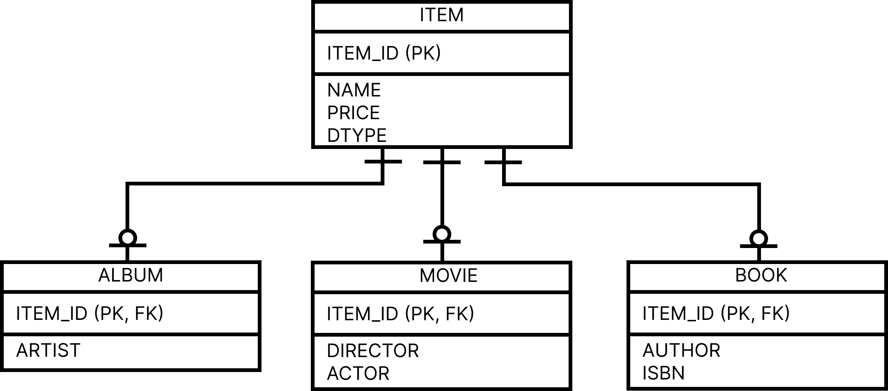
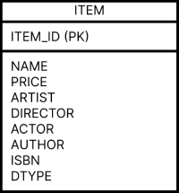
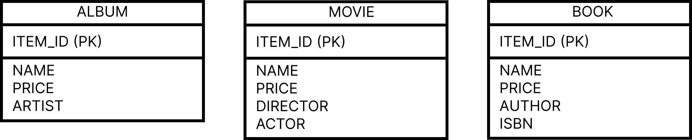
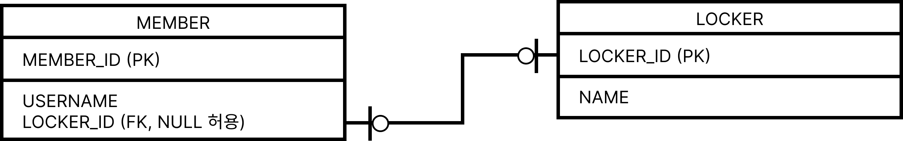
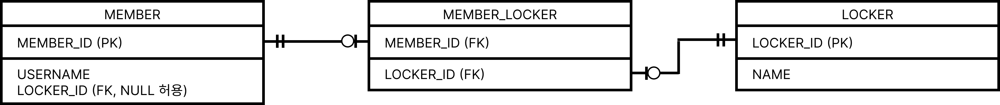

# 7. 고급 매핑

### 7-1. 상속 관계 매핑

슈퍼타입 서브타입 관계 모델링 : 객체의 상속 개념과 유사하다.

- 실제 물리 모델인 테이블로 구현할 때에는 3가지 방법을 선택할 수 있다.
1. 각각의 테이블로 변환 : 아래 그림을 각각 모두 테이블을 만들고 조인을 사용한다. [조인전략]
2. 통합 테이블로 변환 : 테이블을 하나만 사용해서 통합한다. [단일 테이블 전략]
3. 서브타입 테이블로 변환 : 서브 타입마다 하나의 테이블을 만든다. [테이블 전략]



### 조인전략

자식 테이블이 부모 테이블의 기본 키를 받아서 기본 키 + 외래 키로 사용하는 전략

- `@Inheritance(strategy = InheritanceType.JOINED)` : 부모 클래스에 사용해야 함 [조인 전략]
- `@DiscriminatorColumn(name = "DTYPE")` : 부모 클래스에 구분 컬럼을 지정한다.
    
    
    

```java
@Entity
@Inheritance(strategy = InheritanceType.JOINED)
@DiscriminatorColumn(name = "DTYPE")
public abstract class Item{
		@Id @GeneratedValue
		@Column(name = "ITEM_ID")
		private Long id;
	
		private String name;
		private int price;
}

@Entity
@DiscriminatorValue("Album")
public class Album extends Item{
		private String artist;
}

@Entity
@DiscriminatorValue("Movie")
public class Movie extends Item{
		private String director;
		private String actor;
}

@Entity
@DiscriminatorValue("Book")
public class Book extends Item{
		private String author;
		private String isbn;
}
```

### 단일 테이블 전략



```java
@Entity
@Inheritance(strategy = InheritanceType.SINGLE_TABLE)
@DiscriminatorColumn(name = "DTYPE")
public abstract class Item{
		@Id @GeneratedValue
		@Column(name = "ITEM_ID")
		private Long id;
	
		private String name;
		private int price;
}

@Entity
@DiscriminatorValue("Album")
public class Album extends Item{
		private String artist;
}

@Entity
@DiscriminatorValue("Movie")
public class Movie extends Item{
		private String director;
		private String actor;
}

@Entity
@DiscriminatorValue("Book")
public class Book extends Item{
		private String author;
		private String isbn;
} 
```

### 테이블 전략



```java
@Entity
@Inheritance(strategy = InheritanceType.TABLE_PER_CLASS)
public abstract class Item{
		@Id @GeneratedValue
		@Column(name = "ITEM_ID")
		private Long id;
	
		private String name;
		private int price;
}

@Entity
public class Album extends Item{
		private String artist;
}

@Entity
public class Movie extends Item{
		private String director;
		private String actor;
}

@Entity
public class Book extends Item{
		private String author;
		private String isbn;
}
```

### `@MappedSuperclass`

매핑 정보를 상속할 목적으로 사용한다. [추상클래스와 비슷]

- 컬럼명 변경 : `@AttributeOverride` [단일 지정] , `@AttributeOverrides`[”여러개 지정”]


### 7-2. 복합 키와 식별 관계 매핑 [★★]

1. 식별관계 : 기본 키 + 외래 키 = 복합키
2. 비식별관계 : 외래 키, 기본 키를 따로 사용하는 관계
    
    2-1. 필수적 비식별 관계 : 외래 키에 NULL 허용 X [연관관계 필수적]
    
    2-2. 선택적 비식별 관계 : 외래 키에 NULL 허용 O [연관관계 선택적]
    

### `@IdClass`

1. 식별관계

```java
@Entity
public class Parent{
		@Id @Column(name = "PARENT_ID")
		private String id;
		private String name;
}

public class ChildId implements Serializable{
		private String parent;
		private String child;
	
		public ChildId(){}
		@Override
		public boolean equals(){...}
		@Override
		public int hashCode(){...}
}

@Entity
@IdClass(ChildId.class)
public class Child{
		@Id
		@ManyToOne
		@JoinColumn(name = "PARENT_ID")
		private Parent parent;
	
		@Id @Column(name = "CHILD_ID")
		private String id;
	
		private String name;
}

public class GrandChildId implements Serializable{
		private ChildId child;
		private String id;
	
		public ChildId(){}
		@Override
		public boolean equals(){...}
		@Override
		public int hashCode(){...}
}

@Entity
@IdClass(GrandChildId.class)
public class GrandChild{
		@Id
		@ManyToOne
		@JoinColumns({
				@JoinColumn(name = "CHILD_ID"),
				@JoinColumn(name = "PARENT_ID")
		})
		private Child child;
	
		@Id @Column(name = "GRANDCHILD_ID")
		private String id;
	
		private String name;
}
```

2. 비식별

```java
public class ParentId implements Serializable{
		private String id1;
		private String id2;
	
		public ParentId(){}
		@Override
		public boolean equals(){...}
		@Override
		public int hashCode(){...}
}

@Entity
@IdClass(ParentId.class)
public class Parent{
		@Id
		@Column(name = "PARENT_ID1")
		private String id1;
		
		@Id
		@Column(name = "PARENT_ID2")
		private String id2;
}

@Entity
public class Child{
		@Id
		private String id;
		
		@ManyToOne
		@JoinColumns({
				@JoinColumn(name = "PARENT_ID1",
						referencedColumnName = "PARENT_ID1"),
				@JoinColumn(name = "PARENT_ID2",
						referencedColumnName = "PARENT_ID2")
		})
		private Parent parent;
}
```

### `@EmbeddedId`

1. 식별 관계

```java
@Entity
public class Parent{
		@Id @Column(name = "PARENT_ID")
		private String id;
		private String name;
}
@Embeddable
public class ChildId implements Serializable{
		private String parentId;
	
		@Column(name = "CHILD_ID")
		private String id;
	
		public ChildId(){}
		@Override
		public boolean equals(){...}
		@Override
		public int hashCode(){...}
}

@Entity
public class Child{
		@MapsId("parentId")
		@ManyToOne
		@JoinColumn(name = "PARENT_ID")
		private Parent parent;
	
		@EmbeddedId
		private ChildId id;
	
		private String name;
	}
	@Embeddable
	public class GrandChildId implements Serializable{
		private ChildId childId;
		@Column(name = "GRANDCHILD_ID")
		private String id;
	
		public ChildId(){}
		@Override
		public boolean equals(){...}
		@Override
		public int hashCode(){...}
}

@Entity
@IdClass(GrandChildId.class)
public class GrandChild{
		@MapsId("childId")
		@ManyToOne
		@JoinColumns({
				@JoinColumn(name = "CHILD_ID"),
				@JoinColumn(name = "PARENT_ID")
		})
		private Child child;
	
		@EmbeddedId
		private String id;
	
		private String name;
}
```

1. 비식별 관계

```java
@Embeddable
public class ParentId implements Serializable{
		private String id1;
		private String id2;
	
		public ParentId(){}
		@Override
		public boolean equals(){...}
		@Override
		public int hashCode(){...}
}

@Entity
public class Parent{
		@EmbeddedId
		private ParentId id;
}

@Entity
public class Child{
		@Id
		private String id;
		
		@ManyToOne
		@JoinColumns({
				@JoinColumn(name = "PARENT_ID1",
						referencedColumnName = "PARENT_ID1"),
				@JoinColumn(name = "PARENT_ID2",
						referencedColumnName = "PARENT_ID2")
		})
		private Parent parent;
}
```

### 일대일 식별 관계

```java
@Entity
public class Board{
		@Id @GeneratedValue
		@Column(name = "BOARD_ID")
		private Long id;
	
		private String title;
	
		@OneToOne(mappedBy = "board")
		private BoardDetail boardDetail;
}

@Entity
public class BoardDetail{
		@Id
		private Long boardId;	
	
		@MapsId // BoardDetail.boardId 매핑
		@OneToOne
		@JoinColumn(name = "BOARD_ID")
		private Board board;
		private String content;
}
```

### 7-3. 조인 테이블 [★]

### 조인 컬럼 사용 (외래 키)



```java
@Entity
public class Member{
		@Id @Column(name = "MEMBER_ID")
		@GeneratedValue
		private Long id;
		private String username;
		
		@OneToOne~~(mappedBy = "member")
		private Locker locker;~~
}

@Entity
public class Locker{
		@Id @Column(name = "LOCKER_ID")
		@GeneratedValue
		private Long id;
		private String name;
	
		@OneToOne
		@JoinColumn(name = "MEMBER_ID")
		private Member member;
}
```

### 조인 테이블 사용 (테이블 사용) [링크 테이블, 연결 테이블]



```java
@Entity
public class Member{
		@Id @Column(name = "MEMBER_ID")
		@GeneratedValue
		private Long id;
		private String username;
	
		@OneToOne
		@JoinTable(name = "MEMBER_LOCKER",
							joinColumns = @JoinColumn(name = "MEMBER_ID"),
							inverseJoinColumns = @JoinCloumn(name = "LOCKER_ID")
		)
		private Locker locker;
}

@Entity
public class Locker{
		@Id @Column(name = "LOCKER_ID")
		@GeneratedValue
		private Long id;
		private String name;
	
		@OneToOne(mappedBy = "locker")
		private Member member;
}
```