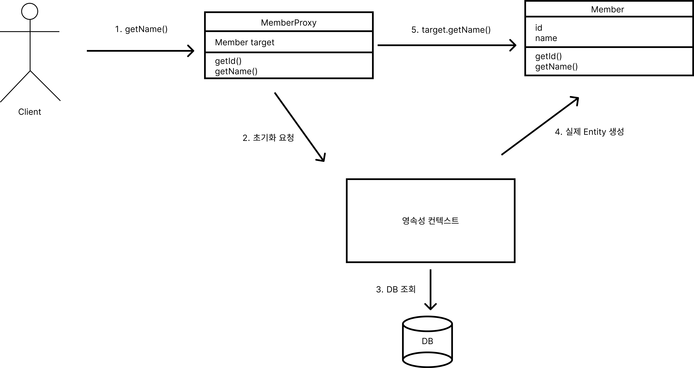
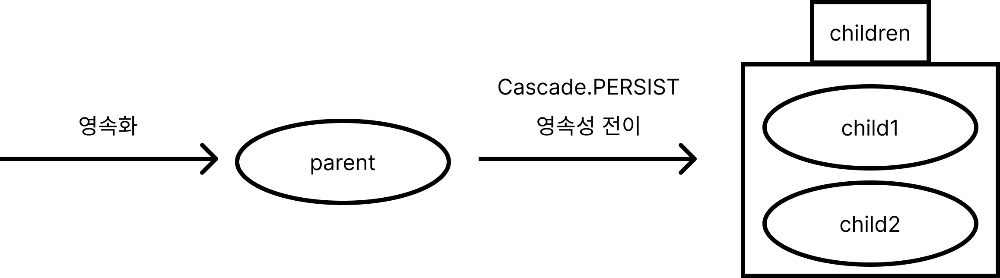

# 8. 프록시와 연관관계 관리 [★★★]

### 프록시 [★★★]

```java
Member member = em.getReference(Member.class, "member1");
// 1. getName();
member.getName();
```

```java
// 프록시 클래스 예상 코드
class MemberProxy extends Member{
		Member target = null;
		public String getName(){
				if (target == null){
						// 2. 초기화 요청
						// 3. DB 조회
						// 4. 실제 Entity 생성
						this.target = ...;
				}
				// 5. target.getName();
				return target.getName();
		}
		...
}
```



### 프록시와 식별자

프록시 객체는 식별자(PK) 값을 보관한다.

```java
Member member = em.getReference(Member.class, "member1");
member.getId();
```

### 프록시 확인

`PersistenceUnitUtil.isLoaded(Object entity)` : 프록시 인스턴스의 초기화 여부 확인

```java
boolean isLoad = em.getEntityManagerFactory().getPersistenceUnitUtil().isLoaded(entity);
boolean isLoad = emf.getPersistenceUnitUtil.isLoad(entity);
```

### 8.1 즉시로딩과 지연로딩 [★★★]

### 즉시로딩 (EAGER) : 엔티티를 조회할 때, 연관된 엔티티도 조회한다.

```java
@Entity
public class Team{
		@Id @Column(name = "TEAM_ID")
		private String id;
		private String name;
}

@Entity
public class Member{
		@Id @Column(name = "MEMBER_ID")
		private String id;
		private String username;
		@ManyToOne(fatch = FetchType.EAGER)
		@JoinColumn(name = "TEAM_ID")
		private Team team;
}
```

```sql
SELECT
       m1_0.MEMBER_ID,
       t1_0.TEAM_ID,
       t1_0.name,
       m1_0.username
FROM Member m1_0
LEFT JOIN Team t1_0
ON t1_0.TEAM_ID=m1_0.TEAM_ID
WHERE m1_0.MEMBER_ID=?
```

### 지연로딩 (LAZY) : 연관된 엔티티를 사용 시점에서 조회한다.

```java
@Entity
public class Team{
		@Id @Column(name = "TEAM_ID")
		private String id;
		private String name;
}

@Entity
public class Member{
		@Id @Column(name = "MEMBER_ID")
		private String id;
		private String username;
		@ManyToOne(fatch = FetchType.LAZY)
		@JoinColumn(name = "TEAM_ID")
		private Team team;
}
```

```sql
SELECT
        m1_0.MEMBER_ID,
        m1_0.TEAM_ID,
        m1_0.username 
FROM Member m1_0 
WHERE m1_0.MEMBER_ID=?
#
SELECT
        t1_0.TEAM_ID,
        t1_0.name 
FROM Team t1_0 
WHERE t1_0.TEAM_ID=?
```

### 프록시와 컬렉션 매퍼

엔티티를 영속성으로 만들 때, 엔티티에 컬렉션이 있으면 컬렉션을 관리하고 추적할 목적으로 원본 컬렉션을 하이버네이트 내장 컬렉션으로 바꾼다.

`org.gibernate.collection.internal.PersistentBag`

### JPA 기본 페치 전략 [★★]

`@MayToOne`, `@OneToOne` : 즉시 로딩 (FetchType.EAGER) [default]

`@OneToMany`, `@ManyToMany` : 지연 로딩 (FetchType.LAZY) [default]

### 컬렉션에 `FetchType.EAGER` 사용 시 주의점 [★★★]

1. 컬렉션을 하나 이상 즉시 로딩하는 것은 권장하지 않는다.
2. 컬렉션 즉시 로딩은 항상 외부 조인 `OUTER JOIN`을 사용한다.
- `@ManyToOne`, `@OneToOne`
    - (optional = false) : 내부 조인
    - (optional = true) : 외부 조인
- `@OneToMany`, `@ManyToMany`
    - (optional = false) : 외부 조인
    - (optional = true) : 외부 조인

### 영속성 전이 : CASCADE

JPA에서 엔티티를 저장할 때, 연관된 모든 엔티티는 영속 상태여야 한다.

```java
@Entity
public class Parent{
		@Id @GeneratedValue
		@Column(name = "PARENT_ID")
		private Long id;
		
		@OneToMany(mappedBy = "parent")
		private List<Child> childs = new ArrayList<>();	
}
@Entity
public class Child{
		@Id @GeneratedValue
		@Column(name = "CHILD_ID")
		private Long id;
	
		@ManyToOne
		@JoinColumn(name = "PARENT_ID")
		private Parent parent;
}

public static void saveNoCascade(EntityManager em){
		Parent parent = new Parent();
		// 영속상태
		em.persist(parent);
		
		Child child1 = new Child();
		child1.setParent(parent);
		parent.getChilds().add(child1);
		// 영속상태
		em.persist(child1);
	
		Child child2 = new Child();
		child2.setParent(parent);
		parent.getChilds().add(child2);
		// 영속상태
		em.persist(child2);
}
```

### 영속성 전이 : 저장

엔티티를 영속화 할 때, 연관된 엔티티도 같이 영속화하는 편리함을 제공할 뿐이다.

```java
@Entity
public class Parent{
		@Id @GeneratedValue
		@Column(name = "PARENT_ID")
		private Long id;
		
		@OneToMany(mappedBy = "parent", cascade = CascadeType.PERSIST)
		private List<Child> childs = new ArrayList<>();	
}
@Entity
public class Child{
		@Id @GeneratedValue
		@Column(name = "CHILD_ID")
		private Long id;
	
		@ManyToOne
		@JoinColumn(name = "PARENT_ID")
		private Parent parent;
}

public static void saveWithCascade(EntityManager em){
		Parent parent = new Parent();
		
		Child child1 = new Child();
		child1.setParent(parent); // 연관관계 추가
		parent.getChilds().add(child1);
	
		Child child2 = new Child();
		child2.setParent(parent); // 연관관계 추가
		parent.getChilds().add(child2);
		// 영속상태
		em.persist(parent);
}
```



### 영속성 전이 : 삭제

```java
@Entity
public class Parent{
		@Id @GeneratedValue
		@Column(name = "PARENT_ID")
		private Long id;
		
		@OneToMany(mappedBy = "parent", cascade = {CascadeType.PERSIST, CascadeType.REMOVE})
		private List<Child> childs = new ArrayList<>();	
}
@Entity
public class Child{
		@Id @GeneratedValue
		@Column(name = "CHILD_ID")
		private Long id;
	
		@ManyToOne
		@JoinColumn(name = "PARENT_ID")
		private Parent parent;
}

public static void removeNoCascade(EntityManager em){
		Parent parent = em.find(Parent.class, 1L);
		Child child1 = em.find(Child.class, 1L);
		Child child2 = em.find(Child.class, 2L);
		
		em.remove(parent);
		em.remove(child1);
		em.remove(child2);
}

public static void removeWithCascade(EntityManager em){
		Parent parent = em.find(Parent.class, 1L);
		em.remove(parent);
}
```