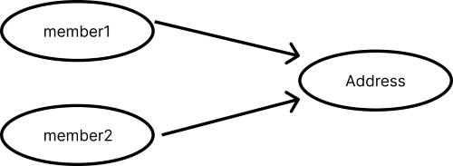
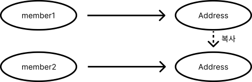
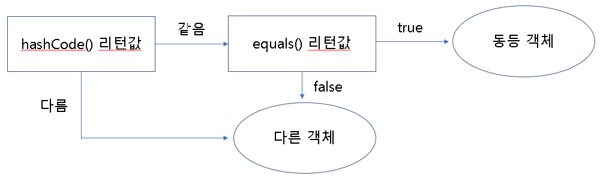
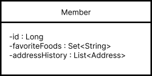
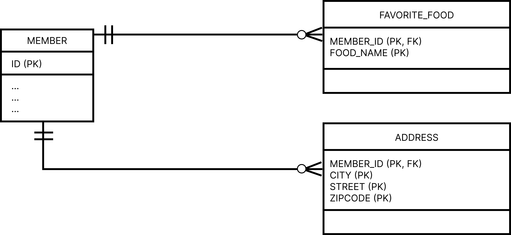

# 9. 값 타입 [★]

1. 기본값 타입
    
    1-1. 자바 기본 타입 (primitive type: int, double)
    
    1-2. 래퍼 클래스 (Integer)
    
    1-3. String
    
2. 임베디드 타입 (복합 값 타입)
3. 컬렉션 타입

### 기본값 타입

```java
@Entity
public class Member{
		@Id @Column(name = "MEMBER_ID")
		private String id;
	
		private String username;
		private int age;
}
```

### 임베디드 타입 (복합 값 타입)

```java

@Embeddable
public class Period{
		@Temporal(TemporalType.DATE)
		private Date startDate;
		
		@Temporal(TemporalType.DATE)
		private Date endDate;
		
		public Period(){
			this.startDate = new Date();
		}
	
		public void retire(){
			this.endDate = new Date();
		}
		...
}

@Embeddable
public class Address{
		private String city;
		private String street;
		private String zipcode;
		public Address(String city, String street, String zipcode){
			this.city = city;
			this.street = street;
			this.zipcode = zipcode;
		}
		...
}

@Entity
public class Member{
		@Id @Column(name = "MEMBER_ID")
		private String id;	
		private String name;
		
		@Embedded
		private Period workPeriod;
		
		@Embedded
		private Address address;
		...
}
```

### 임베디드 타입과 null

임베디드 타입이 null이면, 매핑한 컬럼 값은 모두 null이 된다.

```java
Member member = new Member();
member.setWorkPeriod(new Period());
member.setAddress(null);
```

### 값 타입과 불변 객체 [★★★]

임베디드 값 타입은 여러 엔티팉에서 공유하면 안된다.

```java
// result : 경기도 성남 256-789
Member member1 = new Member();
member1.setWorkPeriod(new Period());
member1.setAddress(new Address("서울", "강남", "123-123"));
em.persist(member1);

Address address = member1.getAddress();
address.setCity("경기도");
address.setStreet("성남");
address.setZipcode("256-789");

// result : 경기도 성남 256-789
Member member2 = new Member();
member2.setAddress(address);
em.persist(member2);
```



### 값 타입 복사

```java
// 서울 강남 123-123
Member member1 = new Member();
member1.setWorkPeriod(new Period());
member1.setAddress(new Address("서울", "강남", "123-123"));
em.persist(member1);

// interface Cloneable @Override
Address address = (Address) member1.getAddress().clone();
address.setCity("경기도");
address.setStreet("성남");
address.setZipcode("256-789");

// 경기도 성남 256-789
Member member2 = new Member();
member2.setAddress(address);
em.persist(member2);
```



### 불변 객체

값타입은 되도록 불변 객체로 설계해야 한다. (`@Embeddable` 값타입 )

```java
@Embeddable
public class Address{
		private String city;
		private String street;
		private String zipcode;
	
		public Address(String city, String street, String zipcode){
			this.city = city;
			this.street = street;
			this.zipcode = zipcode;
		}
		// getter 는 노출한다.
		public String getCity(){ return city; }
		...
		// setter 는 만들지 않는다.
}
```

### 값 타입의 비교

1. **동일성 비교** : 인스턴스의 참조 값(메모리 주소값)을 비교, == 사용
2. **동등성 비교** : 인스턴스의 값을 비교, `equals()` 사용
- `equals()` 를 사용하기 전, `@Override` 해야 하며, `hashcode()` 도 `@Override` 하면 좋다.
    

    

```java
@Embeddable
public class Address{
		private String city;
		private String street;
		private String zipcode;
	
		public Address(String city, String street, String zipcode){
				this.city = city;
				this.street = street;
				this.zipcode = zipcode;
		}
		
		@Override
		public boolean equals(Object obj){
				if (obj instanceof Address){
						if (obj.getCity().equals(city) && obj.getStreet(street).equals() 
								&& obj.getZipcode(zipcode).equals())
							return true;
				}
				return false;
		}
	
		@Override
		public String hashCode(){
				return this.city;
		}
}

Address a = new Address("1", "2", "3");
Address b = new Address("1", "2", "3");

// 1. a == b
// 2. a.equals(b)
```

### 값 타입 컬렉션

```java
@Entity
public class Member{
		@Id @GeneratedValue
		@Column(name = "MEMBER_ID")
		private Long id;
		private String name;
	
		@Embedded
		private Address homeAddress;
	
		@ElementCollection
		@CollectionTable(name = "FAVORITE_FOODS",
					joinColumns = @JoinColumn(name = "MEMBER_ID"))
		@Column(name = "FOOD_NAME")
		private Set<String> favoriteFoods = new HashSet<String>();
	
		@ElementCollection
		@CollectionTable~~(name = "ADDRESS",
				joinColumns = @JoinColumn(name = "MEMBER_ID"))
		private List<Address> addressHistory = new ArrayList<Address>();~~
}

@Embeddable
public class Address{
		private String city;
		private String street;
		private String zipcode;
		...
}
```



