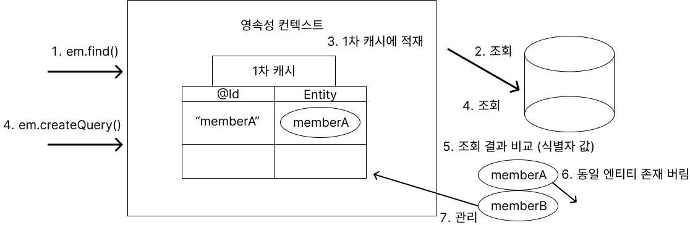
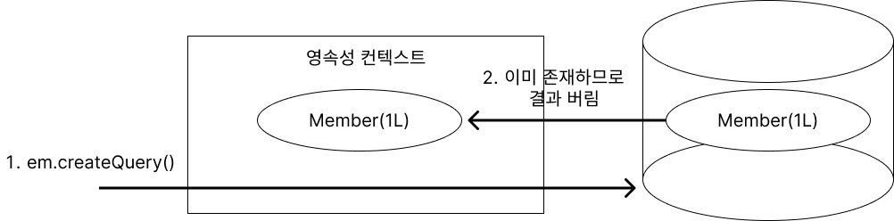

# 10. 객체지향 쿼리언어 [★★★]

1. JPQL
2. Criteria
3. QueryDSL
4. 네이티브SQL

### JPQL(`Java Persistence Query Language`) [★★★]

- 엔티티 객체를 조회하는 쿼리
- SQL을 추상화하기 때문에 특정 데이터베이스에 의존하지 않는다
- 대소문자 구분, 엔티티 이름 사용, 별칭은 필수

### TypeQuery [★]

- 반환되는 값이 **명확**하면 사용

```java
// 30대 이상인 회원만 조회한다.
String sql = "SELECT m FROM Member m WHERE m.age >= :age";
List<Member> members = em.createQuery(sql, Member.class)
				.setParameter("age", 30)
				.getResultList();

members.stream().forEach(member->{
		System.out.println("팀이름 : " + member.getTeam().getName());
		System.out.println("회원이름 : " + member.getName() + ", 회원나이 : " + member.age());
});
```

### Query [★]

- 반환되는 값이 **불명확**하면 사용
- `@Embedded` , `@OneToMany` , `@ManyToOne` …

```java
String sql = "SELECT o.address, o.members, o.product FROM Order o";
List<Object[]> result = em.createQuery(sql)
				.getResultList();

result.stream().forEach(obj -> {
		Address address = (Address) obj[0];
		List<Member> member = (List<Member>) obj[1];
		Product product = (Product) obj[2];
	
		System.out.println("배달주소지 : " + address.getCity() + " " 
					+ address.getStreet() + " " + address.getZipcode());
		System.out.println("상품이름 : " + product.getName() + ", "
					+ "상품가격 : " + product.getPrice());
});
```

### 10-1. 파라미터 바인딩

### 이름 기준 파라미터 [명확함]

```java
String findName = "회원A";
String sql = "SELECT m FROM Member m WHERE m.name = :name";

List<Member> members = em.createQuery(sql, Member.class)
							.setParameter("name", findName)
							.getResultList();
```

### 위치 기준 파라미터

```java
int findAge = 20;
String sql = "SELECT m FROM Member m WHERE m.age >= ?1";
List<Member> members = em.createQuery(sql, Member.class)
							.setParameter(1, findAge)
							.getResultList();
```

### 10-2. 프로젝션 [★★]

SELECT 절에 조회할 대상을 지정하는 것

### 엔티티 프로젝션

```java
String sqlMember = "SELECT m FROM Member m";
String sqlTeam = "SELECT m.team FROM Member m";
...
```

### 임베디드 타입 프로젝션

```java
String sql = "SELECT m.address FROM Member m";
List<Address> addresses = em.createQuery(sql, Address.class)
						.getResultList();
addresses.stream().forEach(address -> {
		System.out.println("주소 : " + address.getCity() + " " + address.getStreet()
											+ ", 우편번호 : " + address.getZipcode());
});
```

### 스칼라 타입 프로젝션

```java
String sql = "SELECT m.name FROM Member m";
List<String> memberNames = em.createQuery(sql, String.class)
						.getResultList();
memberNames.stream().forEach(name -> {
		System.out.println("회원 이름 : " + name);
});

String sql = "SELECT AVG(m.age) FROM Member m";
Double memberAvgAge = em.createQuery(sql, Double.class)
					.getSingleReulst();
System.out.println("회원들의 평균 나이 : " + memberAvgAge);
```

### NEW 명령어

```java
@Data
@Builder
public class MemberDTO{
		private String name;
		private int age;
		public MemberDTO(String name, int age){ ... }
}

public List<MemberDTO> ... {
		String sql = "SELECT m FROM Member m";
		List<MemberDTO> memberDTOs = em.createQuery(sql, Member.class)
							.getResultList()
							.map(member -> { 
									return Member.builder()
											.name(member.getName())
											.age(member.getAge())	
											.build(); 
							});
		return memberDTOs;
}

public List<MemberDTO> ... {
		String sql = "SELECT new com.jpa.demo.queryLanguage.domain1.MemberDTO(m.name, m.age)"
									+ " FROM Member m";
		List<MemberDTO> memberDTOs = em.createQuery(sql, MemberDTO.class)
							.getResultList();
		return memberDTOs;
}
```

### 페이징 API

- `setFirstResult` : 조회 시작 위치 (0부터 시작)
- `setMaxResults` : 조회할 데이터 수

```java
String sql = "SELECT m FROM Member m ORDER BY m.name DESC";
// 11건 ~ 30건
List<Member> members = em.createQuery(sql, Member.class)
					.setFirstResult(10)
					.setMaxResults(20)
					.getResultList();
members.stream().forEach(member -> {
		System.out.println("회원이름 : " + member.getName() + "회원나이 : " + member.getAge());
});
```

### HSQLDB

```sql
SELECT
		M.ID AS ID,
		M.AGE AS AGE
		M.TEAM_ID AS TEAM_ID
		M.NAME AS NAME
FROM 
		MEMBER M
ORDER BY
		M.NAME DESC LIMIT ?, ?
```

### MySQL

```sql
SELECT
		M.ID AS ID,
		M.AGE AS AGE
		M.TEAM_ID AS TEAM_ID
		M.NAME AS NAME
FROM 
		MEMBER M
ORDER BY
		M.NAME DESC LIMIT ?, ?
```

### PostgreSQL

```sql
SELECT
		M.ID AS ID,
		M.AGE AS AGE
		M.TEAM_ID AS TEAM_ID
		M.NAME AS NAME
FROM
		MEMBER M
ORDER BY
		M.NAME DESC LIMIT ? OFFSET ?
```

### 오라클

```sql
SELECT *
FROM 
		(SELECT ROW_.*, ROWNUM ROWNUM_ FROM 
				(SELECT 
						M.ID AS ID,
						M.AGE AS AGE,
						M.TEAM_ID AS TEAM_ID,
						M.NAME AS NAME
				FROM MEMBER M
				ORDER BY M.NAME) ROW_
		WHERE ROWNUM <= ?)
WHERE ROWNUM_ > ?
```

### SQLServer

```sql
WITH query AS(
		SELECT inner_query.*, ROW_NUMBER() OVER (ORDER BY CURRENT_TIMESTAMP)
							as __hibernate_row_nr__
		FROM 
			( SELECT 
						TOP(?) m.id as id,
						m.age age,
						m.team_id as team_id,
						m.name as name
				FROM Member m
				ORDER BY m.name DESC
		) inner_query
)

SELECT id, age, team_id, name
FROM query
WHERE __hibernate_row_nr__ >= ? AND __hibernate_row_nr__ < ?
```

### 집합과 정렬

- 아래 표의 함수를 사용하면 값이 없을 때 `NULL` 값이 된다. `COUNT` 는 0

| 함수 | 설명 |  |
| --- | --- | --- |
| COUNT | 갯수를 구한다. |  |
| MAX, MIN | 최대, 최소 값을 구한다. |  |
| AVG | 평균 값을 구한다. |  |
| SUM | 합계를 구한다. |  |

### `GROUP BY`, `HAVING`

```java
String sql = "SELECT t.name, COUNT(m.age), SUM(m.age), AVG(m.age), MAX(m.age), MIN(m.age) "
					 + "FROM Member m "
					 + "LEFT JOIN m.tea t "
					 + "GROUP BY t.name";

String sql = "SELECT t.name, COUNT(m.age), SUM(m.age), AVG(m.age), MAX(m.age), MIN(m.age) "
					 + "FROM Member m "
					 + "LEFT JOIN m.tea t "
					 + "GROUP BY t.name "
           + "HAVING AVG(m.age) >= 10";
```

### 정렬 (`ORDER BY`)

- `ASC` : 오름차순
- `DESC` : 내림차순

```java
String sql = "SELECT m FROM Member m ORDER BY m.name DESC, m.age ASC";
```

### 10-4. JPQL 조인 [★★★]

### 내부조인

```java
String teamName = "좋아요";
// 좋아요팀인 회원들을 조회한다.
String sql = "SELECT m FROM Member m INNER JOIN m.team t WHERE t.name = :name";
List<Member> members = em.createQuery(sql, Member.class)
					.setParameter("name", teamName)
					.getResultList();
members.stream().forEach(member -> {
		System.out.println("회원이름 : " + member.getName() 
					+ ", 회원나이 : " + member.getName());
});
```

### 외부조인

```java
String teamName = "싫어요";
String sql = "SELECT m FROM Member m LEFT OUTER JOIN m.team t WHERE t.name = :name";
List<Member> members = em.createQuery(sql, Member.class)
				.setParameter("name", teamName)
				.getResultList();
members.stream().forEach(member -> {
		System.out.println("회원이름 : " + member.getName() 
										+ ", 회원나이 : " + member.getAge());
});
```

### 컬렉션조인

1. 일대일 관계나 다대다 관계처럼 컬렉션을 사용하는 곳에 조인하는 것
- [회원 → 팀] 다대일 : 단일 값 연관 필드(m.team) 사용
- [팀 → 회원] 일대다 : 컬렉션 값 연관 필드(m.members) 사용

```java
String sql = "SELECT t, m FROM Team t LEFT JOIN t.members m";
...
```

### 세타조인

1. 세타 조인은 내부 조인만 지원한다.

```java
String sql = "SELECT COUNT(m) FROM Member m, Team t "
					 + "WHERE m.team.id = t.id";
Long memberCount = em.createQuery(sql, Long.class).getSingleResult();
System.out.println(memberCount);
```

### JOIN ON 절

1. ON절을 사용하면 조인 대상을 필터링하고 조인한다.

```java
String sql = "SELECT m FROM Member m "
					 + "LEFT JOIN m.team t "
           + "ON t.name = '좋아요'";
```

### 10-5. 페치 조인 [★★★]

- JPQL에서 성능 최적화를 위해 제공하는 기능이다.
- 연관된 엔티티나 컬렉션을 한 번에 같이 조회하는 기능이다.

### 엔티티 페치 조인

```java
String sql = "SELECT m FROM Member m JOIN FETCH m.team";
```

### 컬렉션 페치 조인

```java
String sql = "SELECT t FROM Team t JOIN FETCH t.members WHERE t.name = '좋아요'";
Team team = em.createQuery(sql, Team.class).getSingleResult();
team.getMembers().stream().forEach(member -> {
		System.out.println("회원이름 : " + member.getName()
								+ "회원나이 : " + member.getAge() + ", member : " + member);
});
/** == 출력결과 == 
 * 팀이름 : 좋아요, team : Team@71e4b308
 * 회원이름 : MemberB, 회원나이 : 25, member : Member@2100d047
 * 회원이름 : MemberD, 회원나이 : 27, member : Member@57562473
 * 팀이름 : 좋아요, team : Team@71e4b308
 * 회원이름 : MemberB, 회원나이 : 25, member : Member@2100d047
 * 회원이름 : MemberD, 회원나이 : 27, member : Member@57562473
 */
```


### 페치 조인과 DISTINCT

```java
String sql = "SELECT DISTINCT(t) FROM Team t JOIN FETCH t.members " 
					 + "WHERE t.name = '좋아요'";
...
/** == 출력결과 ==
 * 팀이름 : 좋아요, team : Team@71e4b308
 * 회원이름 : MemberB, 회원나이 : 25, member : Member@2100d047
 * 회원이름 : MemberD, 회원나이 : 27, member : Member@57562473
 */
```

.png)

- 페치 조인과 일반 조인의 차이

JPQL은 결과를 반환할 때, 연관관계까지 고려하지 않는다. 단지 SELECT 절에 지정한 엔티티만 조회할 뿐이다.

- 지연 로딩이 설정되어 있다면, 프록시 래퍼를 반환하므로, `SELECT` 를 한 번 더 한다.

```java
// 일반 조인
String sql = "SELECT t FROM Team t JOIN t.members m WHERE t.name = '좋아요'";
```

```sql
SELECT t.*
FROM team t
INNER JOIN member m ON t.id = m.team_id
WHERE t.name = '좋아요'
```

- 페치 조인은 글로벌 로딩 전략 (`@OneToMany(fetch = FetchType.LAZY)`) 보다 우선시 된다.

```java
// 컬렉션 조인
String sql = "SELECT t FROM Team t FETCH JOIN t.members WHERE t.name = '좋아요'";
```

```sql
SELECT t.*, m.*
FROM team t
INNER JOIN member m ON t.id = m.team_id
WHERE t.name = '좋아요'
```

### 10-5. 경로 표현식 [★★]

.(점)을 찍어 객체 그래프를 탐색하는 것

- 상태필드 : 단순히 값을 저장하기 위한 필드 (필드 or 프로퍼티)
- 연관필드 : 연관관계를 위한 필드, 임베디드 타입 포함 (필드 or 프로퍼티)
    - 단일 값 연관 필드 : `@ManyToOne`, `@OneToOne` , 대상이 엔티티
    - 컬렉션 값 연관 필드 : `@OneToMany`, `@ManyToMany` , 대상이 컬렉션

```java
String sql = "SELECT m.name "
           + "FROM Member m "
           + "JOIN m.team t "
           + "JOIN m.orders o "
           + "WHERE t.name = '좋아요'";
```

### 경로 표현식과 특징

1. 상태 필드 경로 : 경로 탐색의 끝. 더는 탐색 불가
2. 단일 값 연관 경로 : 묵시적으로 내부 조인, 단일 값 연관 경로는 계속 탐색 가능
3. 컬렉션 값 연관 경로 : 묵시적으로 내부 조인, 더는 탐색 불가, 단 FROM 절에 조인을 통해 별칭을 얻으면 별칭으로 탐색 가능
- 상태 필드 경로 탐색
    
    `SELECT m.name, m.age FROM Member m`
    
- 단일 값 연관 경로 탐색
    
    `SELECT m.team FROM Member m` : 성공
    
    `SELECT m.team.name FROM Member m` : 성공
    
- 컬렉션 값 연관 경로 탐색
    
    `SELECT t.members FROM Team t` : 성공
    
    `SELECT t.members.name FROM Team t` : 실패
    
    `SELECT m.name FROM Team JOIN t.members m` : 성공
    

### 서브쿼리

```java
String sql = "SELECT m FROM Member m WHERE m.age > "
              "(SELECT AVG(m2.age) FROM Member m2)";
```

### 서브 쿼리 함수

- EXISTS : 서브쿼리에 결과가 존재하면 참

```java
// 팀 좋아요에 소속인 회원
String sql = "SELECT m FROM Member m " 
+ "WHERE EXISTS (SELECT t FROM m.team t WHERE t.name = '좋아요')";
```

- {ALL | ANY | SOME} : ALL - 조건을 만족하면 참, ANY/SOME - 조건을 하나라도 만족하면 참

```java
// 전체 상품 각각의 재고보다 주문량이 많은 주문들
String sqlAll = "SELECT o FROM Order o "
+ "WHERE o.orderAmount > ALL (SELECT p.stockAAmount FROM PRODUCT p)";
// 어떤 팀이든 템이 소속된 회원
String sqlAny = "SELECT m FROM Member m "
+ "WHERE m.team = ANY (SELECT t FROM Team t)";
```

- IN 서브쿼리 결과 중 하나라도 같은 것이 있으면 참

```java
// 20세 이상을 보유한 팀
String sql = "SELECT t FROM Team t"
+ "WHERE t IN (SELECT t2 FROM Team t2 JOIN t2.members m2 WHERE m2.age >= 20)";
```

[1. JPA란 무엇인가?[★★★★★]](https://www.notion.so/1-JPA-b1755d3ec8ac4e849e6fd98dfad91e3a?pvs=21)

[2. 객체매핑](https://www.notion.so/2-2eb483679f1c4148bcd784f178df4891?pvs=21)

[3. 영속성 관리 (★★★)](https://www.notion.so/3-0ab06c1a407a45c6827672f358c60bbb?pvs=21)

[4. 엔티티 매핑 (★)](https://www.notion.so/4-0ef5c695668743b0a5768fa78dbb2af6?pvs=21)

[5. 연관관계 매핑 기초 (★★★)](https://www.notion.so/5-d3934bb126ef417fbf937046b3b8b71d?pvs=21)

[6. 다양한 연관관계 매핑](https://www.notion.so/6-f47b6409daa64ef5acab110181cafc96?pvs=21)

[7. 고급 매핑](https://www.notion.so/7-8f84b75d39e84c9189b8e13763d62ae5?pvs=21)

[8. 프록시와 연관관계 관리 [★★★]](https://www.notion.so/8-78c466db7f59466c8180943b67ebfbd6?pvs=21)

[9. 값 타입 [★]](https://www.notion.so/9-63a0534144344741bff4ba07981d4b3e?pvs=21)

[10. 객체지향 쿼리언어 [★★★]](https://www.notion.so/10-502e6e78b23441fda4d3ffb2503a8b2c?pvs=21)

### Between, Like, NULL 비교

- Between

```java
// 10 ~ 20살인 회원을 찾아라
String sql = "SELECT m FROM Member m WHERE m.age BETWEEN 10 AND 20";
```

- Like

```java
// 처음에 원이라는 단어가 포함
String sql = "SELECT m FROM Member m WHER m.name LIKE 원%";
// 마지막에 원이라는 단어가 포함
String sql = "SELECT m FROM Member m WHER m.name LIKE %원";
// 중간에 원이라는 단어가 포함
String sql = "SELECT m FROM Member m WHER m.name LIKE %원%";
// 세글자 중 회원을 포함하는 것
String sql = "SELECT m FROM Member m WHER m.name LIKE 회원_";
// 세글자 중 마지막은 3인 것
String sql = "SELECT m FROM Member m WHER m.name LIKE __3";
```

- NULL 비교

```java
String sql = "WHERE m.name IS NULL";
String sql = "WHERE NULL = NULL"; // 거짓
String sql = "WHERE 1 = 1"; // 참
```

### 컬렉션식

- 빈 컬렉션 비교 식 : 컬렉션 값이 비어 있으면 참

```java
String sql = "SELECT t FROM Team t WHERE t.members IS NOT EMPTY";
```

- 컬렉션 멤버식 : 엔티티나 값이 컬렉션에 포함되어 있으면 참

```java
String sql = "SELECT t FROM Team t WHERE :memberParam MEMBER OF t.members";
```

### CASE 식

- 기본 CASE - IF문이랑 유사

```java
String sql = "SELET CASE WHEN m.age <= 10 THEN '학생요금' "
                      + "WHEN m.age >= 60 THEN '경로요금' "
                      + "ELSE '일반요금' "
                    + "END "
           + "FROM Member m";
```

- 심플 CASE - CASE문이랑 유사

```java
String sql = "SELECT CASE t.name "
                      + "WHEN '좋아요' THEN '실적이좋음'"
                      + "WHEN '싫어요' THEN '실적이안좋음'"
                  + "END "
           + "FROM Member m";
```

- COALESCE : 스칼라식을 차례대로 조회해서 null이 아니면 반환한다.

```java
String sql = "SELECT COALESCE(m.name, '이름 없는 회원') FROM Member m";
```

- NULLIF : 두 값이 같으면 첫번째 인자 반환, 같지 않으면 NULL 반환

```java
String sql = "SELECT NULLIF(m.name, '회원A') FROM Member m";
```

### 다형성 쿼리

JPQL로 부모 엔티티를 조회하면 자식 엔티티도 함께 조회한다.

```java
String sql = "SELECT i FROM Item i";
```

### TYPE

엔티티의 상속 구조에서 조회 대상을 특정 자식 타입으로 한정할 때 사용

```java
String sql = "SELECT i FROM Item i WHERE TYPE(i) IN (Book, Movie)";
```

### TREAT

자바의 타입 캐스팅이랑 비슷

```java
String sql = "SELECT i FROM Item i WHERE TREAT(i as Book).author = 'kim'";
```

### 10-7. 엔티티 직접 사용

### 기본 키 값

```java
String sql = "SELECT COUNT(m) FROM Member m";
String sql = "SELECT COUNT(m.id) FROM Member m";
```

### 외레 키

```java
String sql = "SELECT m FROM Member m WHERE m.team = :team";
...
```

### Named 쿼리 : 정적쿼리

1. 동적 쿼리 : `SELECT ...` 문자를 완성하여 직접 처리하는 방식
2. 정적 쿼리 : 미리 정의한 쿼리에 이름을 부여하여 필요할 때 사용하는 것, 한 번 정의하면 변경 불가

```java
@Entity
@NamedQuery(
		name = "Member.findByUserName",
		query = "SELECT m FROM Member m WHERE m.name = :name"
)
public class Member{
		...
}

List<Member> members = em.createNameQuery("Member.findByUserName", Member.class)
			.setParameter("name", "회원A")
			.getResultList();
```

### Named 쿼리 XML에 정의

```xml
<?xml version="1.0" encoding="UTF-8"?>
<entity-mappings xmls="http://xmlns.jcp.org/xml/hs/ns/persistence/orm" 
		version="2.1">
    <name-query name="Member.findByUsername">
        <query><CDATA [
            SELECT m
            FROM Member m
            WHERE m.name = :name
            ]></query>
    </name-query>
    <name-query name="Member.findByUsername">
        <query>SELECT COUNT(m) FROM Member m</query>
    </name-query>
</entity-mappings>
```

```xml
<?xml version="1.0" encoding="UTF-8"?>
<persistence xmlns="http://xmlns.jcp.org/xml/ns/persistence"
             version="2.1">
    <persistence-unit name="jpabook">
        <mapping-file>META-INF/query.xml</mapping-file>
...
```

### Criteria

JPQL을 자바 코드로 작성할 수 있도록 도와주는 빌더 API이다.

```java
CriteriaBuilder cb = em.getCriteriaBuilder(); // 쿼리 빌더
//Criteria 생성, 반환타입 지정
CriteriaQuery<Member> cq = cb.createQuery(Member.class);

Root<Member> m = cq.from(Member.class);

Predicate nameEqual = cb.equal(m.get("name"), "회원A");

javax.persistence.criteria.Order ageDesc = cb.desc(m.get("age"));

List<Member> members = em.createQuery(
				cq.select(m)
					.where(nameEqual )
					.orderBy(ageDesc)
).getResultList();
```

### 10-8. QueryDSL

JPQL의 빌더

### 환경설정

- querydsl-jpa: QueryDSL JPA 라이브러리
- querydsl-apt: 쿼리 타입(Q)을 생성할 때 필요한 라이브러리

```groovy
implementation "com.querydsl:querydsl-jpa:5.0.0:jakarta"
annotationProcessor "com.querydsl:querydsl-apt:5.0.0:jakarta"
annotationProcessor "jakarta.annotation:jakarta.annotation-api"
annotationProcessor "jakarta.persistence:jakarta.persistence-api:3.1.0"

def querydslDir = "src/generated/querydsl"

querydsl {
	jpa = true
	querydslSourcesDir = querydslDir
}

sourceSets {
	main.java.srcDir querydslDir
}

compileQuerydsl {
	options.annotationProcessorPath = configurations.querydsl
}

configurations {
	compileOnly {
		extendsFrom annotationProcessor
	}
	querydsl.extendsFrom compileClasspath
}
```

### QueryDSL 사용예시

```java
JPAQueryFactory query = new JPAQueryFactory(em);
// m 별칭
QMember qMember1 = new QMember("m");
// 인스턴스 사용
QMember qMember2 = QMember.member;

List<Member> members = query
								.selectFrom(qMember1)
								.where(qMember1.name.eq("MemberA"))
								.orderBy(qMember.name.desc())
								.fetch();
```

### 프로젝션 결과 반환

1. 프로젝션 대상이 하나

```java
JPAQueryFactory query = new JPAQueryFactory(em);
QMember qMember = QMember.member;
List<String> names = query.select(qMember.name).from(qMember).fetch();

names.stream().forEach(name -> {
		System.out.println("회원이름 : " + name);
});
```

1. 여러 컬럼 반환과 튜플

```java
JPAQueryFactory query = new JPAQueryFactory(em);
QMember qMember = QMember.member;
List<Tuple> result = query.select(qMember.name, qMember.age).from(qMember).fetch();

result.stream().forEach(item->{
		System.out.println("회원이름 : " + item.get(qMember.name));
		System.out.println("회원나이 : " + item.get(qMember.age));
});
```

1. 빈생성

쿼리 결과를 특정 객체로 받고 싶을 때 사용 다양한 방법 제공

```java
@Getter
@Setter
@NoArgsConstructor
@AllArgsConstructor
public class MemberDTO{
		private String name;
		private Integer age;
}
```

- 프로퍼티 접근 (setter)

```java
JPAQueryFactory query = new JPAQueryFactory(em);
QMember qMember = QMember.member;

List<MemberDTO> result = query
.select(Projections.bean(MemberDTO.class, qMember.name, qMember.age))
.from(qMember)
.fetch();
```

- 필드 직접 접근

```java
JPAQueryFactory query = new JPAQueryFactory(em);
QMember qMember = QMember.member;

List<MemberDTO> result = query
.select(Projections.fields(MemberDTO.class, qMember.name, qMember.age))
.from(qMember)
.fetch();
```

- 생성자 사용

```java
JPAQueryFactory query = new JPAQueryFactory(em);
QMember qMember = QMember.member;

List<MemberDTO> result = query
.select(Projections.constructor(MemberDTO.class, qMember.name, qMember.age))
.from(qMember)
.fetch();
```

### 동적 쿼리

`com.mysema.query.BooleanBuilder` 를 사용하여 특정 조건에 따른 동적 쿼리 생성 가능

```java
SeachParam param = new SearchParam();
param.setName("MemberB");
param.setAge(30);

QMember qMember = QMember.member;
BooleanBuilder builder = new BooleanBuilder();
if (StringUtils.hasText(param.getName())){
		builder.and(qMember.name.contains(param.getName()));
}
if (param.getAge() != null){
		builder.and(qMember.age.gt(param.getAge()));
}
List<Member> members = query.selectFrom(qMember).where(builder);
```

- 메소드 위임
    
    쿼리 타입에 검색 조건을 직접 정의할 수 있다.
    

```java
public class AgeExpression {
		@QueryDelegate(Member.class)
		public static BooleanExpression isGreaterAge(QMember member, Integer age){
				return member.age.gt(age);
		}
}
List<Member> members = query.selectFrom(qMember).where(qMember.isGreaterAge(30));
```

### 10-9. 네이티브 SQL

JPQL을 사용할 수 없을 때, SQL을 직접 정의하는 것 [JPQL : 자동모드 / 네이티브SQL : 수동모드]

### 네이티브 SQL 사용예시

1. 엔티티 조회 :: 결과 타입 정의 [엔티티 조회]

```java
String sql = "SELECT MEMBER_ID, AGE, NAME, TEAM_ID "
           + "FROM MEMBER WHERE AGE > ?";
// 결과 타입 정의
List<Member> members = em.createNativeQuery(sql, Member.class)
									.setParameter(1, 20);
									.getResultList();
```

1. 값 조회 :: 결과 타입을 정의할 수 없을 때 [스칼라 조회]

```java
String sql = "SELECT AGE, NAME "
           + "FROM MEMBER WHERE AGE > ?";
// 결과 타입을 정의할 수 없을 때
List<Object[]> result = em.createNativeQuery(sql)
							.setParameter(1, 20)
							.getResultList();
```

1. 결과 매핑 사용 :: 결과 매핑 사용 [엔티티 + 스칼라 조회]

```java
@Entity
@SqlResultSetMapping(name = "memberWithTeam",
		entities = {@EntityResult(entityClass = Member.class)},
		columns = {@ColumnResult(name = "t.team_name"), 
							@ColumnResult(name = "t.team_id")}
)
public class Member{
		...
}
String sql = "SELECT m.AGE, m.NAME, t.* "
					 + "FROM MEBMER m "
           + "LEFT JOIN TEAM t "
           + "ON m.TEAM_ID = t.TEAM_ID";
List<Object[]> result = em.createNativeQuery(sql, "memberWithTeam")
						.getResultList();
          
```

### Named 네이티브 SQL

```java
@Entity
@NamedNativeQuery(
		name = "Member.memberSQL",
		query = "SELECT MEMBER_ID, AGE, NAME "
          + "FROM MEMBER WHERE AGE > ?",
		resultClass = Member.class
)
public class Member {
		...
}
List<Member> result = em.createNamedQuery("Member.memberSQL", Member.class)
								.setParameter(1, 20)
								.getResultList();
```

### 10-10. 객체지향 쿼리 심화

### 벌크 연산

- 여러 건을 한 번에 수정하거나 삭제할 때
- 영속성 컨텍스트를 무시하고, 데이터베이스에 직접 쿼리를 날린다.
- select -> update(벌크연산) -> 영속컨텍스트를 안거침 -> 데이터 미스매치 일어남
    

    

```java
String sql = "UPDATE Member m "
           + "SET m.age = m.age * 1.1 ";

int resultCount = em.createQuery(sql)
									.executeUpdate();
System.out.println("처리 건수 : " + resultCount);

String sql = "DELETE FROM Member WHERE m.age > :age";
int resultCount = em.createQuery(sql)
	                .setParameter("age", 30)
                  .executeUpdate();
System.out.println("처리 건수 : " + resultCount);
```

1. `em.refesh()` 사용

```java
em.refesh(Member);
```

1. 벌크 연산 먼저 실행
    - 가장 실용적
2. 벌크 연산 수행 후 영속성 컨텍스트 초기화
    - 영속성 컨텍스트를 초기화하면 이후 엔티티를 조회할 때 벌크연산이 적용된 엔티티를 조회한다.

### 영속성 컨텍스트와 JPQL

1. 쿼리 후 영속 상태인 것과 아닌것
    - 엔티티, 임베디드, 값 타입 … 엔티티가 아니면 영속성 컨텍스트에서 관리 되지 않는다.
    - 조회한 엔티티만 영속성 컨텍스트에서 관리한다.
2. JPQL로 조회한 엔티티와 영속성 컨텍스트
    - 영속성 컨텍스트는 영속 상태인 엔티티의 **동일성을 보장**한다.
    
    
    
    ```java
    Member memberA = em.find(Member.class, "memberA");
    
    String sql = "SELECT m FROM Member m";
    List<Member> member = em.createQuery(sql, Member.class).getResultList();
    ```
    

### find() vs JPQL



`em.find()` : 영속성 컨텍스트에서 먼저 찾고 없으면 데이터베이서 찾는다. (1차캐시)

JPQL : 항상 데이터베이스에 SQL을 실행해서 결과를 조회한다.

### JPQL 특징 정리

1. JPQL은 항상 데이터베이스를 조회한다.
2. JPQL로 조회한 엔티티는 영속 상태다.
3. 영속성 컨텍스트에 이미 존재하는 엔티티가 있다면 기존 엔티티를 반환한다.

### 10-11. JPQL과 플러시 모드

```java
em.setFlushMode(FlushModeType.AUTO);   // 커밋 또는 실행 시 플러시 (기본값)
em.setFlushMode(FlushModeType.COMMIT); // 커밋시에만 플러시
```

### 쿼리와 플러시 모드

```java
em.setFlushMode(FlushModeType.COMMIT);
member.setAge(40); // 영속성 컨텍스트에 의해 UPDATE
// 1. em.flush(); 직접호출

Member member = em.createQuery("SELECT m FROM Member m WHERE m.age = :age")
							.setFlushMode(FlushModeType.AUTO) // 2. setFlushMode() 설정
							.getSingleResult();
```

### 플러시 모드  최적화

등록, 수정 등이 자주 일어나는 상황

`em.setFlushMode(FlushMode.COMMIT)`

```java
// FlushMode.COMMIT     FlushMode.AUTO
등록();                 등록();    
등록();                 커밋();
등록();                 등록();
등록();                 커밋();
등록();                 등록();
등록();                 커밋();
커밋();                 ...
```