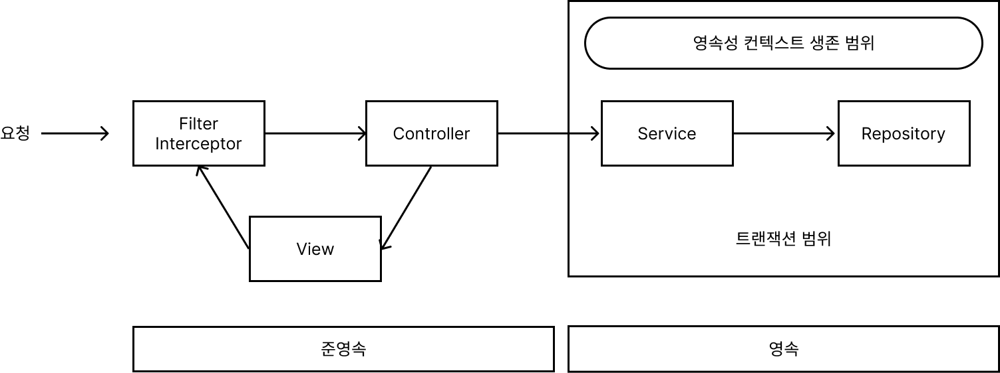
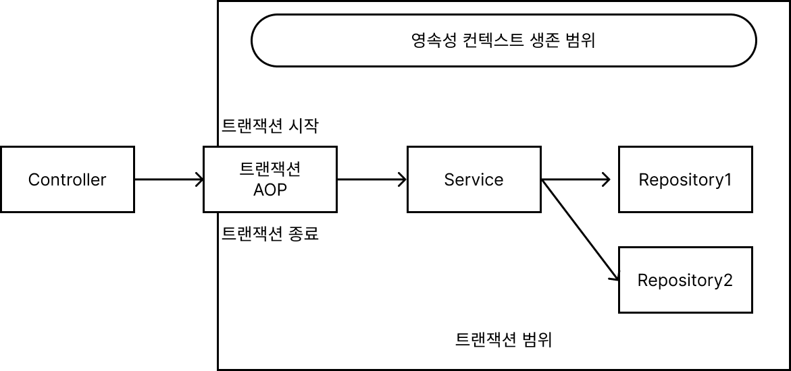
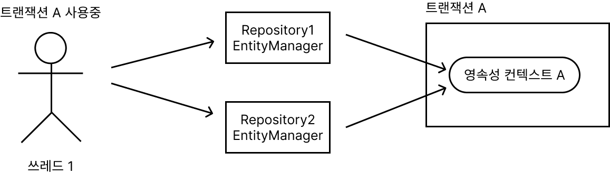
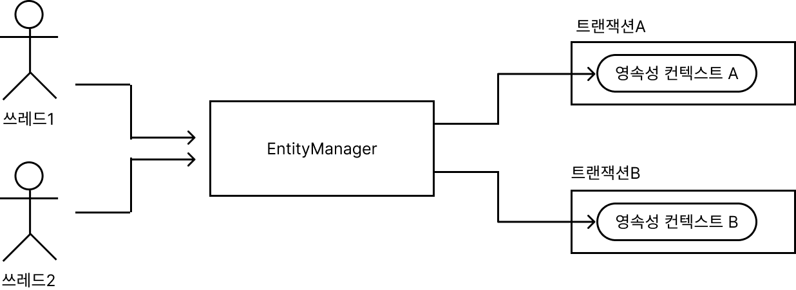
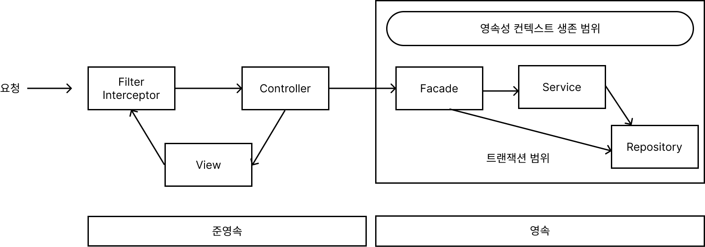
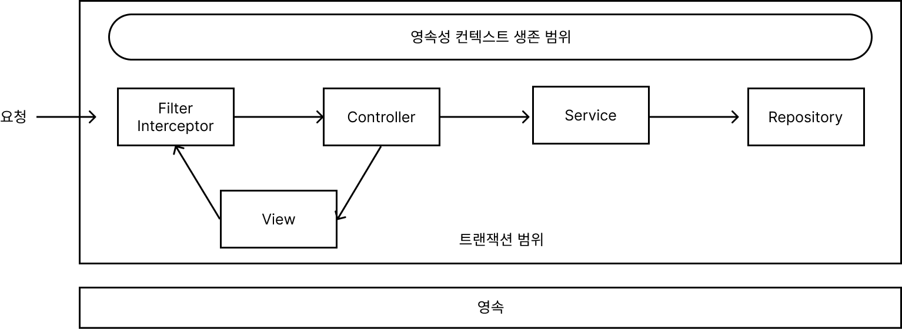
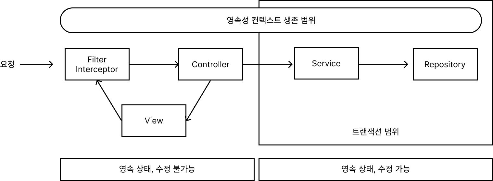
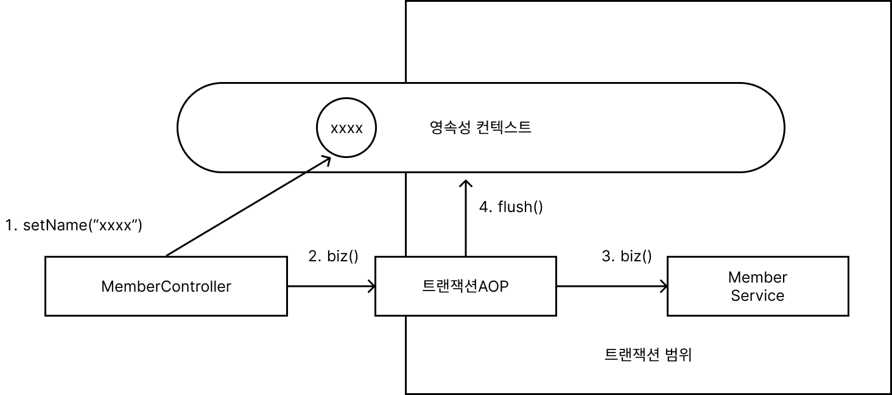

# 13. 웹 애플리케이션과 영속성 관리

### 트랜잭션 범위의 영속성 컨텍스트 [★★★]

- 스프링 컨테이너는 **트랜잭션 범위의 영속성 컨텍스트 전략**을 기본으로 사용한다.
    

    
- `@Transactional` : 호출한 메소드를 실행하기 직전에 스프링의 트랜잭션 AOP가 먼저 동작한다.
- 대상 메소드가 정상 종료되면 트랜잭션을 커밋 → JPA 영속성 컨텍스에 플러시 → 변경 내용 데이터베이스 반영 → 데이터베이스 트랜잭션을 커밋


    

- 트랜잭션이 같으면 같은 영속성 컨텍스트 사용
    
    

    
- 트랜잭션이 다르면 다른 영속성 컨텍스트 사용
    

    

### 준영속 상태와 지연로딩

- 비지니스 계층(서비스 계층) + 퍼시스턴스 계층 (리포지토리 계층) : **영속상태**
- 프레젠테이션 계층 : **준영속**
- 준영속 상태와 변경 감지
    - 보통 변경 감지 기능은 서비스 계층에서 비지니스 로직을 수행하면서 발생
- 준영속 상태와 지연 로딩
    - 뷰를 렌더링 할 때, 연관된 엔티티도 같이 사용하게 되면 프레젠테이션 계층은 준영속 상태이기 때문에 `org.hibernate.LazyInitializationException` 발생
- 준영속 상태의 지연 로딩 문제 해결 방법
    1. 뷰가 필요한 엔티티를 미리 로딩해두는 방법
        - 글로벌 페치 전략 수정
            1. 지연로딩 → 즉시로딩 변경 `@ManyToOne(fetch = FetchType.LAZY)` → `@ManyToOne(fetch = FetchType.EAGER)`
            - 글로벌 페치 전력에 즉시 로딩 사용시 단점
                1. 사용하지 않는 엔티티를 로딩한다.
                    - 화면A에서 order 엔티티와 member 엔티티를 필요해서 즉시 로딩으로 설정을 했지만, 화면 B에서는 order 엔티티만 필요로 하는 경우 쓸데없이 member 엔티티도 함께 조회한다.
                2. N+1 문제가 발생한다.
                    - JPA는 JPQL을 분석해서 SQL을 생성할 때는 글로벌 페치 전략을 참고하지 않고 오직 JPQL 자체만 사용한다.
                    1. JPQL → SQL 생성
                    2. 데이터베이스에서 결과를 받아 Order 엔티티 인스턴스 생성
                    3. Order.member의 글로벌 페치 전략이 즉시로딩이므로 Order를 로딩하는 즉시 member도 로딩해야함
                    4. 연관된 member를 영속성 컨텍스트에서 찾음
                    5. 영속성 컨텍스트에 없으면 select문을 SQL을 조회한 Order 엔티티 수만큼 실행
                    - 처음 조회한 데이터 수만큼 다시 SQL을 사용해서 조회하는 문제 - JPQL 페치 조인으로 해결가능
            - JPQL 페치 조인
                - JPQL : `SELECT o FROM Order o`
                - JPQL Fetch : `SELECT o FROM Order o JOIN FETCH o.member`
                
                ```sql
                SELECT * FROM Order
                // Fetch
                SELECT o.*, m.*
                FROM Order o
                JOIN Member m on o.MEMBER_ID = m.MEMBER_ID
                ```
                
            - 강제로 초기화
                
                영속성 컨텍스트가 살아있을 때 프리젠테이션 계층이 필요한 엔티티를 강제로 초기화 하는 방법
                
                ```java
                public class OrderService{
                		@Transactional
                		public Order findOrder(Long id){
                				Order order = orderRepository.findById(id);
                				order.getMember().getName(); // 프록시 객체 강제 초기화
                				return order;
                		}
                }
                ```
                
            - FACADE 계층 추가
                - 프리젠테이션 계층에서 필요한 프록시 객체를 초기화 한다.
                    
                    
                    
                
                ```java
                public class OrderFacade{
                		@Autowired
                		private OrderService orderService;
                
                		public Order findOrder(Long id){
                				Order order = orderService.findOrder(id);
                				order.getMember().getName();
                				return order;
                		}
                }
                
                public class OrderService{
                		public Order findOrder(Long id){
                				return orderRepository.findById(id);
                		}
                }
                ```
                
    2. OSIV를 사용해서 엔티티를 항상 영속 상태로 유지하는 방법
        - OSIV (`Open Session In View`) 영속성 컨텍스트를 뷰까지 열어둔다는 뜻이다.
        - 요청이 들어오면 서블릿 필터나 스프링 인터셉터에서 영속성 컨텍스트를 만들면서 트랜잭션을 시작하고 요청이 끝날 때 트랜잭션과 영속성 컨텍스트를 함께 종료한다.
            
            
            
        - 요청 당 트랜잭션 방식의 OSIV 문제점
            
            프리젠테이션 계층에서 데이터를 변경하면, 변경을 감지한 영속성 컨텍스트가 플러시를 하면서 데이터베이스에 반영을 하게된다.
            
        - 프리젠테이션 계층에서 엔티티를 수정하지 못하게 막는 방법
            - 엔티티를 읽기 전용 인터페이스로 제공
                
                ```java
                public interface MemberView{
                		public String getName();
                }
                @Entity
                public class Member implements MemberView{
                		...
                }
                
                public class MemberService{
                		public MemberView getMember(Long id){
                				return memberRepository.findById(id);
                		}
                }
                ```
                
            - 엔티티 레핑
                - 엔티티의 읽기 전용 메소드만 가지고 있는 Wrapper 클래스를 만들어 프리젠테이션 계층에 반환하는 방법
                
                ```java
                public class MemberWrapper{
                		private Member member;
                
                		public MemberWrapper(member){
                				this.member = member;
                		}
                
                		// 읽기 전용 메소드만 제공
                		public String getName(){
                				member.getName();
                		}
                }
                
                ```
                
            - DTO만 반환
                - 엔티티 클래스 + DTO 클래스 만들어야 함
                
                ```java
                public class MemberDTO{
                		private String name;
                		...
                }
                ```
                
        - 스프링 OSIV: 비지니스 계층 트랜잭션
            
            spring-orm.jar 다양한 OSIV 클래스를 제공한다.
            
            - 하이버네이트 OSIV 서블릿 필터
            - 하이버네이트 OSIV 스프링 인터셉터
            - JPA OEIV 서블릿 필터
            - JPA OEIV 스프링 인터셉터
            
            요청 → 영속성 컨텍스트를 생성 (트랜잭션 생성 X) → 서비스 계층에서 트랜잭션 시작 → 영속성 컨텍스트에 트랜잭션 시작 → 서비스계층이 끝나면 트랜잭션 커밋 → 영속성 컨텍스트 플러시 → 데이터베이스에 반영 이후, 트랜잭션만 종료하고 영속성 컨텍스트는 살려둔다.
            
            
            
            - 트랜잭션 없이 읽기
                
                영속성 컨텍스트를 통한 모든 변경은 트랜잭션 안에서 이루어져야 하는데, 엔티티를 변경하지 않고 조회만 한다면 트랜잭션이 없어도 된다. = 트랜잭션 없이 읽기
                
            - 스프링 OSIV 주의사항
                
                프리젠테이션 계층에서 엔티티를 수정한 직후 트랜잭션을 시작하는 서비스 계층을 호출하면 문제가 발생한다.
                
                
                
                ```java
                public class MemberController{
                		public String viewMember(Long id){
                				Member member = memberService.getMember(id);
                				member.setName("xxxx");
                				
                				memberService.biz(); // 비지니스 로직
                				return "view";
                		}
                
                }
                
                public class MemberService{
                		@Transactional
                		public void biz(){
                				...
                		}
                }
                // 해결방법
                memberService.biz(); // 비지니스 로직 먼저 호출
                
                Member member = memberService.getMember(id);
                member.setName("xxxx"); // 마자믹에 엔티티를 수정
                ```
                
            - 스프링 OSIV 특징
                1. 한 번 조회한 엔티티는 요청이 끝날 때까지 영속 상태를 유지한다.
                2. 엔티티의 수정은 프레젠테이션 계층에서 불가능하다.