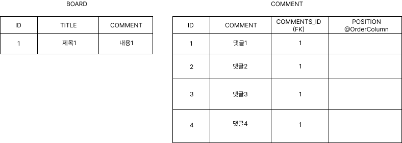
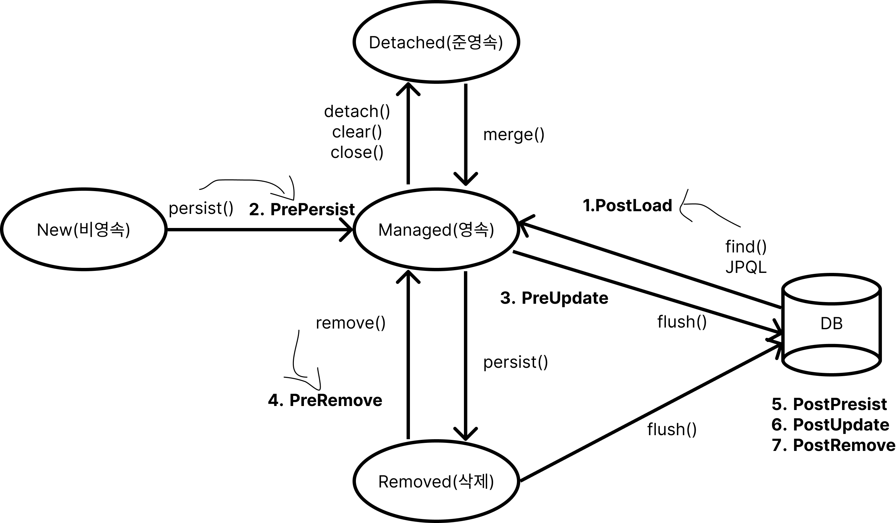
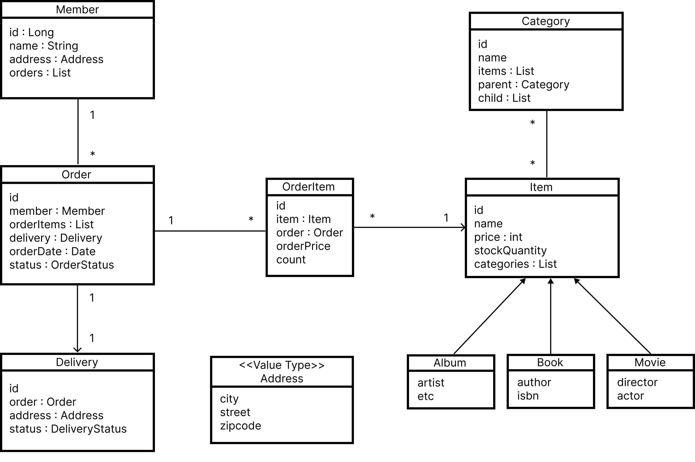

# 14. 컬렉션과 부가기능

**컬렉션 : 다양한 컬렉션과 특징을 설명한다.**

**컨버터 : 엔티티의 데이터를 변환해서 데이터베이스에 저장한다.**

**리스너 : 엔티티에서 발생한 이벤트를 처리한다.**

**엔티티 그래프 : 엔티티를 조회할 때 연관된 엔티티들을 선택해서 함께 조회한다.**

## 컬렉션

`Collection` : 자바가 제공하는 최상위 컬렉션, 하이버네이트는 중복을 허용하고 순서를 보장하지 않는다고 가정한다.

`Set` : 순서 보장 X, 중복 허용 X

`List` : 순서가 있는 컬렉션, 순서 보장 O, 중복 허용 O

`Map` : Key, Value 구조로 되어있는 컬렉션

### JPA와 컬렉션

```java
Team team = new Team();
// java.util.ArrayList
System.out.println("before persist = " + team.getMembers().getClass());
em.persist(team);
// org.hibernate.collection.internal.PersistentBag
System.out.println("after persist = " + team.getMembers().getClass());
```

컬렉션을 효율적으로 관리하기 위해 엔티티를 영속 상태로 만들 때, 원본 컬렉션을 감싸고 있는 내장 컬렉션을 생성해서 내장 컬렉션을 사용하도록 참조한다. (래퍼 클래스라고도 한다)

컬렉션을 사용할 때 즉시 초기화 해서 사용하는 것을 권장한다.

### 하이버네이트 내장 컬렉션과 특징

| 컬렉션 인터페이스 | 내장 컬렉션 | 중복 허용 | 순서 보관 |
| --- | --- | --- | --- |
| `Collection`, `List` | PersistentBag | O | X |
| `Set` | PersistentSet | X | X |
| `List` + `@OrderColumn` | PersistentList | O | O |

### Collection, List

중복을 허용하는 컬렉션, PersistentBag을 래퍼 컬렉션으로 사용한다.

- `ArrayList`로 초기화 (`List list = new ArrayList()`)

**Collection, List는 엔티티를 추가할 때 중복된 엔티티가 있는지 비교하지 않는다. 따라서 엔티티를 추가해도 지연 로딩된 컬렉션을 초기화 하지 않는다.**

```java
List<Comment> comments = new ArrayList<Comment>();

// 단순히 추가만 한다. 결과는 항상 true 어떤 비교도 하지 않고 항상 true
boolean result = comments.add(data);
// 같은 엔티티가 있는지 찾거나 삭제할 때에는 equals() 메소드 사용
comments.contains(comment); // equals 비교
comments.remove(comment); // equals 비교
```

### Set

중복을 허용하지 않는다. PersistentSet을 컬렉션 래퍼로 사용한다.

- HashSet으로 초기화 (`Set set = new HashSet()`)

**Set은 엔티티를 추가할 때 중복된 엔티티가 있는지 비교한다. 따라서 엔티티를 추가할 때 지연 로딩된 컬렉션을 초기화한다.**

```java
Set<Comment> comments = new HashSet<Comment>();
// add() 메소드로 객체를 추가할 때마다 eqauls() 메소드로 같은 객체가 있는지 비교
// HashSet은 해시알고리즘을 사용하므로, hashcode()도 함께 사용해서 비교한다.
boolean result = comments.add(data); // hashcode + equals 비교
comments.contains(comment); // hashcode + equals 비교
comments.remove(comment); // hashcode + equals 비교
```

### List + @OrderColumn

`List` 인터페이스에 `@OrderColumn`을 추가하면 특수한 컬렉션으로 인지 PersistentList 사용

순서가 있다는 의미는 **데이터베이스에 순서 값을 저장해서 조회할 때 사용한다는 의미**

```java
@Entity
@Getter
@Setter
public class Board{
		@Id @GeneratedValue
		private Long id;

		private String title;
		private String content;

		@OneToMany(mappedBy = "board")
		@OrderColumn(name = "POSITION")
		private List<Comment> comments = new ArrayList<Comment>();
}

@Entity
@Getter
@Setter
public class Comment{
		@Id @GenratedValue
		private Long id;

		private String comment;

		@ManyToOne
		@JoinColumn(name = "BOARD_ID")
		private Board board;
}
```



### @OrderColumn의 단점

실무에서 잘 사용되지 않는다.

1. 추가적인 UPDATE 쿼리 발생
2. null 값 보관될 가능성 있음

### @OrderBy

ORDER BY 절을 사용해서 컬렉션을 정렬함

```java
@Entity
public class Team{
		@Id @GeneratedValue
		private Long id;
		private String name;

		@OneToMany(mappedBy = "team")
		@OrderBy("username desc, id asc")
		private Set<Member> members = new HashSet<Member>();
		...
}

@Entity
public class Member{
		@Id @GeneratedValue
		private Lond id;

		@Column(name = "MEMBER_NAME")
		private String username;

		@ManyToOne
		private Team team;
		...
}
```

### @Converter

엔티티의 데이터를 변환해서 데이터베이스에 저장할 수 있다.

`Boolean` 타입 → `String` 타입 저장

```sql
CREATE TABLE MEMBER(
		ID VARCHAR(255) NOT NULL,
		USERNAME VARCHAR(255),
		VIP VARCHAR(1) NOT NULL,
		PRIMARY KEY(ID)
)
```

```java
@Entity
// @Convert(converter=BooleanToYNConverter.class, attributeName = "vip")
public class Member{
		@Id
		private String id;
		private String username;

		@Convert(converter=BooleanToYNConverter.class)
		private boolean vip;
}

// @Converter(autoApply = true) 글로벌 설정 모든 boolean 타입에 적용
@Converter
public class BooleanToYNConverter implements AttributeConverter<Boolean, String>{
		// 데이터베이스에 저장될 때 Y 또는 N
		@Override
		public String convertToDatabaseColumn(Boolean attribute){
				return (attribute != null && attribute) ? "Y" : "N";
		}
		// 데이터베이스에서 조회할 때 Y면 true 아니면 false
		@Override
		public Boolean convertToEntityAttribute(String dbData){
				return "Y".equals(dbData);
		}
}
```

| 속성 | 기능 | 기본값 |
| --- | --- | --- |
| `converter` | 사용할 컨버터를 지정한다. |  |
| `attributeName` | 컨버터를 적용할 필드를 지정한다. |  |
| `disableConversion` | 글로벌 컨버터나 상속 받은 컨버터를 사용하지 않는다. | false |

### 리스너

JPA 리스너 기능을 사용하면 엔티티의 생명주기에 따른 이벤트를 처리할 수 있다.

### 이벤트 종류



1. PostLoad: ***엔티티가 영속성 컨텍스트에 조회된 직후 또는 refresh를 호출한 후*** (2차 캐시에 저장되어 있어도 호출된다.)
2. PrePersist: `persist()` 메소드를 호출해서 ***엔티티를 영속성 컨텍스에 관리하기 직전***에 호출, 식별자 생성 전략을 사용한 경우 엔티티에 식별자는 아직 존재하지 않는다. 새로운 인스턴스를 `merge` 할 때도 수행된다.
3. PreUpdate: `flush` 나 `Commit` 을 호출해서 엔티티를 ***데이터베이스에 수정하기 직전***해 호출
4. PreRemove: `remove()` 메소드를 호출해서 ***엔티티를 영속성 컨텍스에서 삭제하기 직전***에 호출된다. 또한 삭제 명령어로 영속성 전이가 일어날 때도 호출된다. orphanRemoval에 대해서는 `flush` 나 `commit` 시에 호출된다.
5. PostPersist: `flush` 나 `commit`을 호출해서 엔티티를 ***데이터베이스에 저장한 직후***에 호출된다. 식별자가 항상 존재한다. 참고로 식별자 생성 전략이 IDENTITY이면 식별자를 생성하기 위해서 `persist()`를 호출하면서 데이터베이스에 해당 엔티티를 저장하므로 이때는 `persist()` 를 호출한 직후에 바로 PostPersist가 호출된다.
6. PostUpdate: `flush` 나 `commit` 을 호출해서 엔티티를 ***데이터베이스 수정한 직후***에 호출
7. PostRemove: `flush` 나 `commit` 을 호출해서 엔티티를 ***데이터베이스에 삭제한 직후***에 호출

### 이벤트 적용 위치

- 여러 리스너를 등록했을 경우 이벤트 호출 순서
    1. 기본 리스너
    2. 부모 클래스 리스너
    3. 리스너
    4. 엔티티
1. 엔티티에 직접 적용

```java
@Entity
public class Duck{
		@Id @GeneratedValue
		private Long id;
		private String name;

		@PrePersist
		public void prePersist(){
				System.out.println("Duck.prePersist id=" + id);
		}
		
		@PostPersist
		public void prePersist(){
				System.out.println("Duck.postPersist id=" + id);
		}

		@PostLoad
		public void postLoad(){
				System.out.println("Duck.postLoad");
		}

		@PreRemove
		public void preRemove(){
				System.out.println("Duck.preRemove");
		}

		@PostRemove
		public void postRemove(){
				System.out.println("Duck.postRemove");
		}
}
```

1. 별도의 리스너 등록
    - 대상 엔티티를 파라미터로 받을 수 있다. 반환 타입은 void로 설정해야한다.
    
    ```java
    @Entity
    @EntityListeners(DuckListener.class)
    public class Duck{
    		...
    }
    
    public class DuckListener{
    		@PrePersist
    		private void prePersist(Object obj){
    				System.out.println("DuckListener.prePersist obj = [" + obj + "]");
    		}
    		@PostPersist
    		private void postPersist(Object obj){
    				System.out.println("DuckListener.postPersist obj = [" + obj + "]");
    		}
    }
    ```
    
2. 기본 리스너 사용
    - xml 설정
    
    ```xml
    <?xml version="1.0" encoding="UTF-8"?>
    <entity-mappings ...>
    		<persistence-unit-metadata>
    				<entity-listeners>
    						<entity-listener class="com.example.domain.
                       listener.DefaultListener"/>
    				</entity-listeners>
    		</persistence-unit-metadata>
    </entity-mappings>
    ```
    

### 엔티티 그래프

엔티티 그래프 기능은 엔티티 조회시점에 연관된 엔티티들을 함께 조회하는 기능이다.

1. 정적 (Named 엔티티 그래프)
    
    
    
2. 동적 (엔티티 그래프)