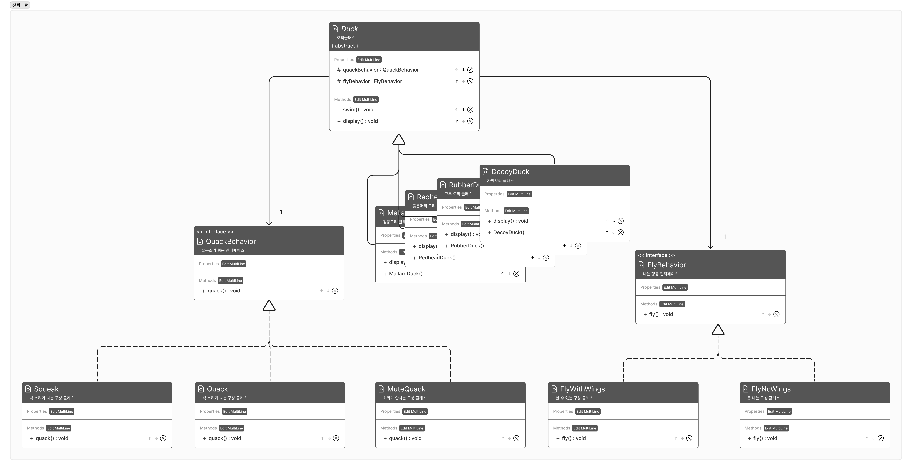

**개발의 절대 불변 법칙 : 변화**

- 상속보다 구성(합성: Composition)을 더 중요시 하자
- 구성(합성: Composition) : 클래스 안에 다른 클래스의 인스턴스를 포함시키는 것
- 인터페이스에 맞춰 프로그래밍 하자



### 코드

- 나는 행동 모음

```java
public interface FlyBehavior{
		public void fly();
}
public class FlyWithWings implements FlyBehavior{
		@Override
		public void fly(){
				System.out.println("난당~");
		}
}
public class FlyNoWings implements FlyBehavior{
		@Override
		public void fly(){
				System.out.println("못 난당 ㅠ");
		}
}
```

- 소리내는 행동 모음

```java
public interface QuackBehavior{
		public void quack();
}

public class Quack implements QuackBehavior{
		@Override
		public void quack(){
				System.out.println("꽦");
		}
}
public class Squeak implements QuackBehavior{
		@Override
		public void quack(){
				System.out.println("삑");
		}
}
public class QuackMute implements QuackBehavior{
		@Override
		public void quack(){
				System.out.println("<<조용>>");
		}
}
```

- 오리들 모음

```java
public abstract class Duck{
		protected FlyBehavior flyBehavior;
		protected QuackBehavior quackBehavior;
		
		public Duck(){}
		
		public void swim(){
				System.out.println("모든 오리는 물에 뜹니다!");
    }
		
		public void performFly(){
				flyBehavior.fly();
		}

		public void performQuack(){
				quackBehavior.quack();
		}

		public abstract void display();
}

public class MallardDuck extends Duck{
		public MallardDuck(){
				flyBehavior = new FlyWithWings();
				quackBehavior = new Quack();
		}
		@Override
		public void display(){
				System.out.println("청동오리에오");
		}
}

public class RedheadDuck extends Duck{
		public RedheadDuck(){
				flyBehavior = new FlyWithWings();
				quackBehavior = new Quack();
		}
		@Override
		public void display(){
				System.out.println("머리가 붉은 오리에오");
		}
}

public class RubberDuck extends Duck{
		public RubberDuck(){
				flyBehavior = new FlyNoWings();
				quackBehavior = new Squeak();
		}
		@Override
		public void display(){
				System.out.println("러버덕");
		}

}
```

- 바뀌는 부분을 캡슐화하자