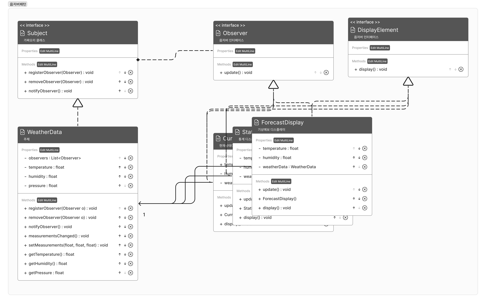

- 느슨한 결합을 추구하자
- 다른 클래스의 변경이 생기면 알려줌



### 코드

```java
public interface Subject{
		public void registerObserver(Observer o);
		public void removeObserver(Observer o);
		public void notifyObserver();
}

public interface Observer{
		public void update();
}

public interface DisplayElement{
		public void display();
}
// concrete class
public class WeatherData implements Subject{
		private List<Observer> observers;
		private float temperature;
		private float humidity;
		private float pressure;
		

		@Override
		public void registerObserver(Observer o){
				observers.add(o);
		}
		
		@Override
		public void removeObserver(Observer o){
				observers.remove(o);
		}
		
		@Override
		public void notifyObserver(){
				for (Observer observer : observers){
						observer.update();
				}
		}
		
		public void measurementsChanged(){
				notifyObserver();
		}
		
		public void setMeasurements(float temperature, float humidity, float pressure){
				this.temperature = temperature;
				this.humidity = humidity;
				this.pressure = pressure;
				measurementsChanged();
		}
		
		public float getTemperature(){
				return temperature;
		}
		
		public float getHumidity(){
				return humidity;
		}
		
		public float getPressure(){
				return pressure;
		}
}
// concrete class
public class ForecaseDisplay implements Observer, DisplayElement{
		private WeatherData weatherData;
		private float temperature;
		private float humidity;
		
		
		public ForecaseDisplay(WeatherData weatherData){
				this.weatherData = weatherData;
				weatherData.registerObserver(this);
		}
		
		@Override
		public void update(){
				this.temperature = weatherData.getTemperature();
				this.humidity = weatherData.getHumidity();
				display();
		}
		
		@Override
		public void display(){
				
		}
}
// concrate class
public class CurrentConditionDisplay implements Observer, DisplayElement{
		
		private WeatherData weatherData;
		private float temperature;
		private float humidity;
		
		public CurrentConditionDisplay(WeatherData weatherData){
				this.weatherData = weatherData;
				weatherData.registerObserver(this);
		}
		
		@Override
		public void update(){
				this.temperature = weatherData.getTemperature();
				this.humidity = weatherData.getHumdity();
				display();
		}
		
		@Override
		public void display(){
		
		}
}
// concrate class
public class StatisticsDisplay implements Observer, DisplayElement{

		private WeatherData weatherData;
		private float temperature;
		private float humidity;

		public StatisticsDisplay(WeatherData weatherData){
				this.weatherData = weatherData;
				weatherData.registerObserver(this);
		}
		
		@Override
		public void update(){
				this.temperature = weatherData.getTemperature();
				this.humidity = weatherData.getHumidity();
				display();
		}
		@Override
		public void display(){
		
		}
}
```