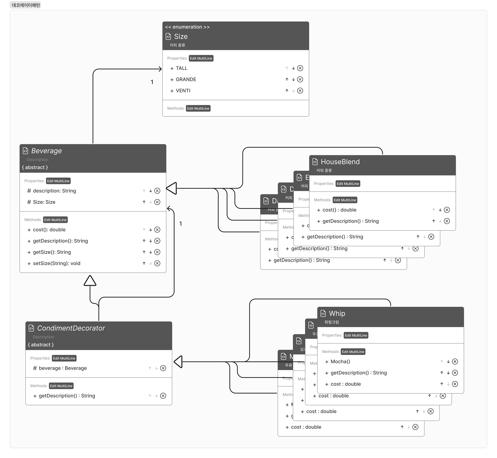

- OCP (Open-Closed Principle) : 확장에는 열려있고, 변경에는 닫혀있다.



### 코드

```java
public abstract class Beverage{
		protected String description;
		public abstract double cost();
		public String getDescription(){
				return description;
		}
}

public abstract class CondimentDecorator extends Beverage{
		protected Beverage beverage;
		public abstract String getDescription();
}
```

```java
public class DarkRoast extends Beverage{
		public DarkRoast(){
				description = "다크 로스트 커피";
		}
		@Override
		public double cost(){
				return .15;
		}
}

public class HouseBlend extends Beverage{
		public HouseBlend(){
				description = "하우스 블랜드 커피";
		}
		@Override
		public double cost(){
				return .10;
		}
}
```