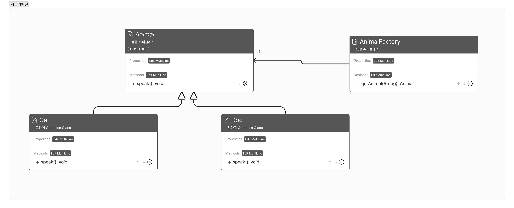
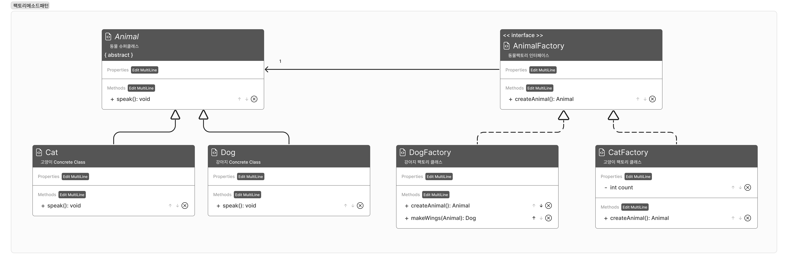

- 인스턴스를 용도에 맞게 생성하기 위한 패턴
- 심플팩토리 패턴은 OCP에 어긋난다. 변경사항이 생기기 때문!


### 팩토리 패턴



- 코드
    
    ```java
    public abstract class Animal{		
    		public abstract void speak();
    }
    
    public class Cat extends Animal{
    		@Override
    		public void speak(){
    				System.out.println("야옹");
    		}
    }
    
    public class Dog extends Animal{
    		@Override
    		public void speak(){
    				System.out.println("멍멍");
    		}
    }
    
    public class AnimalFactory{
    		public Animal getAnimal(String type){
    				if (type == null)
    					return null;
    		
    				if (type.equalsIgnoreCase("CAT")){
    						return new Cat();
    				}else if (type.equalsIgnoreCase("DOG")){
    						return new Dog();
    				}
    				return null;
    		}
    }
    // 클라이언트
    public class AnimalTestDrive{
    		public static void main(String[] args){
    				Animal animal = null;
    				AnimalFactory factory = new AnimalFactory();
    				animal = factory.getAnimal("DOG");
    				animal.speak();
    				
    				animal = factory.geyAnimal("CAT");
    				animal.speak();
    		}
    }
    ```


### 팩토리 메소드



- 코드
    
    ```java
    public abstract class Animal{
    		public abstract void speak();
    }
    
    public class Cat extends Animal{
    		@Override
    		public void speak(){
    				System.out.println("야옹");
    		}
    }
    
    public class Dog extends Animal{
    		@Override
    		public void speak(){
    				System.out.println("멍멍");
    		}
    }
    
    public interface AnimalFactory{
    		public Animal createAnimal();
    }
    
    public class DogFactory implements AnimalFactory{
    
    		@Override
    		public Animal createAnimal(){
    				return new Dog();
    		}
    		
    		public Dog makeWings(Animal animal){
    				System.out.println("add wings");
    				return (Dog) animal;
    		}
    }
    
    public class CatFactory implements AnimalFactory{
    		
    		private int count = 0;
    		
    		@Override
    		public Animal createAnimal(){
    				count += 1;
    				return new Cat();
    		}
    }
    // 클라이언트
    public class AnimalTestDrive{
    		public static void main(String[] args){
    				Animal animal = null;
    				CatFactory catFactory = new CatFactory();
    				animal = catFactory.createAnimal();
    				animal.speak();
    				
    				DogFactory dogFactory = new DogFactory();
    				animal = dogFactory.createAnimal();
    				animal = dogFactory.makeWings(animal);
    				animal.speak();
    		}
    }
    ```