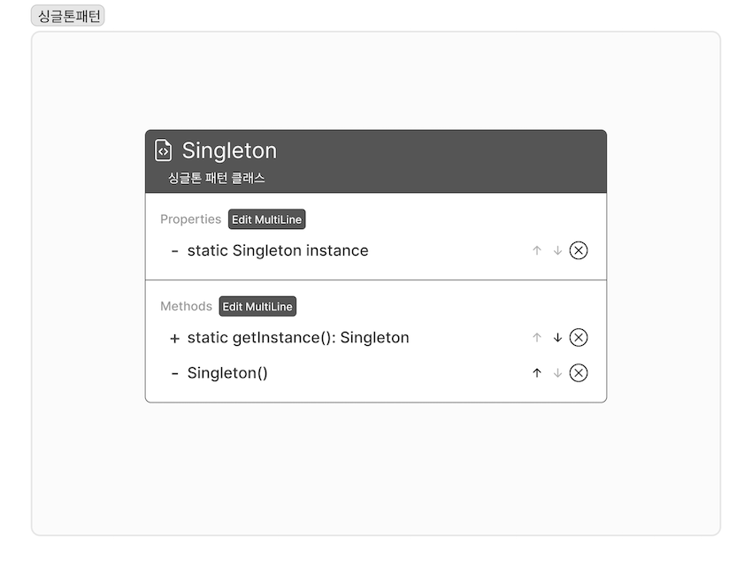

- 클래스 인스턴스를 하나만 만들고, 그 인스턴스로 전역 접근을 제공한다.(정적메소드 사용)
    



### 코드

```java
public class Singleton{
		private static Singleton instance;
		private Singleton(){}
		// 정적 메소드
		public static Singleton getInstance(){
				if (instance == null){
						instance = new Singleton();
				}
				return instance;
		}
}
```


### 멀티 스레딩 문제점

- `getInstance()` 메소드를 동기화 시킴
    - `synchronized` 사용
    
    ```java
    public class Singleton{
    		private static Singleton instance;
    		private Singleton(){}
    		public synchronized static Singleton getInstance(){
    				if (instance == null){
    						instance = new Singleton();
    				}
    				return instance;
    		}
    }
    ```
    
- `getInstance()` 의 속도가 그리 중요하지 않다면 그냥 두기
- 인스턴스가 필요할 때는 생성하지 말고 처음부터 만들기
    - `new` 를 통해 생성
    
    ```java
    public class Singleton{
    		private static Singleton instance = new Singleton();
    		private Singleton(){}
    		public static Singleton getInstance(){
    				return instance;
    		}
    }
    ```
    
- DCL을 써서 `getInstance()` 에서 동기화되는 부분을 줄임
    - DCL(Double-Checked Locking) 인스턴스가 생성되었는지 확인 후 있지 않았을 때에만 동기화할 수 있음
    
    ```java
    public class Singleton{
    		private volatile static Singleton instance = new Singleton();
    		private Singleton(){}
    		public static Singleton getInstance(){
    				if (instance == null){
    						synchronized (Singleton.class){
    								if (instance == null){
    										instance = new Singleton();
    								}
    						}
    				}
    		}
    }
    ```