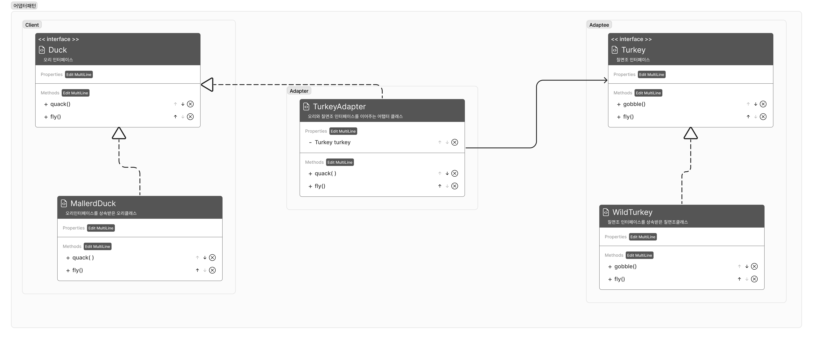
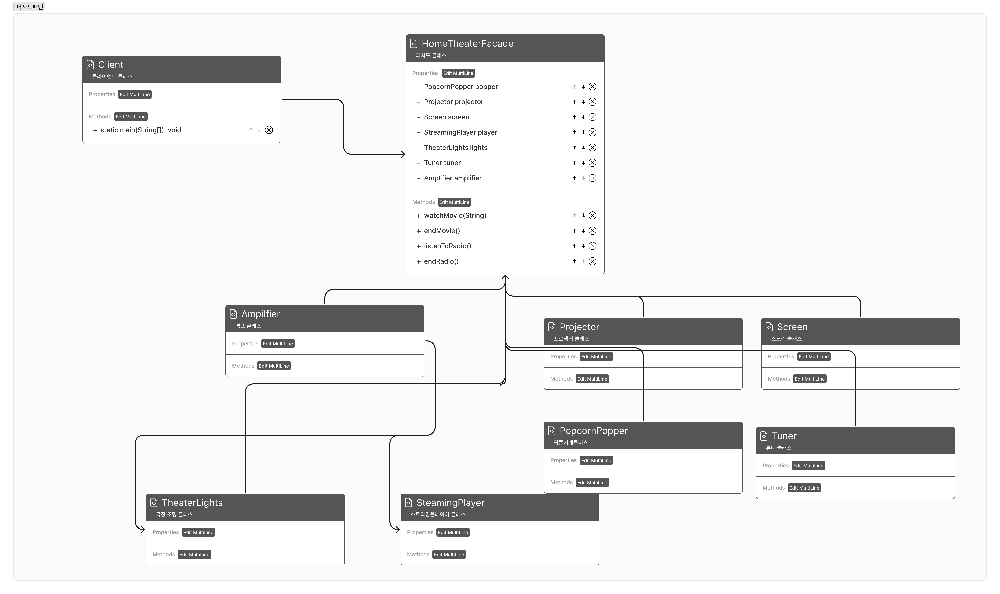

## 어댑터 패턴
- 특정 클래스 인터페이스를 클라이언트에서 요구하는 다른 인터페이스 변환
- 인터페이스 간 메소드가 같아야함
        

        
### 코드
- adaptee
        
```java
public interface Turkey{
        public void gobble();
        public void fly();
}

public class WildTurkey implements Turkey{
        @Override
        public void gobble(){
                System.out.println("골골");
        }
        
        @Override
        public void fly(){
                System.out.println("짧은 거리를 납니다.");		
        }
}
```

- client

```java
public interface Duck{
        public void quack();
        public void fly();
}

public class MallardDuck implements Duck{
        @Override
        public void quack(){
                System.out.println("꽥");
        }
        
        @Override
        public void fly(){
                System.out.println("날고 있어요");
        }
}
```

- adapter

```java
public class TurkeyAdapter implements Duck{
        private Turkey turkey;
        
        public TurkeyAdapter(Turkey turkey){
                this.turkey = turkey;
        }
        
        @Override
        public void quack(){
                turkey.gobble();
        }
        
        @Override
        public void fly(){
                // 오리보다 오래 날지 못하기 때문에 짧은 거리를 많이 이동시킴
                for (int i=0; i<5; i++){
                        turkey.fly();
                }
        }
}
```

- client

```java
public class DuckTestDrive{
        public static void main(String[] args){
                Duck duck = new MallardDuck();
                Turkey turkey = new WildTurkey();
                Duck turkeyAdapter = new TurkeyAdapter(turkey);
                
                System.out.println("===오리===");
                testDuck(duck);
                System.out.println("===칠면조===");
                turkey.gobble();
                turkey.fly();
                System.out.println("===칠면조어댑터===");
                testDuck(turkeyAdapter);
        }
        
        public static void testDuck(Duck duck){
                duck.quack();
                duck.fly();
        }
}
```


## 퍼사드 패턴
    


- 많은 수의 서브시스템에 대한 통합된 인터페이스를 제공

### 코드

- 서브시스템
        
```java
public class TheaterLights{

    private int dim;
    private boolean isFlag;

    public void on(){
            isFlag = true;
            System.out.println("극장 조명 켜기");
    }

    public void off(){
            isFlag = false;
                System.out.println("극장 조명 끄기");
    }

    public void dim(int dim){
        this.dim = dim;
        System.out.println("조명 밝기 : " + this.dim + "%");
    }

    @Override
    public String toString() {
        StringBuilder sb = new StringBuilder();
            sb.append("극장 조명 상태 : ");
            if (isFlag) sb.append("on");
            else sb.append("off");
            return sb.toString();
    }
}

public class Screen{
        private boolean isFlag;

    public void up(){
        System.out.println("스크린 올리기");
                isFlag = true;
    }

    public void down(){
        System.out.println("스크린 내리기");
        isFlag = false;
    }

    @Override
    public String toString() {
            StringBuilder sb = new StringBuilder();
            sb.append("프로젝터 상태 : ");
            if (isFlag) sb.append("up");
            else sb.append("down");
            return sb.toString();
    }
}

public class Projector{
        private StreamingPlayer player;
        private isFlag;

    public Projector(StreamingPlayer player){
        this.player = player;
    }

    public void on(){
        System.out.println("프로젝터 켜기");
        isFlag = true;
    }

    public void off(){
        System.out.println("프로젝터 끄기");
        isFlag = false;
    }

    public void tvMode(){
        System.out.println("TV 모드로 전환");
    }

    public void wideScreenMode(){
        System.out.println("와이드 스크린 모드로 전환");
    }

    @Override
    public String toString() {
        StringBuilder sb = new StringBuilder();
            sb.append("프로젝터 상태 : ");
            if (isFlag) sb.append("on");
            else sb.append("off");
            return sb.toString();
    }
}

public class PopcornPopper{
        private boolean isFlag;

        public void on(){
                System.out.println("팝콘 기계 작동");
                isFlag = true;
        }
        
        public void off(){
                System.out.println("팝콘 기계 종료");
                isFlag = false;
        }
        
        public void pop(){
                System.out.println("팝콘 튀기기");
        }
        
        @Override
        public String toString(){
                StringBuilder sb = new StringBuilder();
            sb.append("팝콘 기계 상태 : ");
            if (isFlag) sb.append("on");
            else sb.append("off");
            return sb.toString();
        } 

}

public class Tuner{
        private int frequency;
        private boolean isFlag;

        public void on(){
                System.out.println("튜너 켜기");
                isFlag = true;
        }
        
        public void off(){
                System.out.println("튜너 끄기");
                isFlag = false;
        }
        
        public void setFrequency(int frequency){
        System.out.println("주파수 조절 : " + frequency + "Hz");
        this.frequency = frequency;
    }
    
    @Override
    public String toString(){
            StringBuilder sb = new StringBuilder();
            sb.append("튜너 상태 : ");
            if (isFlag) sb.append("on");
            else sb.append("off");
            sb.append("현재 주파수 : " + frequency + "Hz");
            return sb.toString();
    }
}

public class StreamingPlayer{

        private String movie;
        private boolean isFlag;

        public void on(){
                System.out.println("스트리밍 플레이어 켜기");
                isFlag = true;
        }
        
        public void off(){
                System.out.println("스트리밍 플레이어 끄기");
                isFlag = false;
        }
        
        public void play(String movie){
                System.out.println("스트리밍 플레이어에서 " + "\"" + movie + "\" 를 재생합니다.");
                this.movie = movie;
        }
        
        public void stop(){
                System.out.println("스트리밍 플레이어에서 " + "\"" + movie + "\" 를 종료합니다.");
        }
        
        @Override
        public String toString(){
                StringBuilder sb = new StringBuilder();
                sb.append("스트리밍 플레이어 상태 : ");
                if (isFlag) {
                    sb.append("on");
                    sb.append("재생 중인 영화 : " + movie);
                }else sb.append("off");
                return sb.toString();
        }
}

public class Amplifier{
        
        private StreamingPlayer player;
        private Tuner tuner;
        private int volumn;
        private boolean isFlag;
        
        public void on(){
                System.out.println("앰플 켜기");
                isFlag = true;
        }		
        
        public void off(){
                System.out.println("앰플 끄기");
                isFlay = false;
        }
        
        public void setSurroundSound(){
                System.out.println("서라운드 모드 채널(5.1)");
        }
        
        public void setStereoSound(){
                System.out.println("스테레오 모드");
        }
        
        public void setVolumn(int volumn){
                System.out.println("볼륨 설정하기 : " + volumn);
                this.volumn = volumn;
        }
        
        public void setStreamPlayer(StreamPlayer player){
                System.out.println("실시간 플레이어 연결하기");
                this.player = player;
        }
        
        public void setTuner(){
                System.out.println("튜너 연결하기");
                this.tuner = tuner;
        }
        
        @Override
        public String toString(){
                StringBuilder sb = new StringBuilder();
                sb.append("앰플 상태 : ");
                
                if (isFlag) sb.append("on");
                else sb.append("off");
                
                sb.append("앰플 볼륨 : " + volumn);
                return sb.toString();
        }
}
```
    

```java
public class HomeTheaterFacade{
        private PopcornPopper popper;
    private Projector projector;
    private Screen screen;
    private StreamingPlayer player;
    private TheaterLights lights;
    private Tuner tuner;
    private Amplifier amplifier;

    public HomeTheaterFacade(PopcornPopper popper,
                            Projector projector,
                            Screen screen,
                            StreamingPlayer player,
                            TheaterLights lights,
                            Tuner tuner,
                            Amplifier amplifier){
        this.popper = popper;
        this.projector = projector;
        this.screen = screen;
        this.player = player;
        this.lights = lights;
        this.tuner = tuner;
        this.amplifier = amplifier;
        this.tuner = tuner;
    }

    public void watchMovie(String movie){
        System.out.println("영화 볼 준비 중");
        popper.on();
        popper.pop();
        lights.dim(10);
        screen.down();
        projector.on();
        projector.wideScreenMode();
        amplifier.on();
        amplifier.setStreamPlayer(player);
        amplifier.setSurroundSound();
        amplifier.setVolumn(5);
        player.on();
        player.play(movie);
    }

    public void endMovie(){
        System.out.println("홈시어터를 끄는 중");
        popper.off();
        lights.on();
        screen.up();
        projector.off();
        amplifier.off();
        player.stop();
        player.off();
    }

    public void listenToRadio(){
        amplifier.on();
        amplifier.setStereoSound();
        amplifier.setVolumn(5);
        tuner.on();
        tuner.setAm(amplifier);
        tuner.setFrequency(144);
    }

    public void endRadio(){
        amplifier.off();
        tuner.off();
    }
}
```

