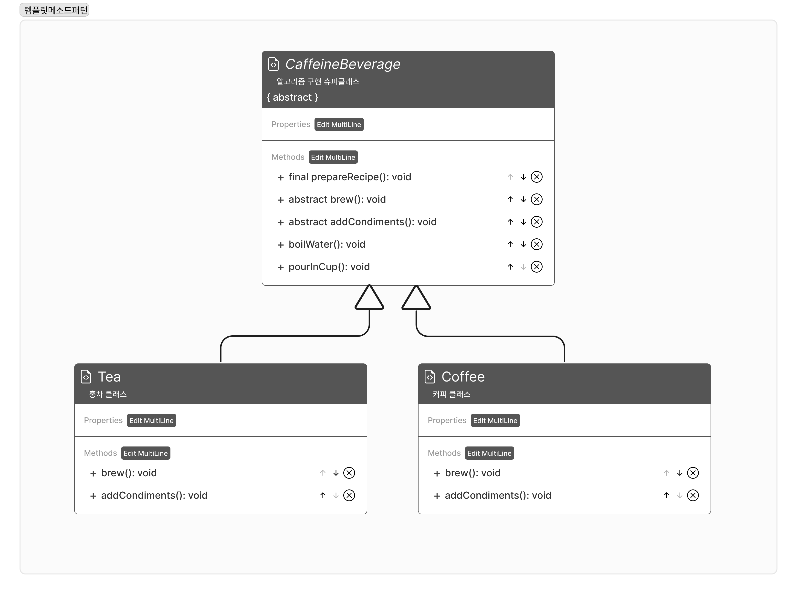

- 알고리즘의 구조를 슈퍼클래스에서 정의하고, 일부 단계를 서브클래스에서 확장할 수 있게함




### 알고리즘
  - 차
  1. 물을 끓인다.
  2. 차를 우린다.
  3. 차를 컵에 따른다.
  4. 레몬을 추가한다.
  - 커피
  1. 물을 끓인다.
  2. 커피를 필터로 걸러낸다.
  3. 커피를 컵에 따른다.
  4. 설탕 및 우유를 추가한다.

### 코드
    
```java
public abstract class CaffeineBeverage{
    final void prepareRecipe(){
            boilWater();
            brew();
            pourInCup();
            addCondiments();
    }
    
    abstract void brew();

abstract void addCondiments();

public void boilWater(){
    System.out.println("물 끓이는 중");
}

public void pourInCup(){
    System.out.println("컵에 따르는 중");
}
}

public class Tea extends CaffeineBeverage{
    @Override
    public void brew(){
            System.out.println("찻잎을 우려내는 중");
    }
    
    @Override
    public void addCondiments(){
            System.out.println("레몬 추가하기");
    }
}

public class Coffee extends CaffeineBeverage{
    @Override
    public void brew(){
            System.out.println("커피 필터 거르는 중");
    }
    
    @Override
    public void addCondiments(){
            System.out.println("설탕 및 우유 추가하기");
    }
}

```