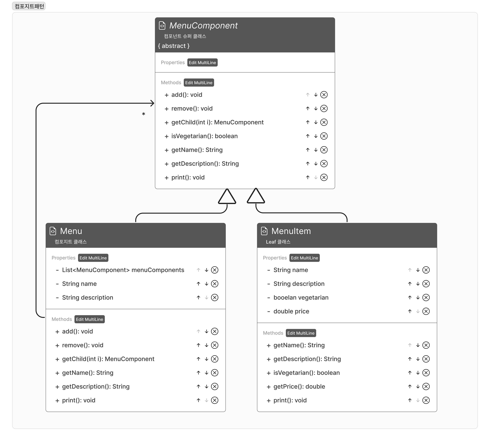

- 객체를 트리구조로 형성해서 부분-전체 계층구조를 구현한다.




### 코드
    
```java
public abstract class MenuComponent{
        public void add(MenuComponent menuComponent){
                throw new UnsupportedOperationException();
        }
        
        public void remove(MenuComponent menuComponent){
                throw new UnsupportedOperationException();
        }
        
        public MenuComponent getChild(int i){
                throw new UnsupportedOperationException();
        }
        
        public String getName(){
                throw new UnsupportedOperationException();
        }
        
        public String getDescription(){
                throw new UnsupportedOperationException();
        }
        
        public boolean isVegetarian(){
                throw new UnsupportedOperationException();
        }
        
        public double getPrice(){
                throw new UnsupportedOperationException();
        }
        
        public void print(){
                throw new UnsupportedOperationException();
        }
}

public class Menu extends MenuComponent{
        private List<MenuComponent> menuComponents = new ArrayList<MenuComponent>();
        private String name;
        private String description;
        
        public Menu(String name, String description){
                this.name = name;
                this.description = description;
        }
        
        @Override
        public void add(MenuComponent menuComponent){
                menuComponents.add(menuComponent);
        }
        
        @Override
        public void remove(MenuComponent menuComponent){
                menuComponents.remove(menuComponent);
        }
        
        @Override
        public MenuComponent getChild(int i){
                return menuComponents.get(i);
        }
        
        @Override
        public String getName(){
                return this.name;
        }
        
        @Override
        public String getDescription(){
                return this.description;
        }
        
        @Override
        public void print(){
                System.out.println("\n" + getName());
        System.out.println(", " + getDescription());
        System.out.println("-------------------------");

        for (MenuComponent menuComponent : menuComponents){
            menuComponent.print();
        }
        }
}

public class MenuItem extends MenuComponent{
        private String name;
        private String description;
        private boolean vegetarian;
        private double price;
        
        public MenuItem(String name, String description, boolean vegetarian, double price){
                this.name = name;
                this.description = description;
                this.vegetarian = vegetarian;
                this.price = price;
        }
        
        @Override
        public String getName(){
                return this.name;
        }
        
        @Override
        public String getDescription(){
                return this.description;
        }
        
        @Override
        public boolean isVegetarian(){
                return this.vegetarian;
        }
        
        @Override
        public double getPrice(){
                return this.price;
        }
        
        @Override
        public void print(){
                System.out.print(" " + getName());
        if (isVegetarian()){
            System.out.print("(v)");
        }
        System.out.println(", " + getPrice());
        System.out.println("   -- " + getDescription());
        }

}
```
    
- client
        
```java
public class Waitress{
    private MenuComponent allMeuns;

    public Waitress(MenuComponent allMeuns){
        this.allMeuns = allMeuns;
    }

    public void printMenu(){
        allMeuns.print();
    }
}

public class MenuTestDrive{
    public static void main(String[] args) {
        MenuComponent pancakeHouseMenu = new Menu("팬케이크 하우스 메뉴", "아침 메뉴");
        MenuComponent dinerMenu = new Menu("객체마을 식당 메뉴", "점심 메뉴");
        MenuComponent cafeMenu = new Menu("카페 메뉴", "저녁 메뉴");
        MenuComponent dessertMenu = new Menu("디저트 메뉴", "디저트를 즐겨 보세요");

        MenuComponent allMeuns = new Menu("전체 메뉴", "전체 메뉴");

        allMeuns.add(pancakeHouseMenu);
        allMeuns.add(dinerMenu);
        allMeuns.add(cafeMenu);

        dinerMenu.add(new MenuItem("파스타", 
        "마리나라 소스 스파게티", 
        true, 
        3.89));
        
        dinerMenu.add(dessertMenu);

        dessertMenu.add(new MenuItem("애플 파이", 
        "바삭바삭한 크러스트에 바닐라 아이스크림이 얹혀 있는 애플 파이", 
        true, 
        1.59));

        Waitress waitress = new Waitress(allMeuns);
        waitress.printMenu();
    }

}
```