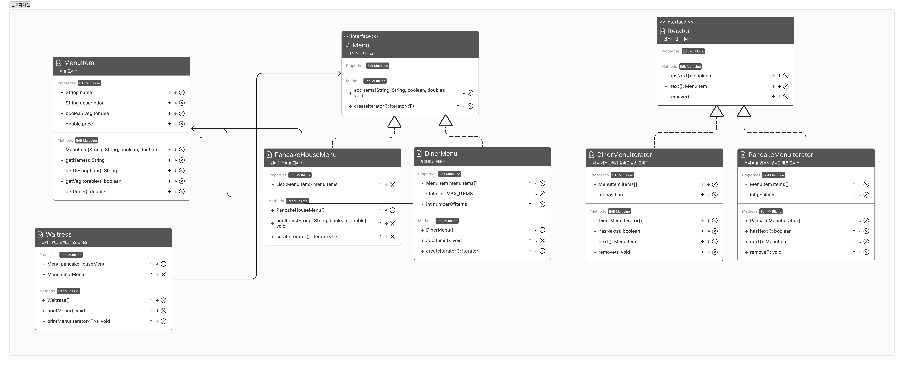

- ArrayList, 배열, HashTable 등.. 컬렉션 객체에 구애받지 않고 반복을 통일화된 방법으로 제공




- 코드
    - 메뉴 코드
        
        ```java
        public class MenuItem{
        		private String name;
        		private String description;
        		private boolean vegetarian;
        		private double price;
        		
        		public MenuItem(String name, String description, boolean vegetarian, double price){
        				this.name = name;
        				this.description = description;
        				this.vegetarian = vegetarian;
        				this.price = price;
        		}
        		// Getter
        		...
        }
        
        public interface Iterator<T>{
        		public boolean hasNext();
        		public T next();
        		public void remove();
        }
        
        public interface Menu{
        		private void addItems(String name, String description, boolean vegetarian, double price);
        		public Iterator createIterator();
        }
        ```
        
    - 저녁메뉴코드
        
        ```java
        public class DinerMenuIterator implements Iterator<MenuItem>{
        
        		private MenuItem items[];
        		private int position = 0;
        		
        		public DinerMenuIterator(MenuItem items[]){
        				this.items = items;
        		}
        
        		@Override
        		public boolean hasNext(){
        				if (position >= items.length || items[position] == null){
                    return false;
                }else {
                    return true;
                }
        		}
        		
        		@Override
        		public MenuItem next(){
        				MenuItem menuItem = items[position];
                position += 1;
                return menuItem;
        		}
        		
        		@Override
        		public void remove(){
        				throw new UnsupportedOperationException("메뉴 항목은 지우면 안 됩니다.");
        		}
        }
        
        public class DinerMenu implements Menu{
        
        		private static int MAX_ITEMS = 6;
        		private int numberOfItems = 0;
        		private MenuItem menuItems[];
        		
        		public DinerMenu(){
        				menuItems = new MenuItem[MAX_ITEMS];
        				
                addItem("채식주이자용 BLT",
                "통밀 위에 콩고기 베이컨, 상추, 토마토를 얹은 메뉴", true, 2.99);
                
                addItem("BLT",
                "통밀 위에 베이컨, 상추, 토마토를 얹은 메뉴", false, 2.99);
                
                addItem("오늘의 스프y",
                "감자 샐러드를 곁들인 오늘의 스프", false, 3.29);
                
                addItem("핫도그",
                "샤워크라우트, 갖은 양념, 양파, 치즈가 곁들여진 핫도그", false, 3.05);
        		}
        
        		
        		@Override
        		private void addItems(String name, String description, boolean vegetarian, double price){
        				MenuItem menuItem = new MenuItem(name, description, vegetarian, price);
        				if (numberOfItems >= MAX_ITEMS){
                    System.err.println("죄송합니다, 메뉴가 꽉 찼습니다. 더 이상 추가할 수 없습니다.");
                }else{
                    menuItems[numberOfItems] = menuItem;
                    numberOfItems += 1;
                }
        		}
        		
        		@Override
        		public Iterator<MenuItem> createIterator(){
        				return new DinerMenuIterator(menuItems);
        		}
        		
        }
        ```
        
    - 팬케이크메뉴코드
        
        ```java
        public class PancakeHouseMenuIterator implements Iterator<MenuItem>{
        		private List<MenuItem> items;
            private int position = 0;
        
            public DinerMenuIterator(List<MenuItem> items){
                this.items = items;
            }
        
            @Override
            public boolean hasNext() {
                if (position >= items.length || items[position] == null){
                    return false;
                }else {
                    return true;
                }
            }
        
            @Override
            public MenuItem next() {
                MenuItem menuItem = items[position];
                position += 1;
                return menuItem;
            }
        
            @Override
            public void remove() {
                throw new UnsupportedOperationException("메뉴 항목은 지우면 안 됩니다.");
            }
        }
        
        public class PancakeHouseMenu implements Menu{
        		private List<MenuItem> menuItems;
        		
        		public PancakeHouseMenu(){
        				menuItems = new ArrayList<MenuItem>();
        				addItems("K&B 팬케이크 세트", 
        				"스크램블 에그와 토스트가 곁들여진 팬케이크", 29.99);
        				
        				addItems("레귤러 팬케이크 세트", 
        				"달걀 프라이와 소시지가 곁들여진 팬케이크", 25.99);
        				
        				addItems("블루베리 팬케이크", 
        				"신선한 블루베리와 블루베리 시럽으로 만든 팬케이크", 19.99);
        				
        				addItems("와플", 
        				"취향에 따라 블루베리나 딸기를 얹을 수 있는 와플", 12.99);
        		}
        		
        		@Override
        		private void addItems(String name, String description, boolean vegetarian, double price){
        				MenuItem menuItem = new MenuItem(name, description, vegetarian, price);
        				menuItems.add(menuItem);
        		}
        		
        		@Override
        		public Iterator<MenuItem> createIterator(){
        				// return new PancakeHouseMenuIterator(menuItems);
        				return menuItems.iterator();
        		}
        }
        ```
        
    - 카페메뉴 코드
        
        ```java
        public class CafeMenu implements Menu{
        		
        		private Map<String, MenuItem> menuItems;
        		
        		public CafeMenu(){
        				menuItems = new HashMap<String, MenuItem>();
        				
        				addItem("베지 버거와 에어 프라이", 
                "통밀빵, 상추, 토마토, 감자 튀김이 첨가된 베지 버거", 
                true, 3.99);
        
                addItem("오늘의 스프", 
                "샐러드가 곁들여진 오늘의 스프", 
                false, 3.69);
        
                addItem("부리토", 
                "통 핀토콩과 살사, 구아카울이 곁들여진 푸짐한 부리토", 
                true, 4.29);
        		}
        		
        		@Override
        		private void addItems(String name, String description, boolean vegetarian, double price){
        				MenuItem menuItem = new MenuItem(name, description, vegetarian, price);
        				menuItems.put(name, menuItem);
        		}
        		
        		@Override
        		public Iterator createIterator(){
        				Collection<MenuItem> menuItems = getItems();
        				return menuItems.iterator();
        		}
        		
        		private Collection<MenuItem> getItems(){
        				return menuItems.values();
        		}
        }
        ```
        
    - 클라이언트 코드
        
        ```java
        public class Waitress{
        		private List<Menu> menus;
        		
        		public Waitress(List<Menu> menus){
        				this.menus = menus;
        		}
        		
        		public void printMenu(){
        				Iterator menuIterator = menus.iterator();
        				while (menuIterator.hasNext()){
        						Menu menu = (Menu) menuIterator.next();
        						printMenu(menu.createIterator());
        				}
        		}
        		
        		private void printMenu(Iterator<MenuItem> iterator){
        				while(iterator.hasNext()){
        						MenuItem menuItem = (MenuItem) iterator.next();
        						System.out.println(menuItem.getName() + ", ");
                    System.out.println(menuItem.getPrice() + " -- ");
                    System.out.println(menuItem.getDescription());
        				}
        		}
        }
        
        public class MenuTestDrive{
        		public static void main(String[] args){
        				Menu pancakeHouseMenu = new PancakeHouseMenu();
        				Menu dinerMenu = new DinerMenu();
        				Menu cafeMenu = new CafeMenu();
        				
        				addMenuItems(pancakeHouseMenu);
        				addMenuItems(dinerMenu);
        				addMenuItems(cafeMenu);
        			
        				
        				Waitress waitress = new Waitress(menus);
        				waitress.printMenu();
        		}
        		
        		private static List<Menu> addMenuItems(Menu item){
        				List<Menu> menus = new ArrayList<Menu>();
        				menus.add(item);
        				return menus;
        		}
        }
        ```